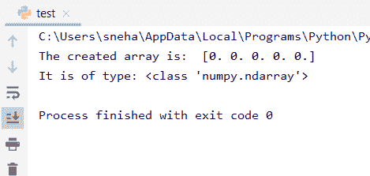
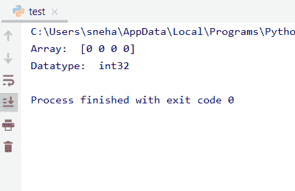
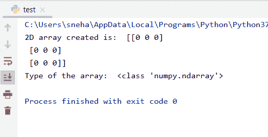
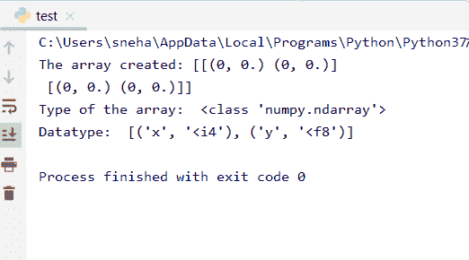

# Python 中的 NumPy zeros()方法

> 原文：<https://www.askpython.com/python-modules/numpy/numpy-zeros-method-in-python>

## 介绍

**NumPy** 是 **Python** 中大量实现的模块。今天我们将学习 Numpy `zeros()`方法，它是 Numpy 中定义的方法之一。

所以，让我们开始吧！

## Python 中的 Numpy zeros()方法

Python 中的 Numpy `zeros()`方法创建一个指定**形状**和**类型**的新数组，它的所有元素都被初始化为 **0** 。该函数无论在哪里被调用都返回相同的数组。

`zeros()`方法的基本语法可以由下式给出:

```py
import numpy as np

arr = np.zeros( shape , dtype , order )

```

这里，

*   **arr** 存储由`zeros()`方法返回的结果数组，
*   `shape`是一个整数序列，它决定了数组的大小和形状。当形状作为整数提供时，生成的数组将是 1D 数组。然而，如果我们给一个整数元组不同的整数值，我们将得到一个多维数组，
*   `dtype` or data type 指定数组元素的数据类型。默认情况下，它被设置为浮点型。
*   `Order`决定数组是按照行主(C)还是列主(F)模式/顺序存储在内存位置。

## Python 中如何使用 Numpy zeros()？

现在我们知道了 Python 中的 Nump `zeros()`方法是做什么的，让我们学习一下用法。

## 使用 Numpy 个零的 1D 数组()

我们可以用这种方法在 Python 中创建所有元素都为零的一维数组( **0** )。为了更好地理解，让我们举一个例子。

```py
import numpy as np

arr1 = np.zeros(5)
print("The created array is: ",arr1) #generated array
print("It is of type:",type(arr1)) #type of array

```

**输出**:



1 D Array Using Zeros

在上面的代码中，

*   **arr1** 是新创建的数组。正如我们所看到的，我们刚刚将' **5** '传递给了 Numpy `zeros()`函数，没有数据类型和顺序。
*   默认情况下，`dtype`和 order 的值分别被认为是**浮点型**和’**C**。这意味着生成的数组将具有 float 类型的元素，并以行为主的形式存储。
*   最后，当我们打印出数组时，我们得到一个 **1D 数组**，它的所有浮点元素的值都是 **0** 。而 arr1 的 type()告诉我们它是`ndarray`类的成员。

## 使用 Numpy 零()的不同数据类型的数组

因此，我们创建了一个默认类型为 float 的数组。如果我们需要一个包含整数值或元素的数组呢？我们可以通过将`dtype`参数指定为我们想要的类型来轻松做到这一点。让我们看看如何

```py
import numpy as np

int_array = np.zeros(4, dtype=int)  #data type set as int
print("Array: ",int_array) #the final int array
print("Datatype: ", int_array.dtype) # the data types

```

**输出**:



Data Types Using Zeros

这里，

*   **int_array** 是使用`zeros()`方法创建的新数组。
*   正如我们从输出中看到的，我们创建了一个整数类型的大小为 **4** 的数组。同样，元素的数据类型被给定为 **int32** 。(整数)。

## 使用 Numpy 个零的多维数组()

我们在本教程前面创建了一个 1D 数组，那么多维数组呢？让我们试着创建一个 **2D 数组**来说明如何创建元素为 **0** 的多维数组。

```py
import numpy as np

arr2 = np.zeros((3, 3), int) #2D integer array
print("2D array created is: ",arr2)
print("Type of the array: ",type(arr2)) #type of the array

```

**输出**:



Multidimensional Array Using Zeros

在上面的代码中:

*   我们向 Numpy `zeros()`方法传递一个整数元组,而不是一个整数元组。这允许我们创建一个 int 类型的多维数组(指定的)。
*   正如我们从输出中看到的，我们得到了一个所有元素都为 0 的 2D 数组。

## 使用 Numpy 零()的异构数据类型数组

我们还可以使用 Python 中的`zeros()`函数创建异构数据类型的数组。我们只需要传递一个包含所需信息的元组。

```py
import numpy as np

# creating array with heterogeneous data types
arr = np.zeros((2,2), dtype=[('x', 'int'), ('y', 'float')])
print("The array created:",arr)
print("Type of the array: ",type(arr)) #type of the array
print("Datatype: ", arr.dtype) # the data types

```

**输出**:



Heterogeneous Data Type Array Using Zeros

这里，

*   我们通过将 shape 作为元组 **(2，2)** 传递来创建一个二维数组，
*   在数据类型的情况下，我们使用一个**元组**，指定整数和浮点类型，
*   这导致创建了具有元组元素的 2D 数组。每个元组有两个数据，一个是`int`类型，另一个是`float` 类型，
*   最后，我们打印成员元素的**数据类型**，如输出所示。

## 结论

所以在本教程中，我们讨论了 **Python** 中的 Numpy `zeros()`方法。希望大家理解得很好。如有任何问题，欢迎使用下面的评论。

## 参考

*   [Numpy Zeros Python 文档](https://numpy.org/doc/stable/reference/generated/numpy.zeros.html)
*   关于 Numpy 零的 JournalDev 文章