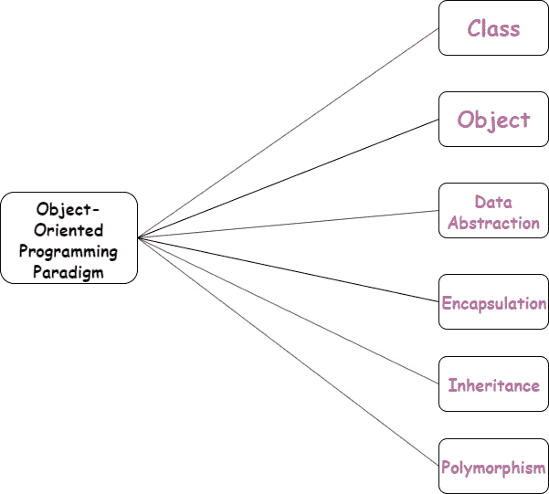
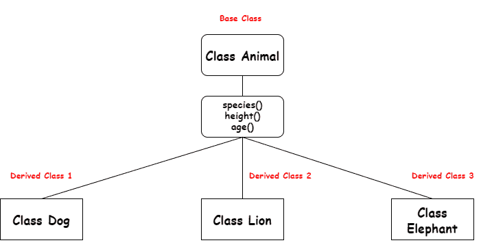

# Python 中的面向对象编程

> 原文：<https://www.askpython.com/python/oops/object-oriented-programming-python>

**面向对象**编程( **OOP** )是指软件设计，其中程序员定义数据结构的数据类型，以及可应用于该数据结构的功能类型。这种范式为数据结构提供了功能和行为模式。

这种范式将现实世界的事物映射和建模在一起，并描述它们之间的关系。OOP 将现实世界的实体建模为软件对象，这些实体有与之相关联的数据，并且有一些行为模式(功能)。



*Object-Oriented Programming Paradigm*

* * *

## Python 中的类

*类是实体*功能的蓝图。类用于创建包含任意数据的新的用户定义的数据结构。对于动物，我们可以创建一个动物类来跟踪动物的属性，比如名字和年龄。

把类想象成一个有标签的动物的蓝图。它包含了关于名称、大小等的所有细节。根据这些描述，我们可以研究动物。在这里，动物是一个对象。

### 语法:

```py
class class_name:
  pass

```

### 示例:

```py
class Animal:
  pass

```

* * *

## Python 中的对象

一个对象是一个类的实例。定义类时，只定义对象的描述。因此，不会分配任何内存。对象表示类及其功能和行为。

### 语法:

```py
object_name = Class_name(argument list)

```

### 示例:

```py
class Dog:

    # class attribute
    species = "animal"

    # instance attribute
    def __init__(self, name, age):
        self.name = name
        self.age = age

# instantiate the Dog class i.e create objects
A = Dog("Blu", 10)
B = Dog("Woo", 15)

# access the class attributes
print("A is a {}".format(A.__class__.species))
print("B is also a {}".format(B.__class__.species))

# access the instance attributes
print("{} is {} years old".format( A.name, A.age))
print("{} is {} years old".format( B.name, B.age))

```

**输出**:

```py
A is a animal
B is also a animal
A is 10 years old
B is 15 years old
```

* * *

## Python 中的数据抽象

**抽象用于隐藏内部细节，显示必要的功能**。抽象意味着以这样一种方式显示内容，即只有必要的功能根据特权显示给用户，其余的内部工作保持隐藏。

* * *

## Python 中的封装

**封装是指将数据和功能绑定到一个单元中**。类表示封装，因为它将功能和行为绑定到单个单元中，并将其表示为对象。

* * *

## Python 中的继承

在面向对象编程(OOP)的世界中，继承指的是一个类在运行中从另一个类派生或扩展属性的能力机制。该属性使派生类能够获取基类的属性或特征。

继承被认为是 OOP 最重要的方面之一，因为它提供了**可重用性**的特性，从而使代码更加可靠。



**Inheritance**

### 示例:

```py
# Base class
class Dog:

    # Class attribute
    species = 'mammal'

    # Instance attributes
    def __init__(self, name, age):
        self.name = name
        self.age = age

    # instance method
    def description(self):
        return "{} is {} years old".format(self.name, self.age)

    # instance method
    def speak(self, sound):
        return "{} says {}".format(self.name, sound)

# Derived class (inherits from Dog class)
class Bulldog(Dog):
    def run(self, speed):
        return "{} runs {}".format(self.name, speed)

# Derived class inherits attributes and
# behavior from the parent class
Jim = Bulldog("Jim", 12)
print(Jim.description())

# Derived class has specific attributes
# and behavior as well
print(Jim.run("slowly"))

```

**输出**:

```py
Jim is 12 years old
Jim runs slowly
```

> [Python 多重继承](https://www.askpython.com/python/oops/python-multiple-inheritance)

<about:blank>