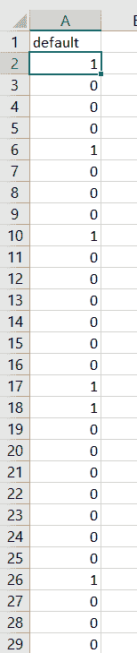

# Python 中的一种热门编码——一种实用方法

> 原文：<https://www.askpython.com/python/examples/one-hot-encoding>

读者朋友们，你们好！在本文中，我们将关注 Python 中 **One hot encoding** 的实际实现。

所以，让我们开始吧！

* * *

## 一、什么是 one 热编码？

在深入研究一键编码的概念之前，让我们了解一些先决条件。

变量分为两个主要部分

1.  **连续变量**:这些是描述数值变量的变量。示例:[1，2，3，4，5，6…..100]
2.  **分类变量**:这些变量描述了数据值中的类别或组。例子:[苹果，芒果，浆果]

在数据集中，我们会遇到包含分组形式的分类数据的数据，例如[苹果、浆果、芒果]。为了将每一类数据表示为一个独立的实体，我们使用了编码技术。

最常用的编码技术包括

*   **[虚拟变量](https://www.askpython.com/python/examples/creating-dummy-variables)**
*   **标签编码**
*   **一个热编码**等。

今天，让我们来讨论一个热门的编码。

**一个热编码以二进制向量的形式表示分类数据。**

现在，您可能会想到一个问题，当它以二进制向量格式表示类别时，它何时将数据转换为 0 和 1，即整数？

在一种热编码方案中，在将其应用于数据之前，我们需要将分类数据值映射到整数数据值。这是借助标签编码完成的。

不要担心，我们将在后面的章节中讨论标签编码的实际实现。

因此，通过一次热编码，每个类别的数据值将被分配一个整数值，并被映射到二进制向量。

因此，映射到整数值的每个数据值将被表示为二进制向量，其中，除了被标记为 1 的整数(类别)的索引值之外，向量中的所有值都为零。

* * *

## 一个热编码实现示例

将包含分类数据的数据集视为[苹果和浆果]。应用标签编码后，假设它会将 apple 指定为“0”，将 berry 指定为“1”。

此外，在应用独热编码时，它将创建长度为 2 的二进制向量。这里，编码为“0”的标签“苹果”将具有二进制向量[1，0]。

这是因为值 1 将被放置在编码的索引处，对于 apple 来说，该索引为零(如其标签编码所示)。

因此，[苹果，浆果，浆果]将被编码为:

[1，0]
【0，1】
【0，1】

现在让我们通过例子来实现这个概念。

* * *

### 示例 1:分组分类数据的热编码

看看下面的例子！我们已经用一个热编码对水果进行了编码。

```py
from sklearn.preprocessing import LabelEncoder
from sklearn.preprocessing import OneHotEncoder

cat_data = ["apple", "mango", "apple", "berry", "mango", "apple", "berry", "apple"]

label = LabelEncoder()
int_data = label.fit_transform(cat_data)
int_data = int_data.reshape(len(int_data), 1)

onehot_data = OneHotEncoder(sparse=False)
onehot_data = onehot_data.fit_transform(int_data)
print("Categorical data encoded into integer values....\n")
print(onehot_data)

```

**输出:**

```py
Categorical data encoded into integer values....

[[1\. 0\. 0.]
 [0\. 0\. 1.]
 [1\. 0\. 0.]
 [0\. 1\. 0.]
 [0\. 0\. 1.]
 [1\. 0\. 0.]
 [0\. 1\. 0.]
 [1\. 0\. 0.]]

```

**说明:**

1.  加载完数据后，我们创建了一个对象`LabelEncoder()`,将分类数据编码成整数值。
2.  此外，我们将把相同的整数数据传递给`OneHotEncoder()`以将整数值编码成类别的二进制向量。
3.  `fit_transform()`函数应用要对数据或一组值执行的特定函数。

* * *

### 示例 2:数据集上的一个热编码

在本例中，我们将一个数据集拉入 Python 环境。你可以找到下面的数据集供你参考。



**Onehot Encode Dataset**

此外，我们使用了`ColumnTransformer()`函数来创建一个对象，该对象将类别 0 表示为 N 个类别中的第一列。

最后，我们将它应用于要编码成二进制[数组](https://www.askpython.com/python/array/python-array-declaration)形式的整个分类数据。

让我们导入[熊猫](https://www.askpython.com/python-modules/pandas/python-pandas-module-tutorial)和[熊猫](https://www.askpython.com/python-modules/numpy/python-numpy-module)库。

```py
import pandas
import numpy
from sklearn.preprocessing import OneHotEncoder 
from sklearn.compose import ColumnTransformer 

cat_data = pandas.read_csv("bank-loan.csv")
#print(cat_data)

column_set = ColumnTransformer([('encoder', OneHotEncoder(),[0])], remainder='passthrough') 

onehot_data = numpy.array(column_set.fit_transform(cat_data), dtype = numpy.str) 

print(onehot_data)

```

**输出:**

所以，你看，数据现在包含两列:第一列描述第 0 类，第二列描述第 1 类。

```py
[['0.0' '1.0']
 ['1.0' '0.0']
 ['1.0' '0.0']
 ...
 ['1.0' '0.0']
 ['1.0' '0.0']
 ['1.0' '0.0']]

```

* * *

## 结论

到此，我们就结束了这个话题。如果你遇到任何问题，欢迎在下面评论。在那之前，请继续关注并快乐学习！！🙂

* * *