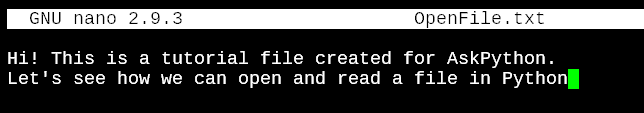
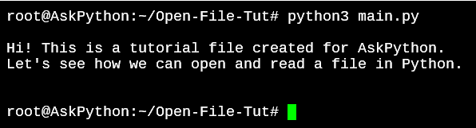
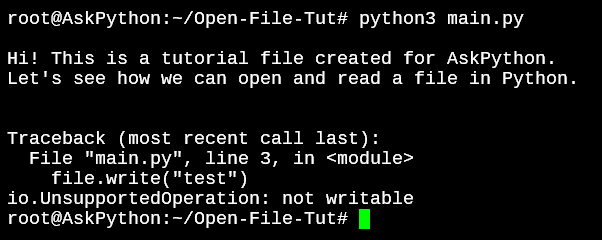
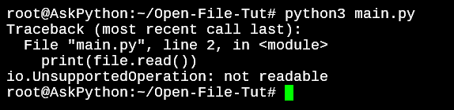
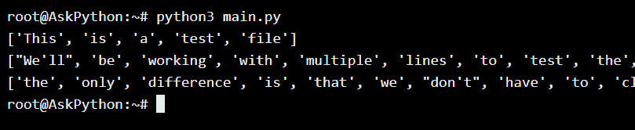

# 如何在 Python 中打开文件

> 原文：<https://www.askpython.com/python/built-in-methods/open-files-in-python>

Python 在其标准库中为我们提供了文件处理方法。这对于开发人员来说非常方便，因为您真的不需要导入更多的模块来处理文件。

Python 为我们提供的文件处理的关键方法有`open()`、`close()`、`write()`、`read()`、`seek()`和`append()`。

让我们回顾一下`open()`方法，它允许我们以不同的模式打开 Python 中的文件。

## 用 Python 打开文件

要打开一个文件，我们需要的只是文件所在的目录路径。如果它位于同一个目录中，那么只包含完整的文件名就足够了。

我已经创建了一个包含一些示例文本的文件，我们将使用它作为学习 open file 方法的示例。



Python Open File Sample File Contents

### 1.使用 open()方法打开文件

要打开 OpenFile.txt 并读取文件的文本内容，让我们使用`open()` 和`read()`方法。

```py
file = open('OpenFile.txt')
print(file.read())
file.close()

```

`read()`方法将读取文件的全部内容。



Python Open File Output

默认情况下，`open()`方法以只读模式打开文件。要写入文件，我们需要指定文件必须以写模式打开。

### 2.open()方法的不同模式

让我们尝试在默认模式下写入文件。

```py
file = open('OpenFile.txt')
print(file.read())
file.write("testing write")
file.close()

```

我们将保持读取操作不变，这样我们就可以看到代码在哪里停止。



File Write Not Permitted Read-Only Mode

那么什么是模式，我们如何添加它们呢？下面是使用 open()方法时的模式列表。

*   **r** :只读模式。
*   **r+:** 读写模式。不会创建新文件，如果文件不存在，打开将会失败
*   **rb** :只读二进制模式，读取图像、视频等。
*   **w:** 只写模式。覆盖现有文件内容。如果指定的文件名不存在，这将创建一个新文件。
*   **w+:** 读写模式。
*   **wb:** 写入媒体文件的二进制只写模式。
*   **wb+:** 二进制读写模式。
*   **答:**追加模式。不覆盖现有内容
*   **a+:** 追加和读取模式。如果文件名不存在，它将创建一个新文件。
*   **ab:** 为图像、视频等追加二进制模式。
*   **ab+:** 追加读取二进制模式。

### 3.在 Python 中以写模式打开文件

在 Python 中，有多种方式可以在写入模式下打开文件。根据您希望文件处理方法如何写入文件，您可以使用以下模式之一。

```py
file = open('OpenFile.txt', 'w')
print(file.read())
file.close()

```

通过在打开文件的第一行时添加“w ”,我们指定文件应该以写模式打开。但是**这个操作也会**失败**，因为文件是只写的**，不允许我们使用 read()方法。



Write Only Mode File Not Readable

```py
file = open('OpenFile.txt', 'w')
file.write('New content\n')
file.close()

```

上面的代码将完全清除文本文件的所有内容，而只说“新内容”。

**如果您不想覆盖文件，**您可以使用 **a** +或 **r+** 模式。

r+模式将写入传递给`write()`方法的任何内容。

```py
file = open('OpenFile.txt', 'r+')
print(file.read())
file.write('r+ method, adds a line\n')
file.close()

```

a 或 a+模式将执行与 r+模式相同的操作，但有一个主要区别。

在 r+方法的情况下，**如果指定的文件名不存在，则不会创建新文件**。但是使用+模式，如果指定的文件不可用，将创建一个新文件。

### 4.使用 with 子句打开文件

当使用`open()`方法读取文件时，您总是需要确保调用了`close()`方法以避免内存泄漏。作为一名开发人员，您可能会错过添加`close()` 方法的机会，这会导致您的程序由于文件被打开而泄漏文件内存。

对于较小的文件，对系统资源没有明显的影响，但在处理较大的文件时会表现出来。

```py
with open('OpenFile.txt', 'r+') as file:
    print(file.read())

```


Python Open File Output

在上面的例子中，输出将与我们在开始时看到的一样，但是我们不需要关闭文件。

一个 **`with`** 块一执行就获得一个锁，一旦块结束就释放锁。

您还可以在数据上运行其他方法，同时保持在`**with**`代码块中。在这种情况下，我编辑了 OpenFile.txt，并添加了一些更多的文本以便更好地理解。

```py
with open('OpenFile.txt', 'r+') as file:
    lines = file.readlines()

    for line in lines:
        print(line.split())

```



With Command Open File Python 1

只要我们继续在其作用域内工作，`with`语句就会为我们处理内存。这是在 Python 中处理文件的另一种但更好的方法。

## 结论

现在，您应该已经掌握了如何在 Python 中打开文件，以及如何使用 open()方法处理打开文件的不同模式。我们将在接下来的教程中进一步介绍文件处理方法。