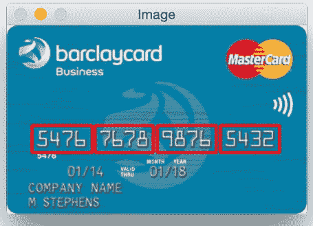
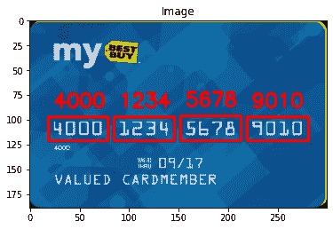
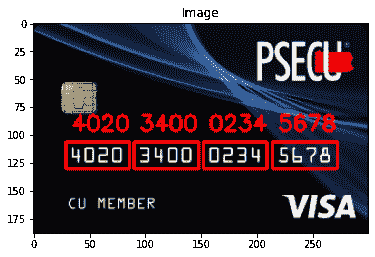
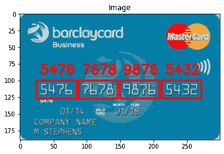

# 使用 OpenCV 的 Python 信用卡读卡器

> 原文：<https://www.askpython.com/python/examples/opencv-credit-card-reader>

本教程的目的是帮助您使用 OpenCV 和机器学习技术构建一个信用卡读卡器，以识别卡号和卡类型。

让我们开始吧！

***也读:[如何使用 OpenCV 读取 Python 中的图像？](https://www.askpython.com/python-modules/read-images-in-python-opencv)***

* * *

## OCR 简介

我们一直看到**光学字符识别**在机器学习和深度学习中被大量使用。许多这样的应用之一包括信用卡和卡号的识别和读取。



Credit Card Reader Demonstration

你可能会想到的问题是为什么？因此，这个应用程序对于银行和其他金融机构数字识别卡号和卡的类型有很大的帮助。

* * *

## 用 Python 实现信用卡读卡器

现在我们已经理解了这个概念，以及在本教程结束时我们将要构建什么。

让我们一步一步地开始构建项目。

* * *

### 步骤 1:导入模块

在这种情况下，我们将使用 [numpy](https://www.askpython.com/python/numpy-trigonometric-functions) 和 [matplotlib](https://www.askpython.com/python-modules/matplotlib/python-matplotlib) 以及 openCV 模块。

```py
import cv2
import imutils
import argparse
import numpy as np
from imutils import contours
from matplotlib import pyplot as plt

```

* * *

### 步骤 2:分配卡类型

卡的类型是根据卡号的第一个数字来分配的。同样显示在下面。

```py
FIRST_NUMBER = {
    "3": "American Express",
    "4": "Visa",
    "5": "MasterCard",
    "6": "Discover Card"}

```

* * *

### 步骤 3:参考图像的加载和预处理

为了读取参考 OCR 图像，我们利用 [`imread`](https://www.askpython.com/python-modules/python-imread-opencv) 功能。参考图像包含 OCR 字体中的数字 0-9，这种字体可以在以后的流水线中用于执行匹配。

图像的预处理包括将其转换为灰度图像，然后阈值化+反转图像以获得二值反转图像。

```py
ref = cv2.imread('ocr_a_reference.png')
ref = cv2.cvtColor(ref, cv2.COLOR_BGR2GRAY)
ref = cv2.threshold(ref, 10, 255, cv2.THRESH_BINARY_INV)[1]

```

* * *

### 步骤 4:检测轮廓

在这一步中，我们找到预处理图像中的轮廓，然后存储返回的轮廓信息。接下来，我们从左到右对轮廓进行排序，并初始化字典 digits，它将数字名称映射到感兴趣的区域。

```py
refCnts = cv2.findContours(ref.copy(), cv2.RETR_EXTERNAL,cv2.CHAIN_APPROX_SIMPLE)
refCnts = imutils.grab_contours(refCnts)
refCnts = contours.sort_contours(refCnts, method="left-to-right")[0]
digits = {}

```

* * *

### 步骤 5:在数字周围创建边界框

现在，在这一步中，我们循环遍历在上一步中获得的图像轮廓，其中每个值包含数字/数字以及轮廓信息。我们进一步计算每个轮廓的边界框，并存储(x，y)坐标以及计算出的框的高度和宽度。

```py
for (i, c) in enumerate(refCnts):
    (x, y, w, h) = cv2.boundingRect(c)
    roi = ref[y:y + h, x:x + w]
    roi = cv2.resize(roi, (57, 88))
    digits[i] = roi

rectKernel = cv2.getStructuringElement(cv2.MORPH_RECT, (9, 3))
sqKernel = cv2.getStructuringElement(cv2.MORPH_RECT, (5, 5))

```

* * *

### 步骤 6:信用卡图像的加载和预处理

在这一步，我们加载我们的信用卡照片，然后`resize`同样的宽度为 300，以保持长宽比。

该步骤之后是将图像转换为`grayscale`。在这之后，我们对灰度图像执行`morphological operations`。

下一步是计算一个 **`Scharr gradient`** ，并将结果存储为`gradX`。然后我们计算存储的 gradX 数组的绝对值。我们的目标是缩放 **`0-255`** 范围内的所有值。

现在，通过计算 gradX 的最小和最大值来进行值的归一化，并形成一个等式来实现 **`min-max normalization`** 。

最后，我们找到`contours`并将它们存储在一个列表中，并初始化一个列表来保存数字组的位置。然后像我们在`step 5`中对参考图像所做的一样循环遍历轮廓。

接下来，我们将对来自`left to right`的分组进行**排序，并为信用卡数字初始化一个列表。**

```py
image = cv2.imread('credit_card_03.png')
image = imutils.resize(image, width=300)
gray = cv2.cvtColor(image, cv2.COLOR_BGR2GRAY)

tophat = cv2.morphologyEx(gray, cv2.MORPH_TOPHAT, rectKernel)

gradX = cv2.Sobel(tophat, ddepth=cv2.CV_32F, dx=1, dy=0, ksize=-1)
gradX = np.absolute(gradX)
(minVal, maxVal) = (np.min(gradX), np.max(gradX))
gradX = (255 * ((gradX - minVal) / (maxVal - minVal)))
gradX = gradX.astype("uint8")

gradX = cv2.morphologyEx(gradX, cv2.MORPH_CLOSE, rectKernel)
thresh = cv2.threshold(gradX, 0, 255, cv2.THRESH_BINARY | cv2.THRESH_OTSU)[1]

thresh = cv2.morphologyEx(thresh, cv2.MORPH_CLOSE, sqKernel)

cnts = cv2.findContours(thresh.copy(), cv2.RETR_EXTERNAL,
	cv2.CHAIN_APPROX_SIMPLE)
cnts = imutils.grab_contours(cnts)
locs = []

for (i, c) in enumerate(cnts):
	(x, y, w, h) = cv2.boundingRect(c)
	ar = w / float(h)
	if ar > 2.5 and ar < 4.0:
		if (w > 40 and w < 55) and (h > 10 and h < 20):
			locs.append((x, y, w, h))

locs = sorted(locs, key=lambda x:x[0])
output = []

```

现在我们知道了每组四位数的位置，让我们遍历这四个已排序的分组并确定其中的位数。循环还包括**阈值处理、检测轮廓和模板匹配**。

```py
for (i, (gX, gY, gW, gH)) in enumerate(locs):
    groupOutput = []
    group = gray[gY - 5:gY + gH + 5, gX - 5:gX + gW + 5]
    group = cv2.threshold(group, 0, 255, cv2.THRESH_BINARY | cv2.THRESH_OTSU)[1]
    digitCnts = cv2.findContours(group.copy(), cv2.RETR_EXTERNAL, cv2.CHAIN_APPROX_SIMPLE)
    digitCnts = imutils.grab_contours(digitCnts)
    digitCnts = contours.sort_contours(digitCnts, method="left-to-right")[0]
    for c in digitCnts:
        (x, y, w, h) = cv2.boundingRect(c)
        roi = group[y:y + h, x:x + w]
        roi = cv2.resize(roi, (57, 88))
        scores = []
        for (digit, digitROI) in digits.items():
            result = cv2.matchTemplate(roi, digitROI, cv2.TM_CCOEFF)
            (_, score, _, _) = cv2.minMaxLoc(result)  
            scores.append(score)
        groupOutput.append(str(np.argmax(scores)))
    cv2.rectangle(image, (gX - 5, gY - 5),
        (gX + gW + 5, gY + gH + 5), (0, 0, 255), 2)
    cv2.putText(image, "".join(groupOutput), (gX, gY - 15),
        cv2.FONT_HERSHEY_SIMPLEX, 0.65, (0, 0, 255), 2)
    output.extend(groupOutput)

```

* * *

### 步骤 7:显示最终结果

下面的代码将显示最终的卡类型、卡号和 OCR 应用的图像。

```py
print("Credit Card Type: {}".format(FIRST_NUMBER[output[0]]))
print("Credit Card #: {}".format("".join(output)))

plt.imshow(cv2.cvtColor(image, cv2.COLOR_BGR2RGB))
plt.title('Image'); plt.show()

```

* * *

## 最终代码

```py
import cv2
import imutils
import argparse
import numpy as np
from imutils import contours
from matplotlib import pyplot as plt

FIRST_NUMBER = {
    "3": "American Express",
    "4": "Visa",
    "5": "MasterCard",
    "6": "Discover Card"}

ref = cv2.imread('ocr_a_reference.png')
ref = cv2.cvtColor(ref, cv2.COLOR_BGR2GRAY)
ref = cv2.threshold(ref, 10, 255, cv2.THRESH_BINARY_INV)[1]

refCnts = cv2.findContours(ref.copy(), cv2.RETR_EXTERNAL,cv2.CHAIN_APPROX_SIMPLE)
refCnts = imutils.grab_contours(refCnts)
refCnts = contours.sort_contours(refCnts, method="left-to-right")[0]
digits = {}

for (i, c) in enumerate(refCnts):
    (x, y, w, h) = cv2.boundingRect(c)
    roi = ref[y:y + h, x:x + w]
    roi = cv2.resize(roi, (57, 88))
    digits[i] = roi

rectKernel = cv2.getStructuringElement(cv2.MORPH_RECT, (9, 3))
sqKernel = cv2.getStructuringElement(cv2.MORPH_RECT, (5, 5))

image = cv2.imread('credit_card_03.png')
image = imutils.resize(image, width=300)
gray = cv2.cvtColor(image, cv2.COLOR_BGR2GRAY)

tophat = cv2.morphologyEx(gray, cv2.MORPH_TOPHAT, rectKernel)

gradX = cv2.Sobel(tophat, ddepth=cv2.CV_32F, dx=1, dy=0, ksize=-1)
gradX = np.absolute(gradX)
(minVal, maxVal) = (np.min(gradX), np.max(gradX))
gradX = (255 * ((gradX - minVal) / (maxVal - minVal)))
gradX = gradX.astype("uint8")

gradX = cv2.morphologyEx(gradX, cv2.MORPH_CLOSE, rectKernel)
thresh = cv2.threshold(gradX, 0, 255, cv2.THRESH_BINARY | cv2.THRESH_OTSU)[1]

thresh = cv2.morphologyEx(thresh, cv2.MORPH_CLOSE, sqKernel)

cnts = cv2.findContours(thresh.copy(), cv2.RETR_EXTERNAL,
	cv2.CHAIN_APPROX_SIMPLE)
cnts = imutils.grab_contours(cnts)
locs = []

for (i, c) in enumerate(cnts):
	(x, y, w, h) = cv2.boundingRect(c)
	ar = w / float(h)
	if ar > 2.5 and ar < 4.0:
		if (w > 40 and w < 55) and (h > 10 and h < 20):
			locs.append((x, y, w, h))

locs = sorted(locs, key=lambda x:x[0])
output = []

for (i, (gX, gY, gW, gH)) in enumerate(locs):
    groupOutput = []
    group = gray[gY - 5:gY + gH + 5, gX - 5:gX + gW + 5]
    group = cv2.threshold(group, 0, 255, cv2.THRESH_BINARY | cv2.THRESH_OTSU)[1]
    digitCnts = cv2.findContours(group.copy(), cv2.RETR_EXTERNAL, cv2.CHAIN_APPROX_SIMPLE)
    digitCnts = imutils.grab_contours(digitCnts)
    digitCnts = contours.sort_contours(digitCnts, method="left-to-right")[0]
    for c in digitCnts:
        (x, y, w, h) = cv2.boundingRect(c)
        roi = group[y:y + h, x:x + w]
        roi = cv2.resize(roi, (57, 88))
        scores = []
        for (digit, digitROI) in digits.items():
            result = cv2.matchTemplate(roi, digitROI, cv2.TM_CCOEFF)
            (_, score, _, _) = cv2.minMaxLoc(result)  
            scores.append(score)
        groupOutput.append(str(np.argmax(scores)))
    cv2.rectangle(image, (gX - 5, gY - 5),
        (gX + gW + 5, gY + gH + 5), (0, 0, 255), 2)
    cv2.putText(image, "".join(groupOutput), (gX, gY - 15),
        cv2.FONT_HERSHEY_SIMPLEX, 0.65, (0, 0, 255), 2)
    output.extend(groupOutput)

print("Credit Card Type: {}".format(FIRST_NUMBER[output[0]]))
print("Credit Card #: {}".format("".join(output)))

plt.imshow(cv2.cvtColor(image, cv2.COLOR_BGR2RGB))
plt.title('Image'); plt.show()

```

* * *

## 一些示例输出

现在让我们看看在各种信用卡图像上实现上述代码后的一些示例输出。



Credit Card Reader Output 01



Credit Card Reader Output 02



Credit Card Reader Output 03

* * *

## 结论

我希望你理解这个概念，并喜欢输出。用更多的图片尝试同样的方法，结果会让你大吃一惊。

编码快乐！😇

想了解更多？查看下面提到的教程:

1.  [Python:检测轮廓](https://www.askpython.com/python/examples/python-detecting-contours)
2.  [箱线图:使用 Python 进行图像边缘检测](https://www.askpython.com/python/examples/edge-detection-in-images)
3.  [Python 中的图像处理——边缘检测、调整大小、腐蚀和膨胀](https://www.askpython.com/python/examples/image-processing-in-python)

* * *