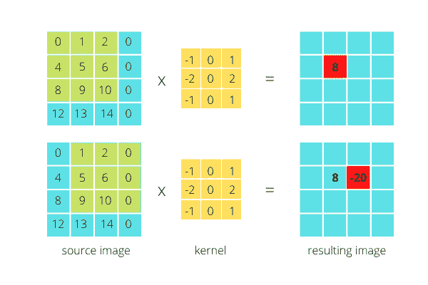

# Python OpenCV filter2D()函数–完整指南

> 原文：<https://www.askpython.com/python-modules/opencv-filter2d>

大家好！在本教程中，我们将学习如何使用 OpenCV `filter2D()`方法在图像上应用滤镜，如锐化、模糊和在图像中寻找边缘。所以让我们开始吧。

***也读:[用 OpenCV](https://www.askpython.com/python-modules/read-images-in-python-opencv)* 用 Python 读图像**

## OpenCV filter2D()函数简介

在图像处理中处理图像时，`filter2D()`功能用于根据周围的像素亮度值改变图像的像素亮度值。这种方法可以增强或移除图像的某些特征来创建新图像。

python 中定义`filter2D()`函数的语法如下:

```py
resulting_image = cv2.filter2D(src, ddepth, kernel)

```

*   **src** :应用过滤器的源图像。它是一个以像素亮度值表示图像的矩阵。
*   **ddepth** :目标图像的**理想深度**。值-1 表示结果图像将具有与源图像相同的深度。
*   **内核**:内核是应用在图像上的滤镜矩阵。

更正式地说，`filter2D()`函数将图像与内核进行卷积，这导致图像变得模糊或锐化，并增强图像特征。

### 什么是内核？

也称为[卷积矩阵](https://www.askpython.com/python-modules/pytorch)或遮罩，内核是一个小的二维矩阵，它包含的值表示计算当前像素的亮度值时应该占用周围像素值的多少部分。通常，核是奇数长度的方阵，如 3×3，5×5，7×7 矩阵。

因此，核充当加权矩阵，并用于图像的模糊、图像的锐化、图像中边缘的检测等。在图像处理方面。这是通过图像和内核之间的卷积来完成的。

### 什么是卷积？

在[图像处理](https://www.askpython.com/python/examples/image-processing-in-python)中，卷积只是内核和源图像的某个部分的元素乘法，以产生代表像素的新的单个数据点，对图像的每个可能部分进行卷积，以创建新的图像。

在卷积中，我们从源图像中取出一个与核大小相同的子矩阵，将源图像的每个元素与核的相应元素相乘，对之前的计算执行加法，并对数据进行归一化，从而将数据表示为像素值。

考虑下图所示的示例:



Convolution Image Processing Example 1

图像上的卷积会导致图像的大小小于源图像。区别取决于我们内核的大小。然而，有一些方法可以处理它，如这里讨论的。

## 对不同内核使用 OpenCV filter2d()

让我们对不同内核的图像应用`filter2d()`函数，看看会得到什么结果。对于这个例子，我们将使用下面的图像。


Filter2d Source Image

### 1.锐化图像

您可以了解更多关于[锐化图像](https://www.askpython.com/python/examples/denoising-images-in-python)的信息。这一小段将锐化上面显示的图像。

```py
import cv2
import numpy as np
# Loading source image
src_image = cv2.imread("pug-dog.jpg")
# Defining the kernel of size 3x3
kernel = np.array([
  [0, -1, 0],
  [-1, 5, -1],
  [0, -1, 0]
])

resulting_image = cv2.filter2D(src_image, -1, kernel)

cv2.imshow("original image", src_image)
cv2.imshow("filter2d image", resulting_image)
cv2.imwrite("Filter2d Sharpened Image.jpg", resulting_image)
cv2.waitKey()
cv2.destroyAllWindows()

```


Filter2d Sharpened Image

### 2.模糊图像

```py
import cv2
import numpy as np
# Loading source image
src_image = cv2.imread("pug-dog.jpg")
# Defining the kernel of size 3x3
kernel = np.array([
  [1, 1, 1],
  [1, 1, 1],
  [1, 1, 1]
]) / 9

resulting_image = cv2.filter2D(src_image, -1, kernel)

cv2.imshow("original image", src_image)
cv2.imshow("filter2d image", resulting_image)
cv2.imwrite("Filter2d Blur Image.jpg", resulting_image)
cv2.waitKey()
cv2.destroyAllWindows()

```


Filter2d Blur Image

### 3.图像的轮廓边缘检测

让我们用 OpenCV filter2D()函数来看看[边缘检测](https://www.askpython.com/python/examples/edge-detection-in-images)。

```py
import cv2
import numpy as np
# Loading source image
src_image = cv2.imread("pug-dog.jpg")
# Defining the kernel of size 3x3
kernel = np.array([
  [-1, -1, -1],
  [-1, 8, -1],
  [-1, -1, -1]
])

resulting_image = cv2.filter2D(src_image, -1, kernel)

cv2.imshow("original image", src_image)
cv2.imshow("filter2d image", resulting_image)
cv2.imwrite("Filter2d Outline Image.jpg", resulting_image)
cv2.waitKey()
cv2.destroyAllWindows()

```


Filter2d Outline Image

### 使用浮雕滤镜

```py
import cv2
import numpy as np
# Loading source image
src_image = cv2.imread("pug-dog.jpg")
# Defining the Emboss kernel of size 3x3
kernel = np.array([
  [-2, -1, 0],
  [-1, 1, 1],
  [0, 1, 2]
])

resulting_image = cv2.filter2D(src_image, -1, kernel)

cv2.imshow("original image", src_image)
cv2.imshow("filter2d image", resulting_image)
cv2.imwrite("Filter2d Emboss Image.jpg", resulting_image)
cv2.waitKey()
cv2.destroyAllWindows()

```


Filter2d Emboss Image

### 使用 Sobel 滤波器

```py
import cv2
import numpy as np
# Loading source image
src_image = cv2.imread("pug-dog.jpg")
# Defining the Sobel kernel of size 3x3
kernel = np.array([
  [-1, 0, 1],
  [-2, 0, 2],
  [-1, 0, 1]
])

resulting_image = cv2.filter2D(src_image, -1, kernel)

cv2.imshow("original image", src_image)
cv2.imshow("filter2d image", resulting_image)
cv2.imwrite("Filter2d Sobel Image.jpg", resulting_image)
cv2.waitKey()
cv2.destroyAllWindows()

```


Filter2d Sobel Image

## 结论

在本教程中，您了解了图像处理中的卷积和内核，以及如何在 python 中使用 OpenCV filter2D()函数来处理图像。现在你可以尝试不同的内核过滤器来获得不同的图像效果。

感谢阅读！！