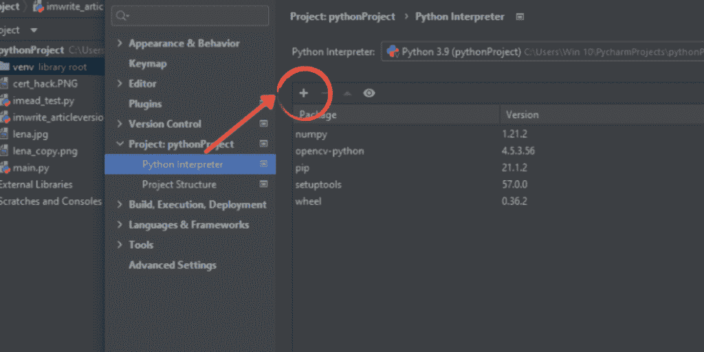

# OpenCV imwrite()–初学者指南

> 原文：<https://www.askpython.com/python-modules/opencv-imwrite>

Python OpenCV 是基于英特尔在 2000 年开发的 C++函数。在本文中，将详细解释如何使用 imwrite()函数将图像保存到用户指定的目录中。

## 安装打开的 CV

由于 OpenCV 是一个第三方库函数，它没有预装在任何 Python IDE 中。因此，首先，您需要学习安装和配置 OpenCV，以便将其用作导入包。

***你可能喜欢:[Python 的 5 大最佳 ide](https://www.askpython.com/python/top-best-ides-for-python)***

在这个例子中，我们使用 Pycharm IDE 来配置 Open CV，因为它比其他 IDE 更简单。

让我们安装最新版本的 [PyCharm](https://www.jetbrains.com/pycharm/download/#section=windows) IDE。安装后，按照以下步骤进行配置:

*   创建新项目。
*   在项目中创建一个 python 文件(。py 扩展)
*   然后进入文件>设置，在左窗格中点击你创建的项目的名称。在下拉菜单中，您会发现一个名为 Python 解释器的选项。
*   Python 解释器包含了该项目所需的所有解释器。您需要找到并点击位于“Package”栏上方的+号。



1.1, Open CV Configuration

*   点击它会打开一个新窗口，里面有一个很棒的 python 解释器列表。你需要搜索“opencv-python”并选择一个名为“opencv-Python”的，不要其他的


1.2 Open CV configuration

*   点击下面的安装包。这将在您的 pycharm 系统中安装 opencv 包以及其他必要的包，如果它们像' pip '，' numpy '等丢失的话


1.3 Open CV configuration

## 使用 OpenCV imwrite()

一旦完成以上步骤，PyCharm IDE 项目就可以使用了。现在我们来看编码部分。

**以下内容将提供使用 python OpenCV imwrite()保存图像的步骤。**

### 1.导入 OpenCV

从图像保存开始，我们将导入我们需要的两个包:cv2、os。

```py
import cv2
import os

```

这篇特别的文章将使用两个 OpenCV 函数来保存图像。两个必需的 cv2 功能是:

*   im read()
*   **imwrite()**

### 2.读取图像

在读取映像之前，程序员需要向编译器指定文件路径和目录。

首先，用图像的文件路径初始化变量‘image location ’,而另一个变量‘filedirectory’用于保存新图像文件将被保存的目录路径。

当两个变量都被初始化时，使用 imread()函数读取图像

示例代码:

```py
imagelocation = (r"C:\Users\Win 10\PycharmProjects\pythonProject\lena.jpg")

filedirectory = (r"C:\Users\Win 10\Pictures")

image = cv2.imread(imagelocation)

```

注意:要保存的图像文件应该位于 Python 项目文件夹中。您可以使用 PyCharm IDE 复制图像并将其粘贴到文件夹中，也可以手动搜索文件夹并将图像粘贴到其中。

### 3.保存图像

这里，一个新的名称存储在变量“newfilename”中，然后函数 imwrite()获取上一个示例中使用的变量“image ”,并用新名称保存它。

示例代码:

```py
newfilename = 'image_savedasnew.jpg'<br><br>cv2.imwrite(newfilename, image)

```

### 4.使用 OpenCV imwrite()的完整代码

```py
import cv2
import os

imagelocation = (r"C:\Users\Win 10\PycharmProjects\pythonProject\lena.jpg")

filedirectory = (r"C:\Users\Win 10\Pictures")

image = cv2.imread(imagelocation)

# Reading the image
image = cv2.imread(imagelocation) 

# Using print command here is not necessary but helpful. If the filepath in both the variables ‘imagelocation’, and ‘filedirectory’  is stored successfully, this command will print a matrix of the image. If there is any mistake in filepath, the compiler will return ‘none’.

print(image)

#to direct compiler towards specified directory
os.chdir(filedirectory)        

# It shows the contents of the directory before file is saved 

print("list of files available before saving function is executed:")  

print(os.listdir(filedirectory))

newfilename = 'image_savedasnew.jpg'

# This is the function specified above that saves image file 
cv2.imwrite(newfilename, image)

#Lists directory contents after saving

print("Following execution of imwrite function:")  
print(os.listdir(directory))
print('Image Saved Positively')

```

## 输出:


## 结论

关于 Python OpenCV imwrite()函数的快速简单教程到此结束。OpenCV 库中还有很多你可以探索的，我鼓励你在这里浏览我们收集的 [OpenCV 教程](https://www.askpython.com/python-modules/read-images-in-python-opencv)。