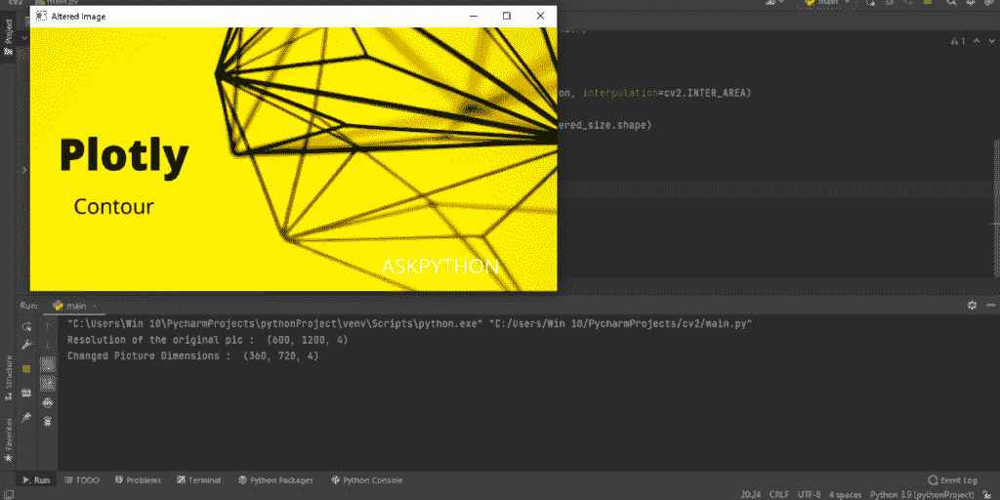
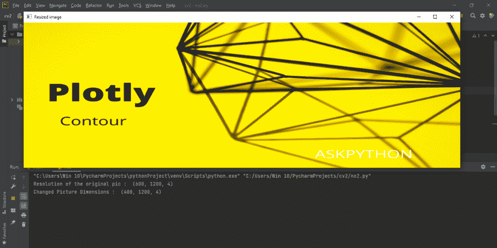
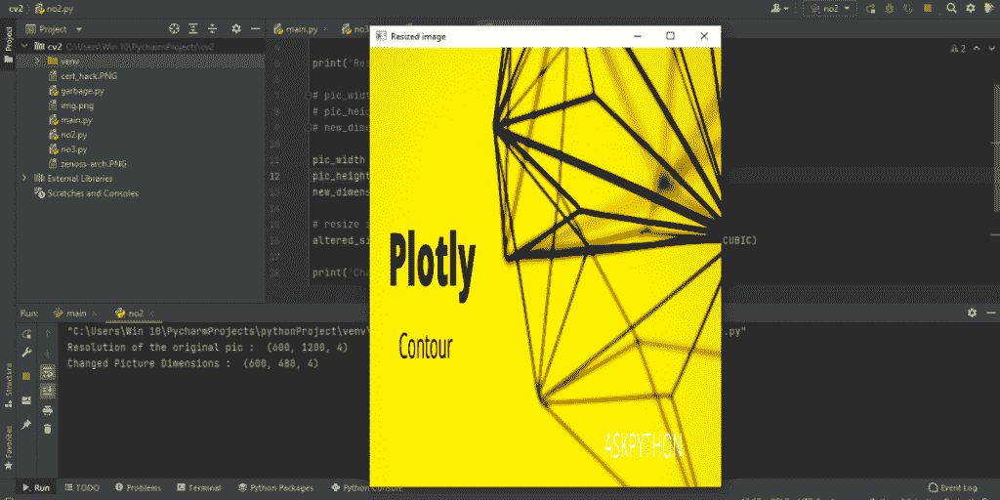

# CV2 调整大小——初学者完全指南

> 原文：<https://www.askpython.com/python-modules/opencv2-resize>

在本文中，我们将学习 OpenCV 包，以及它的 cv2 resize 函数。我们还将查看一些代码示例，以便更好地理解如何在实际场景中使用该函数。

## 打开 CV–cv2 调整大小()

该[图像处理](https://www.askpython.com/python/examples/image-processing-in-python)计算机库由英特尔构建，旨在解决计算机中的实时视觉问题。cv2 resize()函数专门用于使用不同的插值技术来调整图像的大小。让我们来了解如何。

## 简单调整大小

```py
import cv2
image = cv2.imread("img.png", 1)
bigger = cv2.resize(image, (2400, 1200))
cv2.imshow("Altered Image", bigger)
cv2.waitKey(0)
cv2.destroyAllWindows()

```

上面的代码演示了一个简单的调整大小技术。这里我们没有使用任何插值技术或比例因子，但我们得到了想要的输出。

我们也可以在语法中添加比例因子。缩放因子沿其轴缩放图像，不会给最终输出增加太多差异。带有比例因子的语法如下所示:

```py
scaled = cv2.resize(image, (1200, 600), fx = 0.1, fy = 0.1
                 ,interpolation = cv2.INTER_CUBIC)

```

## 通过更改纵横比来调整大小

改变图像的长宽比可以给我们一个缩小或放大的图像。在这个例子中，我们将看看如何做到这一点。

我们将会看到 3 个代码块，其中包括–包导入和图像加载，缩放加载的图像背后使用的逻辑，以及最后，使用插值调整图像的大小。

### 导入和图像读取

```py
import cv2

pic = cv2.imread('img.png', cv2.IMREAD_UNCHANGED)

```

上面的代码导入 Python 的 OpenCV 库，然后将图像加载到变量‘pic’中。你可能已经注意到了，我们用了 cv2。它的基本功能是使用 alpha 通道加载图像，这意味着图片的原始分辨率得到保留。

### 改变纵横比的算法

```py
pd_change = 60  # The percent change from the main aspect ratio
new_resolution = pd_change/100
pic_width = int(pic.shape[1] * new_resolution)
pic_height = int(pic.shape[0] * new_resolution)
new_dimension = (pic_width, pic_height)

```

让我们一行一行地理解上面的代码:

*   “pd_change”变量保存原始纵横比所需的百分比变化。
*   “new_resolution”变量将该百分比转换为小数并存储。
*   变量‘pic _ width’和‘pic _ height’使用该十进制值保存新的高度和宽度。语法“pic.shape”用于获取原始图片的纵横比。[0]表示高度，[1]表示宽度。([2]用于不在本文学习范围内的渠道)
*   变量‘new _ dimension’用于存储新的分辨率。

### 调整图像大小

```py
altered_size = cv2.resize(pic, new_dimension, interpolation=cv2.INTER_AREA)

cv2.imshow("Altered Image", altered_size)

```

变量' altered_size '使用 cv2.resize()函数调整图像大小，这里使用的插值方法是' cv2。' INTER_AREA '，基本上是用来缩小图像的。因此，最后，我们得到了我们的图像完美地缩放到我们想要的百分比大小。

**让我们看看完整的代码，以了解全貌。**

```py
import cv2

pic = cv2.imread('img.png', cv2.IMREAD_UNCHANGED)

print('Resolution of the original pic : ', pic.shape)

percent_dim_change = 60  # The percent change from the main size
pic_width = int(pic.shape[1] * percent_dim_change / 100)
pic_height = int(pic.shape[0] * percent_dim_change / 100)
dim = (pic_width, pic_height)

# resizing image
altered_size = cv2.resize(pic, dim, interpolation=cv2.INTER_AREA)

print('Changed Picture Dimensions : ', altered_size.shape)

cv2.imshow("Altered Image", altered_size)
cv2.waitKey(0)
cv2.destroyAllWindows()

```



Aspect Ratio Change

### 使用自定义值调整大小

我们可以用特定的宽度和高度值来调整图像的大小，而不考虑它们的原始尺寸。或者，我们可以改变单个参数，即高度，同时保持另一个参数，即宽度，不变。让我们看看代码，了解它是如何做到的。

```py
import cv2

pic = cv2.imread('img.png', cv2.IMREAD_UNCHANGED)

print('Resolution of the original pic : ', pic.shape)

pic_width = pic.shape[1]  # keeping intact the original width
pic_height = 800
new_dimension = (pic_width, pic_height)

# resize image
altered_size = cv2.resize(pic, new_dimension, interpolation=cv2.INTER_CUBIC)

print('Changed Picture Dimensions : ', altered_size.shape)

cv2.imshow("Resized image", altered_size)
cv2.waitKey(0)
cv2.destroyAllWindows()

```



Width Intact Resizing

这里，我们使用了一种不同的插值方法，“INTER_CUBIC”，它对 2X2 的相邻像素进行插值。更改插值方法不会产生太大的差异，在本例中最终结果几乎相同(作为练习，您可以通过更改插值方法并观察最终结果的变化，在您的机器上尝试本例)。尽管如此，在最终输出中，我们得到了一个高度改变的新图像。

注意:在上面的代码中，我们改变了图片的高度，也保持了我们的宽度不变。如果我们想在保持高度不变的情况下改变宽度，我们将使用:

```py
pic_width =  480
pic_height = pic.shape[0]     # keeping intact the original height
new_dimension = (pic_width, pic_height)

```



Height Intact Resizing

## 结论

我希望这篇文章能帮助你理解 cv2.resize 函数以及如何使用它来改变图像。我们研究了多种不同的方法，通过这些方法我们的图像可以被操纵。我们还研究了如何使用插值来获得我们的图像所需的结果。希望这篇文章能对你的学习有所帮助。