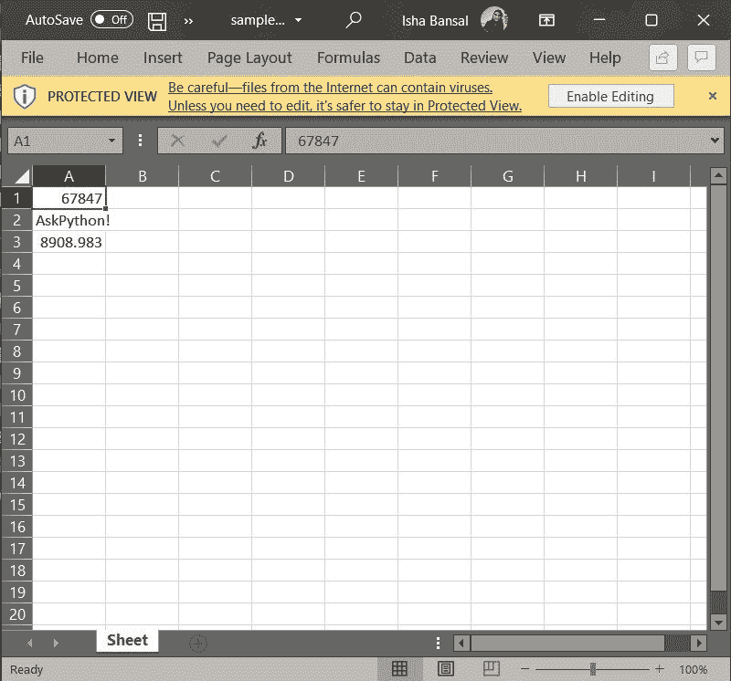
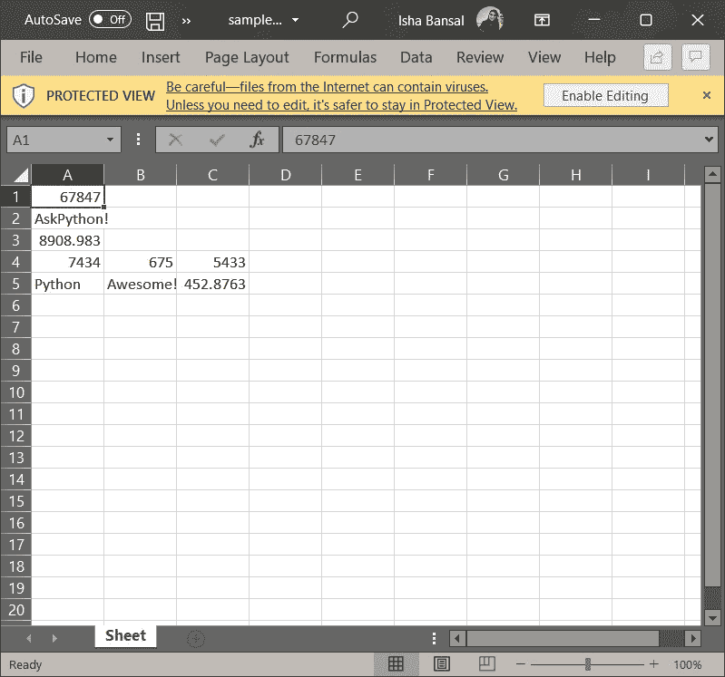

# Python 中的 Openpyxl 简介

> 原文：<https://www.askpython.com/python-modules/openpyxl-in-python>

在本文中，我们将学习 Python 中的 openpyxl。Excel 电子表格是你在人生的某个阶段必须处理的许多事情之一。你可能需要学习如何处理电子表格，要么是因为你的经理喜欢它们，要么是因为营销人员需要它们，这就是学习`openpyxl`的用处所在。

您可以读取电子表格，遍历每一行，从数据库中检索数据，然后使用 **Openpyxl** 写回电子表格。

* * *

## **了解一些基本术语**

在开始学习本模块之前，让我们先了解下表中提到的基本定义:

| **期限** | **定义** |
| **工作簿** | 我们正在处理的主文件。 |
| **工作表** | 整个工作簿中的每个单独的工作表。 |
| **栏** | 标记为 A、B、C、D 等的垂直线。 |
| **行** | 标记为 1、2、3、4、5 等的水平线。 |
| **单元格** | 标记为 A1、A2、A3 等的行和列的组合。 |

**Some basic terms and definitions**

* * *

## **Openpyxl 模块介绍**

Python 中的 Openpyxl 模块用于处理 Excel 文件，不需要第三方微软应用软件。利用这个模块，我们可以在不启动应用程序的情况下操作 Excel。它用于执行 excel 活动，例如从 excel 文件读取数据或将数据写入 excel 文件、绘制图表、访问 excel 表、重命名表、修改(添加和删除)表、格式化、设置表的样式以及任何其他作业。Openpyxl 是为您处理这些工作的高效工具。

数据科学家经常利用 Openpyxl 来执行各种任务，比如数据复制、数据挖掘和数据分析。

### **在 Python 中安装 Openpyxl**

要使用 Openpyxl，您的计算机上必须安装 Python 3.7 和 openpyxl 2.6.2。让我们通过使用以下命令安装 openpyxl 来开始使用它:

```py
pip install openpyxl  

```

* * *

## **在 Python 中使用 openpyxl**

让我们直接进入 Python 中 openpyxl 库的工作。我们将通过 excel 文件实现这个库。事不宜迟，我们继续吧。

### **1。创建和赋值**

首先，我们可以使用工作簿功能创建一个新的工作簿。一个工作簿总是包含至少一个工作表。

```py
from openpyxl import Workbook  
wb = Workbook() 

```

我们获取活动工作表的位置，并给活动工作表的单元格赋值。

```py
sheet = wb.active 
sheet['A1'] = 67847  
sheet['A2'] = 'AskPython!'
sheet['A3'] = 8908.983

```

最后，我们可以使用 save()函数将所有数据存储到“sample_file.xlsx”文件中。最终的 excel 文件如下图所示。



SampleExcelFile1 Openpyxl

### **3。将数据追加到文件**

Openpyxl 中的 **append()** 函数用于添加一组数据。可以附加任何种类的值。这些值被添加到底部的当前工作表中。

```py
data =  ((7434, 675, 5433),  ("Python", 'Awesome!',452.8763) )
for i in data:  
    sheet.append(i)  
wb.save("sample_file.xlsx")

```

修改后的 excel 表如下所示:



SampleExcelFile2 Openpyxl

* * *

## **结论**

您现在了解了如何在 Python 中使用电子表格！说到 Excel 文件，您可以依靠 openpyxl 来完成任何事情！希望你喜欢它！😇

喜欢这个教程吗？无论如何，我建议你看一下下面提到的教程:

1.  [如何将熊猫数据帧转换成 Excel 文件](https://www.askpython.com/python-modules/pandas/convert-pandas-dataframe-to-excel)
2.  [使用 Python 从 Excel 表格中绘制数据](https://www.askpython.com/python/examples/plot-data-from-excel-sheet)
3.  [使用 PySpark 打印数据——完整指南](https://www.askpython.com/python-modules/print-data-using-pyspark)

感谢您抽出时间！希望你学到了新的东西！！😄

* * *