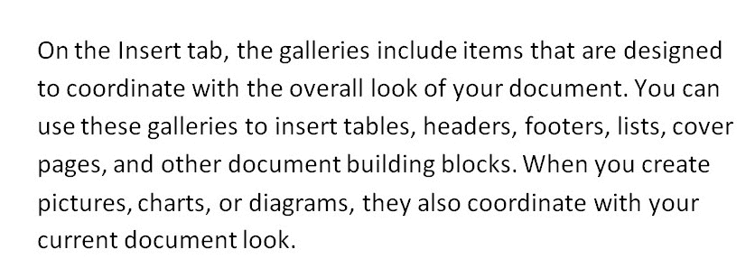

# Python 中的光学字符识别(OCR)

> 原文：<https://www.askpython.com/python/examples/optical-character-recognition>

在本文中，我们将了解如何使用*pytesserac*或 python-tesserac 执行光学字符识别。Pytesseract 是一个用于[宇宙魔方](https://en.wikipedia.org/wiki/Tesseract_(software)) -OCR 引擎的包装器。Tesseract 是一个开源的 OCR 引擎，由 Google 管理。

有时候，我们的图像中有文本，我们需要在电脑上输入文本。

对于我们来说，理解图像中的文字是非常容易的，但是对于计算机来说，理解图像中的文字却是一项非常困难的任务。

计算机只会将图像视为像素阵列。

OCR 在这项任务中派上了用场。OCR 检测图像上的文本内容，并将信息转换为计算机容易理解的编码文本。

在本文中，我们将了解如何使用 Python 执行 OCR 任务。

## 用 Python 实现基本的光学字符识别

使用 [pip](https://www.askpython.com/python-modules/python-pip) 为 tesseract 安装 Python 包装器。

`$ pip install pytesseract`

你可以参考[这个关于栈溢出的](https://stackoverflow.com/questions/50951955/pytesseract-tesseractnotfound-error-tesseract-is-not-installed-or-its-not-i/53672281#:~:text=This%20error%20is%20because%20tesseract%20is%20not%20installed%20on%20your%20computer.&text=On%20Windows%2064%20bits%2C%20just,OCR%22%20and%20it%20will%20work.)查询来获得关于安装 Tesseract 二进制文件和使 pytesseract 工作的细节。

### 1.获取带有清晰可见文本的图像

现在让我们看一个样本图像，并从中提取文本。



Sample text image

### 2.从图像中提取文本的代码

上面的图像是 jpeg 格式，我们将尝试从中提取文本信息。

```py
#Importing libraries
import cv2
import pytesseract

#Loading image using OpenCV
img = cv2.imread('sample.jpg')

#Converting to text
text = pytesseract.image_to_string(img)

print(text)

```

**输出:**

```py
On the Insert tab, the galleries include items that are designed
to coordinate with the overall look of your document. You can
use these galleries to insert tables, headers, footers, lists, cover pages, and other document building blocks. When you create
pictures, charts, or diagrams, they also coordinate with your
current document look.

```

在使用 [OpenCV](https://www.askpython.com/python-modules/read-images-in-python-opencv) 加载图像之后，我们使用 pytesseract image _ to _ string 方法，该方法需要一个图像作为输入参数。这一行代码将把图像中的文本信息转换成编码文本。

然而，如果我们不对图像进行预处理，OCR 的实际任务将是具有挑战性的，因为转换的效率直接受到输入图像质量的影响。

## 利用 OpenCV 实现预处理后的 OCR

**我们将用来预处理图像的步骤:**

*   **将图像转换成灰度**–图像需要转换成二进制图像，所以首先，我们将彩色图像转换成灰度。
*   **阈值处理**用于将灰度图像转换为二值图像。它决定像素值是低于还是高于某个阈值。下面的所有像素都变成白色像素，上面的所有像素都变成黑色像素。
*   **现在将图像**反转为使用 *`bitwise_not`* 操作。
*   **运用腐蚀、膨胀等各种降噪技术**。
*   **将文本提取方法**应用于预处理后的图像。

### 1.查找带有清晰文本的图像

**让我们使用下图在代码中实现上述步骤:**


**Sample For Test**

### 2.使用 Python 从图像中预处理和提取文本的完整代码

现在，我们将按照步骤预处理文件，并从上面的图像中提取文本。当图像对于机器学习算法来说可读且清晰时，光学字符识别效果最佳。

```py
#Importing libraries
import cv2
import pytesseract
import numpy as np

#Loading image using OpenCV
img = cv2.imread('sample_test.jpg')

#Preprocessing image
#Converting to grayscale
gray_image = cv2.cvtColor(img, cv2.COLOR_BGR2GRAY)

#creating Binary image by selecting proper threshold
binary_image = cv2.threshold(gray_image ,130,255,cv2.THRESH_BINARY + cv2.THRESH_OTSU)[1]

#Inverting the image
inverted_bin = cv2.bitwise_not(binary_image)

#Some noise reduction
kernel = np.ones((2,2),np.uint8)
processed_img = cv2.erode(inverted_bin, kernel, iterations = 1)
processed_img = cv2.dilate(processed_img, kernel, iterations = 1)

#Applying image_to_string method
text = pytesseract.image_to_string(processed_img)

print(text)

```

**输出:**

```py
On the Insert tab, the galleries include items that are designed
to coordinate with the overall look of your document. You can
use these galleries to insert tables, headers, footers, lists, cover
pages, and other document building blocks. When you create
pictures, charts, or diagrams, they also coordinate with your
current document look,

You can easily change the formatting of selected text in the
documenttext by choosing a look for the selected text from the
Quick Styies gallery on the Home tab. You can also format text
directly by using the other controls on the Home tab. Most
controls offer a choice of using the look from the current theme

or using a tormat that you specify directly.

To change the overall look of your document, choose new
Theme elements on the Page Layout tab. To change the looks
available in the Quick Style gallery, use the Change Current
Quick Style Set command. Both the Themes gallery and the
Quick Styles gallery provide reset commands so that you can

```

你可以在这里了解更多关于 OpenCV 及其图像转换功能[。](https://opencv.org/) 

## 结论

这篇文章是关于用 Python 实现光学字符识别的，它使用了*pytesserac*包装器和一些预处理步骤，这些步骤可能有助于获得更好的结果。

快乐学习！