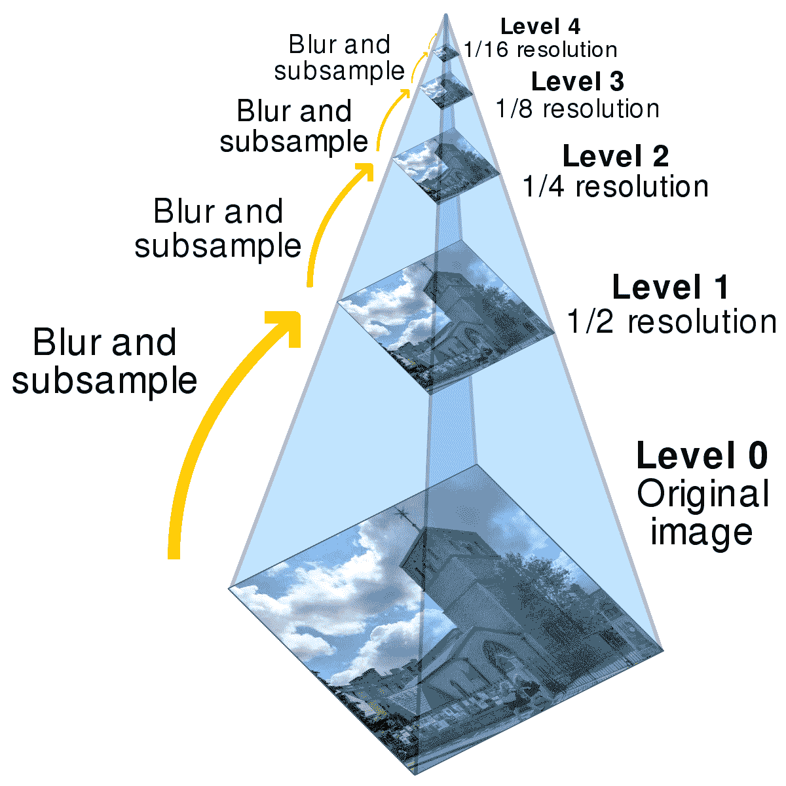
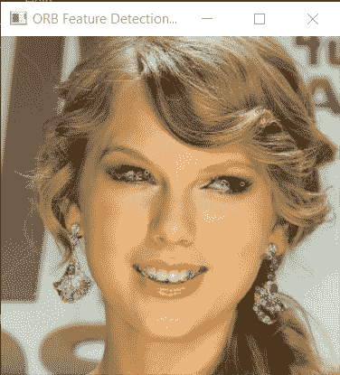
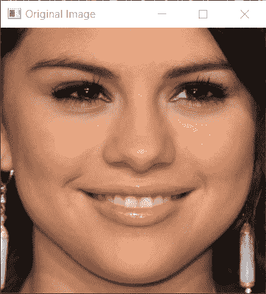
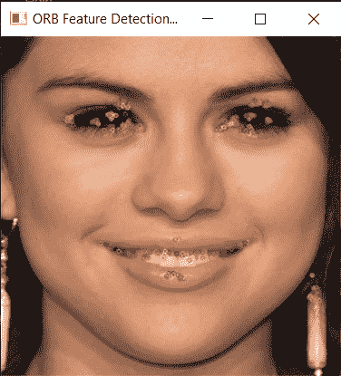

# Python 中的 ORB 特征检测

> 原文：<https://www.askpython.com/python/examples/orb-feature-detection>

你好，各位程序员，在本教程中，我们将看到什么是 **ORB 特征检测器**以及我们如何用 Python 实现它。ORB 代表**快速定向旋转简报**。

***也可阅读:[Python 中的图像阈值处理——简易快速指南](https://www.askpython.com/python/examples/image-thresholding)***

## ORB 特征检测简介

**Oriented FAST and rotated BRIEF(ORB)**是一种快速鲁棒的局部特征检测器，由 **Ethan Rublee et al.** 于 2011 年首次提出，用于物体识别或 3D 重建等计算机视觉任务。



Sample Multiscaled Image Pyramid

ORB 使用了修改版的**快速关键点检测器**和**简短描述符**。在这种情况下，快速特征不是比例不变和旋转不变的。为了使快速惊吓不变，我们使用一个**多尺度金字塔**。ORB **检测每一关**的特征以获得更高的精确度。

* * *

## 用 Python 实现 ORB 特征检测

当谈到 ORB 特征检测时，我们利用一些直接函数来读取图像，检测和计算 ORB 特征，然后将检测到的关键点绘制到图像中。

为了显示图像，我们使用了 OpenCV 库的旧的`imshow`函数。代码如下，希望您清楚所采取的步骤。

```py
import cv2

orb=cv2.ORB_create()
img=cv2.imread("selena.jpg",1)

kp, des = orb.detectAndCompute(img, None)
imgg=cv2.drawKeypoints(img, kp, None)

img = cv2.resize(img, (300, 300))  
imgg = cv2.resize(imgg, (300, 300))  

cv2.imshow("Original Image",img)
cv2.imshow("ORB Feature Detection on Image",imgg)

cv2.waitKey(0)

cv2.destroyAllWindows()

```

* * *

## 产出#1

### 1.1 选择的原始图像


Original Image Face Detection

### 1.2 特征检测后



ORB Face Detection Output Image

* * *

## 样本输出#2

### 2.1 选择的原始图像



Original Image Face Detection Image2

### 2.2 特征检测后



ORB Face Detection Output Image2

* * *

## 结论

如你所见，我们的模型检测到了主要特征。您也可以使用自己的个人图像尝试相同的算法。对模型的结果感到惊讶。希望你喜欢这个教程！

感谢您的阅读！