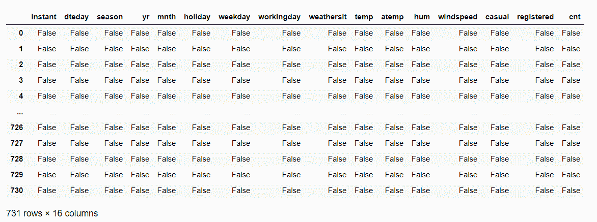
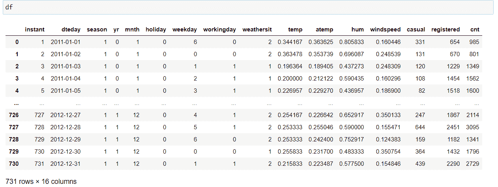

# 4 熊猫转换函数要知道用 Python！

> 原文：<https://www.askpython.com/python-modules/pandas/pandas-conversion-functions>

读者朋友们，你们好！在本文中，我们将关注 Python 中的 **4 个重要的熊猫转换函数。**

所以，让我们开始吧！

## 4 熊猫转换功能

在本主题的过程中，我们将在示例中使用自行车租赁计数预测数据集。你可以在这里找到数据集[。](https://github.com/Safa1615/BIKE-RENTAL-COUNT/blob/master/day.csv)

* * *

### 1。Pandas astype()函数

在 [Pandas 模块](https://www.askpython.com/python-modules/pandas/python-pandas-module-tutorial)中最常用的 Pandas 转换函数是 **astype()** 函数。

使用 astype()函数，我们可以轻松地将变量的数据类型从一种类型转换为另一种类型。因此，数据变量之间的相互转换变得容易。

**举例:**

在这个例子中，首先，我们使用 dtypes 对象检查 dataset 变量的数据类型。

```py
BIKE.dtypes

```

**变量的数据类型:**

```py
instant         int64
dteday         object
season          int64
yr              int64
mnth            int64
holiday         int64
weekday         int64
workingday      int64
weathersit      int64
temp          float64
atemp         float64
hum           float64
windspeed     float64
casual          int64
registered      int64
cnt             int64
dtype: object

```

除此之外，我们现在尝试使用 astype()函数将变量 season 的数据类型从整数更改为类别。

**整数到类别的转换—**

```py
BIKE.season = BIKE.season.astype("category")
BIKE.dtypes

```

**输出:**

```py
instant          int64
dteday          object
season        category
yr               int64
mnth             int64
holiday          int64
weekday          int64
workingday       int64
weathersit       int64
temp           float64
atemp          float64
hum            float64
windspeed      float64
casual           int64
registered       int64
cnt              int64

```

* * *

### 2。熊猫 isna()函数

说到数据分析和预处理，对我们来说，研究数据并提取出有意义的信息是非常重要的。检查空值的存在似乎是建模和转换之前的一个重要步骤。

使用 **isna()** 函数，我们可以很容易地检查空值的存在，如果有的话。这是一个[布尔函数](https://www.askpython.com/python/built-in-methods/python-bool-method)，如果它在列或数据集中检测到任何空值，则返回 TRUE。

**举例:**

在此示例中，isna()函数返回 false，因为它在数据集中遇到零缺失值或空值。

```py
BIKE.isna()

```

**输出:**



Conversion Functions

* * *

### 3。Python notna()函数

使用 Python notna()函数，我们可以很容易地分离和查找不等于 NULL 或 na 的值。也就是说，如果 notna()函数检测到非空值的存在，它将返回 TRUE。

**举例:**

在下面的示例中， **notna()** 函数返回 TRUE，因为它在整个数据集中没有检测到任何空值。

```py
BIKE.notna()

```

**输出:**


Conversion Functions Non Missing Values

* * *

### 4。Python dataframe.copy()函数

当涉及到操作数据集时，拥有原始数据的备份作为进行更改的备用副本对我们来说非常重要。这也有助于我们回滚到最初的情况，以防操纵不起作用。

**举例:**

在本例中，我们使用 **copy()** 函数创建了数据帧‘df ’,它保存了由 BIKE 对象表示的数据集的副本。

```py
df = BIKE.copy()
print(df)

```

**输出:**



Pandas Copy Dataframe

* * *

## 结论

至此，我们已经结束了关于 Python 转换函数的主题。如果你遇到任何问题，欢迎在下面评论。

更多与 Python 编程相关的帖子，敬请关注我们！

在那之前，学习愉快！🙂