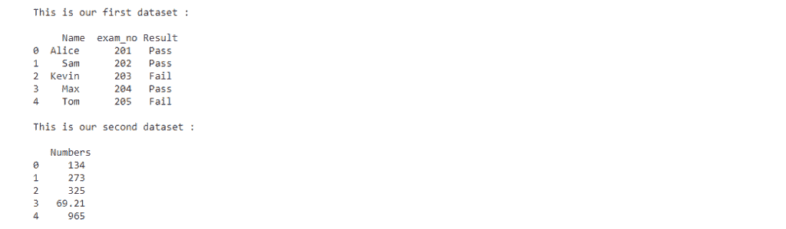

# 将 Pandas 数据帧转换为 Numpy 数组[分步]

> 原文：<https://www.askpython.com/python-modules/numpy/pandas-dataframe-to-numpy-array>

读者你好！在本文中，我们将了解什么是数据帧，以及如何将 Pandas 数据帧转换为 Numpy 数组，反之亦然。让我们开始吧:

## 介绍

Python 中的数据框是一种二维表格数据结构，由定义数据框不同特征的行和列组成。

我们可以使用 [Pandas 库](https://www.askpython.com/python-modules/pandas/python-pandas-module-tutorial)创建一个数据框，或者导入一个已经构建好的数据框(。csv 文件)并处理它。你可以使用 [pip 命令](https://www.askpython.com/python-modules/python-pip)安装 Pandas。

```py
pip install pandas

```

上面写的代码安装了 pandas，我们都准备好使用 Pandas 库的不同功能了。同样，我们将安装 [numpy 库](https://www.askpython.com/python-modules/numpy/python-numpy-arrays):

```py
pip install numpy

```

首先，我们将看到这个表格结构(pandas 数据帧)到 numpy 数组的转换。

* * *

### 1.将 Pandas 数据帧转换为 Numpy 数组

我们可以通过使用 *dataframe.to_numpy()* 方法来做到这一点。这将给定的 Pandas 数据帧转换成 Numpy 数组。

*   让我们创建两个数据框，我们将在本教程中使用。

```py
#importing pandas
import pandas as pd

#creating dataframes
student_data = {"Name": ['Alice', 'Sam', 'Kevin', 'Max', 'Tom'],
        "exam_no": [201, 202, 203, 204, 205],
        "Result": ['Pass', 'Pass', 'Fail', 'Pass', 'Fail']}

set_of_numbers = {"Numbers": ['134', '273', '325','69.21','965']}

print("This is our first dataset :")
student_dataframe = pd.DataFrame(student_data)
print("\n",student_dataframe)

print("\nThis is our second dataset :")
numbers_dataframe = pd.DataFrame(set_of_numbers)
print("\n",numbers_dataframe)

```

*   我们创建了两个数据帧:**学生数据**和**数字集合**。我们的数据框看起来像这样:



*   现在，在将 Pandas 数据帧转换为 Numpy 数组之前，让我们来看看类型:

```py
print(type(student_dataframe))

```

```py
print(type(numbers_dataframe))

```

上面两条语句的输出是相同的。即，

```py
<class 'pandas.core.frame.DataFrame'>

```

*   要将这个 Pandas 数据帧转换成 Numpy 数组，运行下面给出的代码

将学生数据转换为

```py
student_array = student_dataframe.to_numpy()
print(student_array)

```

输出:

```py
[['Alice' 201 'Pass']
 ['Sam' 202 'Pass']
 ['Kevin' 203 'Fail']
 ['Max' 204 'Pass']
 ['Tom' 205 'Fail']]

```

对于第二数据帧(组数)

```py
numbers_array = numbers_dataframe.to_numpy()
print(numbers_array)

```

输出:

```py
[['134']
 ['273']
 ['325']
 ['69.21']
 ['965']]

```

*   我们还可以检查两个数组的数据类型:

```py
print(type(student_array))
print(type(numbers_array))

```

输出:

```py
<class 'numpy.ndarray'>
<class 'numpy.ndarray'>

```

因此，我们可以清楚地看到，我们只用了几个步骤就将 Pandas 数据帧转换为 Numpy 数组。这是处理数据帧及其转换的最简单方法。

*   此外，我们还可以更改数据框中列的数据类型。考虑到我们的第二个数据帧，它由一些整数值和一些浮点值组成，让我们尝试将它们都改为浮点型。

```py
print(numbers_dataframe.to_numpy(dtype ='float64'))

```

输出:

```py
[[134\.  ]
 [273\.  ]
 [325\.  ]
 [ 69.21]
 [965\.  ]]

```

* * *

### 2.将 Numpy 数组转换为 Pandas 数据帧

现在您已经理解了 Pandas 数据帧到 Numpy 数组的转换，我们可能需要将数据转换回 Numpy 数组。让我们看看如何做到这一点:

*   首先，定义一个 [numpy 数组](https://www.askpython.com/python-modules/numpy/python-numpy-arrays)。然后使用 pandas 执行转换。熊猫图书馆的 DataFrame()函数。

```py
#importing pandas and numpy
import pandas as pd
import numpy as np

#defining numpy array 
arr1 = np.array([[1,6,4,5], [3,7,2,4], [9,5,3,7]])
print("Numpy array : ")
print(arr1)

```

我们的数组是这样的:

```py
Numpy array : 
[[1 6 4 5]
 [3 7 2 4]
 [9 5 3 7]]

```

*   现在，把它转换成熊猫数据帧:

```py
#converting array to dataframe
df = pd.DataFrame(arr1)
print("\npandas dataframe :")
df

```

转换后的数据帧为:


*   检查数据帧的类型:

```py
type(df)

```

输出:

```py
pandas.core.frame.DataFrame

```

*   我们还可以为数据帧的行和列指定自己的标题。可以使用关键字 *index* 给出行的标题，对于列，我们使用关键字 *columns* 。

```py
#converting and providing headers
df = pd.DataFrame(arr1, index = ["1","2","3"], columns = ["A","B","C","D" ])
print("\npandas dataframe :")
df

```

这将使我们的数据框看起来像这样:


## 结论

就这样，我们到了这篇文章的结尾。在这篇文章中，你明白了

*   熊猫数据帧和数组的基本知识
*   如何将 pandas 数据帧转换为 numpy 数组
*   如何将 numpy 数组转换为 pandas 数据帧

我希望这篇文章对你有用。谢谢大家！🙂

***参考文献—***

*   *[https://pandas . pydata . org/pandas-docs/stable/reference/API/pandas。data frame . to _ numpy . html](https://pandas.pydata.org/pandas-docs/stable/reference/api/pandas.DataFrame.to_numpy.html)*
*   [*https://stack overflow . com/questions/13187778/convert-pandas-data frame-to-numpy-array/*](https://stackoverflow.com/questions/13187778/convert-pandas-dataframe-to-numpy-array/)