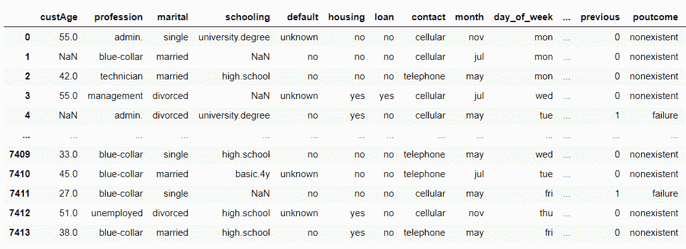
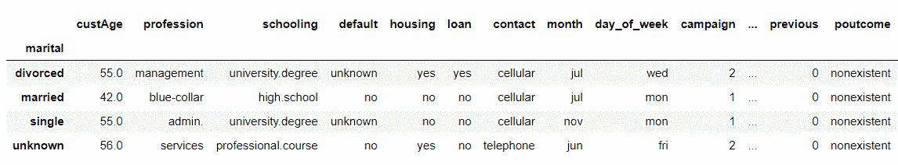
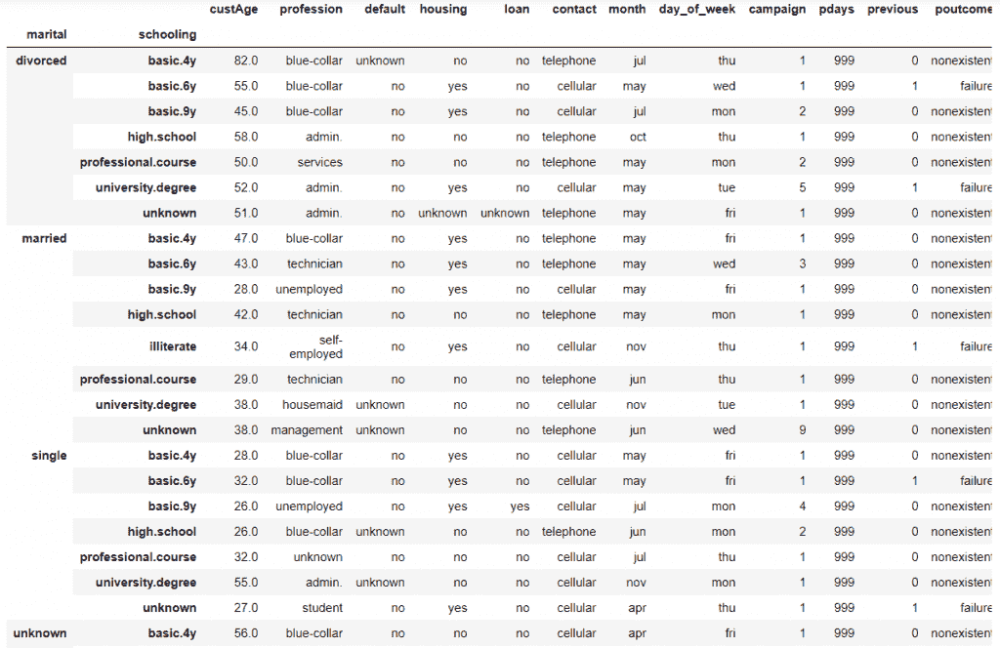
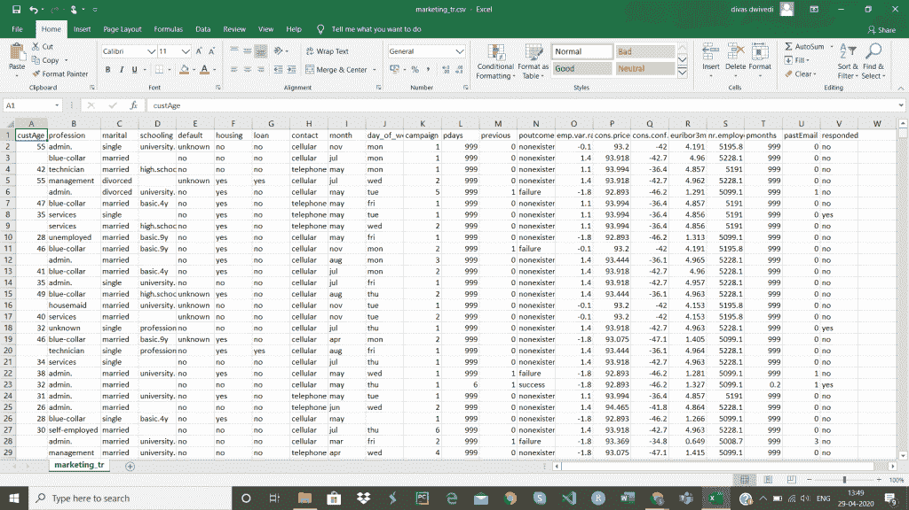
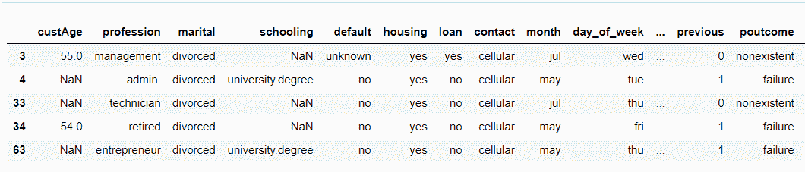

# 了解熊猫 groupby()函数

> 原文：<https://www.askpython.com/python-modules/pandas/pandas-groupby-function>

嘿，伙计们！在本文中，我们将了解 **Pandas groupby()函数**以及它所提供的不同功能。

* * *

## 什么是 groupby()函数？

[Python Pandas 模块](https://www.askpython.com/python-modules/pandas/python-pandas-module-tutorial)广泛用于更好的数据预处理，并与数据可视化密切相关。

Pandas 模块具有各种内置功能，可以更有效地处理数据。Pandas 的`dataframe.groupby() function`模块用于根据某些预定义的条件或选项，从整个数据集中分割和分离出一部分数据。

**语法:**

```py
dataframe.groupby('column-name')

```

使用上面的语法，我们可以拆分数据集，并选择属于传递的列的所有数据作为函数的参数。

**输入数据集:**



**Input Dataset Pandas groupby() Function**

**举例:**

```py
import pandas
data = pandas.read_csv("C:/marketing_tr.csv")
data_grp = data.groupby('marital')
data_grp.first()

```

在上面的例子中，我们使用了 groupby()函数来拆分和单独创建一个新的数据框，其中所有数据分别属于“婚姻”列。

**输出:**



**Python Pandas groupby() function**

* * *

## 多列 Pandas groupby()函数

使用`Pandas dataframe.groupby() function`可以按照**多列值**分割数据。因此，我们可以将多个列标记作为参数传递，以便只将数据值与那些列值一起分割和隔离。

**语法:**

```py
dataframe.groupby(['column1', 'column2', ...., 'columnN'])

```

**举例:**

```py
import pandas
data = pandas.read_csv("C:/marketing_tr.csv")4
data_grp = data.groupby(['marital','schooling'])
data_grp.first()

```

**输出:**



**Grouping Multiple Columns Using groupby() function**

* * *

## Pandas groupby()函数查看群组

除了根据特定的列值分割数据之外，我们甚至可以使用`dataframe.groupby().groups`函数查看由列的类别组成的每个组的详细信息。

以下是本例中使用的样本数据集的快照:



Marketing Tr Csv 1

**语法:**

```py
dataframe.groupby('column').groups

```

**举例:**

```py
import pandas
data = pandas.read_csv("C:/marketing_tr.csv")
data_grp = data.groupby('marital').groups
data_grp

```

如上所示，我们已经拆分了数据，并从列“婚姻”中形成了一个新的数据框架。

此外，我们还使用了 groupby()。groups 函数显示该特定列中所有类别的值。

此外，它还表示这些类别在原始数据集中的位置，以及数据类型和值的数量。

**输出:**

```py
{'divorced': Int64Index([   3,    4,   33,   34,   63,   66,   73,   77,   98,  112,
             ...
             7284, 7298, 7300, 7326, 7349, 7362, 7365, 7375, 7391, 7412],
            dtype='int64', length=843),
 'married': Int64Index([   1,    2,    5,    7,    8,    9,   10,   11,   13,   14,
             ...
             7399, 7400, 7403, 7404, 7405, 7406, 7407, 7408, 7410, 7413],
            dtype='int64', length=4445),
 'single': Int64Index([   0,    6,   12,   16,   18,   19,   24,   29,   31,   32,
             ...
             7383, 7385, 7386, 7390, 7397, 7398, 7401, 7402, 7409, 7411],
            dtype='int64', length=2118),
 'unknown': Int64Index([2607, 4770, 4975, 5525, 5599, 5613, 6754, 7221], dtype='int64')}

```

* * *

## 使用 Pandas groupby()函数选择组

正如到目前为止所看到的，我们可以查看不同类别的唯一值的概述，这些值在列中有详细信息。

使用`dataframe.get_group('column-value')`，我们可以显示属于由 groupby()函数分组的列的特定类别/数据值的值。

**语法:**

```py
dataframe.get_group('column-value')

```

**举例:**

```py
import pandas
data = pandas.read_csv("C:/marketing_tr.csv")
data_grp = data.groupby('marital')
df = data_grp.get_group('divorced')
df.head()

```

在上面的示例中，我们显示了属于“婚姻”列的值为“离婚”的列的数据。

**输出:**



**Selecting a group Using groupby() function**

* * *

## 结论

因此，在本文中，我们已经详细了解了 Pandas groupby()函数的工作原理。

* * *

## 参考

*   Pandas groupby()函数— JournalDev