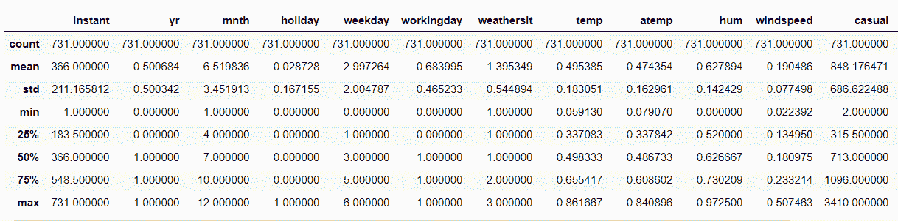

# 熊猫数学的数据分析功能，你应该知道！

> 原文：<https://www.askpython.com/python-modules/pandas/pandas-math-functions>

读者朋友们，你们好！在本文中，我们将详细关注用于数据分析的 **Python Pandas 数学函数**。所以，让我们开始吧！

* * *

## 熊猫数学函数在数据分析中的作用

在统计和数据分析领域，基本任务是分析数据并从中得出观察结果，以便在此基础上建立更好的模型。同样，我们也有必要探索在分析数据的过程中有助于从中提取有意义信息的函数。

Python 编程为我们提供了包含各种函数的 [Pandas 模块](https://www.askpython.com/python-modules/pandas/python-pandas-module-tutorial)，使我们能够分析数据值。

数据分析仅仅意味着从原始数据源中提取有意义的信息。这些信息使我们对数据的分布和结构有所了解。

在本文中，我们将了解以下功能:

*   熊猫。DataFrame.mean()函数
*   熊猫。DataFrame.sum()函数
*   熊猫。DataFrame.median()函数
*   **熊猫最小()和最大()函数**
*   熊猫。DataFrame.value_counts()函数
*   熊猫。DataFrame.describe()函数

在接下来的部分中，让我们逐一了解一下！

在本文中，我们利用了自行车租赁预测数据集。你可以在这里找到数据集[！](https://github.com/Safa1615/BIKE-RENTAL-COUNT/blob/master/day.csv)

* * *

## 1.熊猫意味着()函数

均值作为一个统计值，通过单个值表示数据的整个分布。使用 **dataframe.mean()** 函数，我们可以获得单个列或多个列(即整个数据集)的平均值。

**举例:**

在本例中，我们对整个数据集应用了 mean()函数。

```py
BIKE.mean()

```

**输出:**

因此，数据集所有列的平均值如下所示

```py
instant        366.000000
season           2.496580
yr               0.500684
mnth             6.519836
holiday          0.028728
weekday          2.997264
workingday       0.683995
weathersit       1.395349
temp             0.495385
atemp            0.474354
hum              0.627894
windspeed        0.190486
casual         848.176471
registered    3656.172367
cnt           4504.348837
dtype: float64

```

* * *

## 2.熊猫 sum()函数

除了 mean()函数之外，我们还可以利用 **Pandas sum()函数**在更大的范围内获得列值的总和。这使我们能够从数量上对数据有一个更广阔的视角。

**举例:**

这里，我们通过对整个数据集应用 sum()函数计算了数据集每一列的总和。

```py
BIKE.sum()

```

**输出:**

```py
instant                                                  267546
dteday        2011-01-012011-01-022011-01-032011-01-042011-0...
season                                                     1825
yr                                                          366
mnth                                                       4766
holiday                                                      21
weekday                                                    2191
workingday                                                  500
weathersit                                                 1020
temp                                                    362.126
atemp                                                   346.753
hum                                                     458.991
windspeed                                               139.245
casual                                                   620017
registered                                              2672662
cnt                                                     3292679
dtype: object

```

* * *

## 3.熊猫中位数()函数

使用 median()函数，我们可以得到一组数据的 50%值或中心值。

**举例:**

这里，我们对数据集的每一列都应用了 median()函数。

```py
BIKE.median()

```

**输出:**

在这里，我们看到数据集每一列的中值。

```py
instant        366.000000
season           3.000000
yr               1.000000
mnth             7.000000
holiday          0.000000
weekday          3.000000
workingday       1.000000
weathersit       1.000000
temp             0.498333
atemp            0.486733
hum              0.626667
windspeed        0.180975
casual         713.000000
registered    3662.000000
cnt           4548.000000

```

* * *

## 4.熊猫 min()和 max()函数

使用 min()和 max()函数，我们可以获得数据集每一列的最小值和最大值，以及数据帧的单个列。

**举例:**

这里，我们应用了 max()函数来获取数据集每一列的最大限制。

```py
BIKE.max()

```

**输出:**

```py
instant              731
dteday        2012-12-31
season                 4
yr                     1
mnth                  12
holiday                1
weekday                6
workingday             1
weathersit             3
temp            0.861667
atemp           0.840896
hum               0.9725
windspeed       0.507463
casual              3410
registered          6946
cnt                 8714
dtype: object

```

* * *

## 5.Pandas value_counts()函数

使用 **value_counts()函数**，我们可以获取变量中每个类别或组的计数。这对于分类变量是有益的。

**举例:**

```py
BIKE.season.value_counts()

```

这里，我们对季节变量应用了 value_counts()函数。如下所示，我们将变量中每个组的计数作为一个单独的类别。

**输出:**

```py
3    188
2    184
1    181
4    178

```

* * *

## 6.熊猫描述()函数

用 describe()函数，我们立刻得到下面的统计信息:

*   **每列数据值的计数**
*   **表示**
*   **标准偏差**
*   **最小值**
*   **最大值**
*   **25%值【第一个四分位数】**
*   **50%，即中位数**
*   **75%值【第三个四分位数】**

**举例:**

```py
BIKE.describe()

```

**输出:**



Pandas Describe Dataframe

* * *

## 结论

到此，我们就结束了这个话题。如果你遇到任何问题，欢迎在下面评论。

更多与 Python 编程相关的帖子，请继续关注我们。

在那之前，学习愉快！！🙂