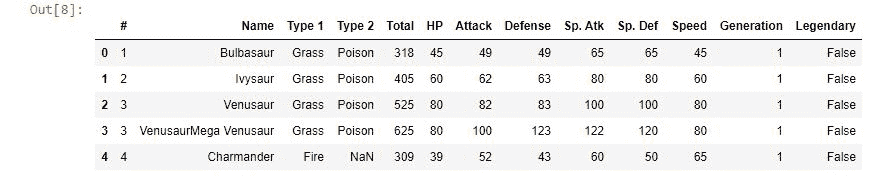
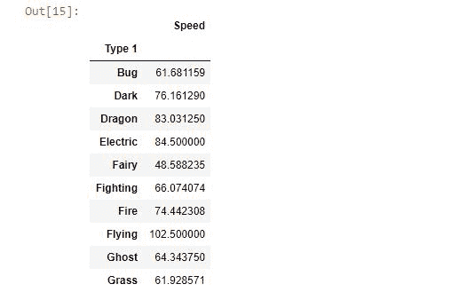
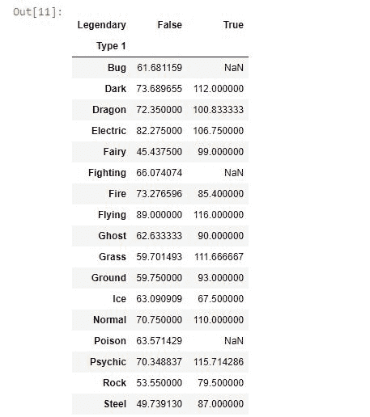
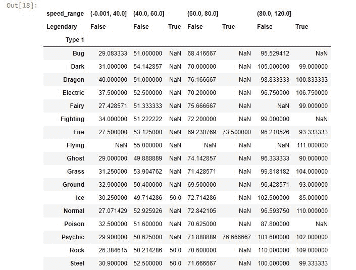

# Python 中的熊猫数据透视表–简易指南

> 原文：<https://www.askpython.com/python-modules/pandas/pandas-pivot-tables>

在本文中，我们将讨论 Python 中的数据透视表。我们将使用 [Pandas 模块](https://www.askpython.com/python-modules/pandas/python-pandas-module-tutorial)中的 pivot_table 函数实现相同的功能。

## 什么是数据透视表？

数据透视表是 Microsoft Excel 的一个关键特性，也是 Excel 在企业界如此受欢迎的原因之一。

数据透视表为执行数据分析提供了极大的灵活性。

它允许我们将列转换为行，将行转换为列。由于它允许基于任何参数进行分组，因此很容易与函数的 [pandas Groupby 混淆。](https://www.askpython.com/python-modules/pandas/pandas-groupby-function)

可以将数据透视表看作是`GroupBy`函数的多维版本。

## 用 Python 实现数据透视表的步骤

让我们直接进入 Python 中数据透视表的实现。

### 1.加载您选择的数据集

我们将使用统计数据集(从 Kaggle 下载)分析神奇宝贝。在这里可以得到数据集[。](https://www.kaggle.com/abcsds/pokemon)

不管你是否喜欢口袋妖怪，你仍然可以从这篇文章中得到 100%。

**要抓住他们所有人……**🙂

```py
import pandas as pd

#importing the dataset
data = pd.read_csv('Pokemon.csv')
data.head()

```



Dataset

### 2.pivot_table()方法语法

```py
DataFrame.pivot_table(data, values=None, index=None,columns=None, aggfunc='mean')

```

在对一个[数据帧](https://www.askpython.com/python-modules/pandas/dataframes-in-python)调用了`pivot_table`方法之后，让我们分解给这个方法的基本输入参数。

*   **数据**–这是我们应用聚合函数的数字列。比如销量，速度，价格等。
*   **index**–我们要转换为行的列。我们可以将多个值作为一个列表传递。
*   **列**–我们现在希望保留为列的列变量。
*   **agg func**–对数据执行的操作类型。即总和、平均值、计数等。

举个例子会更清楚。

### 3.用 Python 实现 pivot_tables

假设我们需要找到属于 Type-1 的神奇宝贝的平均速度。

使用 pandas `Groupby`可以很容易地做到这一点，但是使用代码更加简洁的`pivot_table`也可以很容易地实现相同的输出。

通过每个例子，我们将慢慢探索 pivot_table 的全部优点。

```py
df.groupby(['Type 1'])[['Speed']].mean()

```

使用`pivot_table`的类似结果

```py
df.pivot_table('Speed' , index = ['Type 1'], aggfunc = 'mean')

```



Result With gropuby And Pivot Table

### 4.使用数据透视表查找平均速度

但是现在如果我们被要求找出每一个 1 型神奇宝贝的平均速度，并把它们分成传奇和非传奇。

```py
df.pivot_table('Speed' , index = ['Type 1'] , columns= ['Legendary'] , aggfunc = 'mean')

```



Mean Speed Legendary Vs Non Legendary Pokémon’s

Tada！只需一行代码，我们就能获得想要的结果。

我不禁注意到，一般来说，传说中的神奇宝贝比非传说中的要快。数据透视表的魔力。

这里需要理解的一件重要事情是，我们需要 Type 1 列作为我们的索引，所以我们将它传递给 pivot_table 方法中的 index 参数。

但是现在，由于每个 1 型口袋妖怪都属于传奇或非传奇类别，我们只是以某种方式转换了我们的数据框架，以便它现在显示每种类型的平均速度。

现在，我们的数据中有了传奇或非传奇的特征。

由于我们需要数据中的“传奇”特性作为新数据的列，我们只需要在`columns`参数中传递它。让我们稍微修改一下数据集，做一些新的分析。

**我们现在创建速度可变的箱，作为新增加的功能。**

```py
df['speed_range'] = pd.cut(df['Speed'] , [0,40,60,80,120] , include_lowest=True)

```

现在让我们输出一个数据帧，显示基于传奇特征和速度范围特征的平均速度。

```py
df.pivot_table('Speed' , index = ['Type 1'] , columns= ['speed_range','Legendary'] , aggfunc = 'mean')

```



Legendary As Well As Range Of Speed As Columns

我鼓励你在泰坦尼克号数据集上尝试熊猫`pivot_table`,因为它将补充你对该主题的练习。

Python 中的数据透视表不是一个容易掌握的主题，但是考虑到它所提供的好处，人们必须明确地将这些知识包含在他们的分析工具包中。记住练习是这里的关键！

## 结论

如果这篇文章，我们试图通过在数据集上实现它来获得一些关于熊猫的想法。我们意识到它是 groupby 操作的多维版本(从概念上讲)。快乐学习！