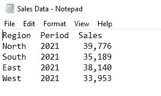
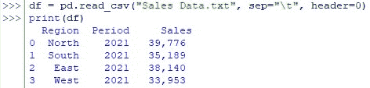
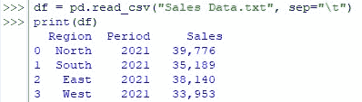

# 如何使用熊猫阅读带标题的 CSV？

> 原文：<https://www.askpython.com/python-modules/pandas/pandas-read-csv-with-headers>

虽然 Python 完全适合于分析数据，但它天生就没有应该分析的数据集来源。所有这些数据集都将从其他地方获得，并被输入 Python，以便让奇迹发生。我们将探索一种这样的技术，使用 Python 的内置特性之一将数据导入 Python。本文中感兴趣的文件也应该有点特殊——一个带头文件的 CSV 文件！

我们将使用下面的数据集来演示操作的顺序，其中一行中的每个条目都由一个“制表符”分隔开。我们开始吧！



Text File for Demonstration

***也读: [Python 熊猫模块教程](https://www.askpython.com/python-modules/pandas/python-pandas-module-tutorial)***

* * *

## **进口熊猫:**

我们应该使用下面的代码将 Pandas 库导入到活动的 Python 窗口中。

```py
import pandas as pd

```

完成后点击回车&等待一会儿，软件会在后台加载“熊猫”库。这可以通过每行代码前的箭头很好地发现。在“熊猫”满载之前，这些箭头不应出现在新行中。


No Arrows when Pandas are loading

只有在成功加载熊猫后，这些箭头才会出现，如下图所示。


Arrows Appear after Pandas are Loaded

* * *

## **使用 read_csv()** 读取带头文件的 csv 文件

CSV 代表逗号分隔值。你会问，哪些值是文本文件中的值！

这意味着文本文件中的值由逗号分隔，以将一个条目与另一个条目隔离开来。尽管 CSV 只使用“逗号”作为分隔符，但它被广泛用于表示文本文件，在这些文件中，分隔符是由制表符、空格甚至冒号来实现的。

下面是 read_csv() 的[语法。](https://www.askpython.com/python-modules/pandas/read-csv-with-delimiters)

```py
df = pd.read_csv(“filename.txt”,sep=”x”, header=y, names=[‘name1’, ‘name2’…])

```

在哪里，

*   df-数据帧
*   filename . txt–要导入的文本文件的名称。
*   x–中使用的分隔符类型。csv 文件。
    *   “\ t”-制表符
    *   “，”–逗号
    *   “”–空间等等
*   y–数据中的标题类型
    *   无–如果第一行中的条目不是标题
    *   0–如果第一行中的条目是标题

现在我们将应用这个语法从本文前面显示的文本文件中导入数据。

“filename.txt”被替换为“Sales Data.txt”，“x”被替换为“\ t”& y 被替换为 0(零)，因为数据包含标题行。在这些替换之后，产生的代码应该如下所示:

```py
df = pd.read_csv("Sales Data.txt", sep="\t", header=0)

```

按回车键&如果箭头在完全沉默片刻后出现，应该知道没有任何错误。


The Arrowheads Appear!

箭头表明数据已经成功地导入到 Python 中，但是如果我们没有偷偷看一眼，这会让我们感到满意吗？

Python 中可用的 print()命令就是为了达到这个目的。使用 read_csv()命令加载数据的数据框现在可以使用，

```py
print(df)

```

输入上述&后，点击**回车**，导入的数据如下图所示。



Viewing the Imported Data

还要注意的是，即使 header=0 在代码中被跳过，read_csv()被设置为默认选择 0 作为头(即第一行)作为头，以便数据被导入时考虑相同的内容。



Importing Data With Default Header Setting

* * *

## **总结**

既然我们已经到了这篇文章的结尾，希望它已经详细阐述了如何使用 Python 中的 Pandas 来读取带头文件的 CSV 文件。这里有另一篇文章详细介绍了 fillna()方法在 Pandas 中的用法。在 [AskPython](https://www.askpython.com/) 中还有许多其他有趣的&文章，这些文章可能对那些想提高 Python 水平的人有很大帮助。