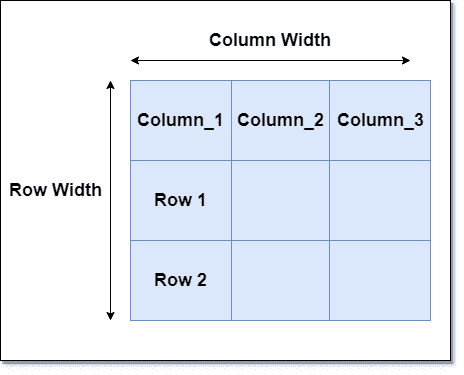
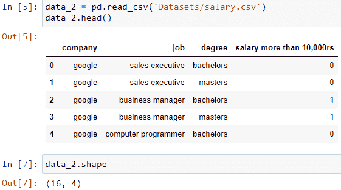
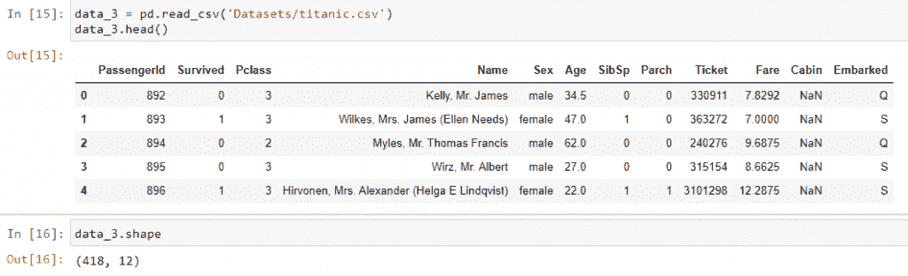

# 熊猫形状属性-完整指南

> 原文：<https://www.askpython.com/python-modules/pandas/pandas-shape-attribute>

Pandas 是一个用于外部数据预处理和内部数据集创建的扩展库。它是帮助预处理信息和清理信息以便更好地使用的主要软件包之一。

最好的特性是它能够从服务器读取大量数据。

这对 Python 的网络抓取和在线收集关键点有很大帮助。这篇文章谈到了这个模块的一个显著特征，那就是**熊猫的形状属性。**

### 先决条件

在我们开始之前，主要的事情是我们需要检查这个游戏的工具和武器。所以，让我们确保这一点。

**工具和技术:**

1.  **Python:*3.6 以上版本***
2.  **IDE: *[Jupyter 笔记本](https://www.askpython.com/python/jupyter-notebook-for-python)***
3.  **浏览器:*谷歌 Chrome***
4.  **环境: *[蟒蛇](https://www.askpython.com/python-modules/python-anaconda-tutorial)***
5.  **支持包: *[Numpy](https://www.askpython.com/python-modules/numpy/python-numpy-module) 和 [Matplotlib](https://www.askpython.com/python-modules/matplotlib/python-matplotlib)***
6.  *稳定的互联网连接(仅在从服务器读取数据时需要)*。

此外，我们还将确定我们将在本文中涵盖哪些内容:

**我们将在本文中讨论的内容:**

1.  熊猫的形状属性是什么
2.  读取数据集
3.  使用数据集中的**形状**

现在我们已经准备好了，让我们开始吧！

## 熊猫中的形状属性是什么？



General Format Of Table 1

数据框是关于特定主题的信息的实际表示。这可以来自各种数据流和行业部分。在这个现代化的世界中，来自特定部门的每个个人和组织都可能维护着关键数据。它的主要格式是表格。但是这些表格数据有各种扩展，如 SQL、Excel、JSON 等。下图显示了实际图片:

它可大可小。大多数情况下，数据手册比我们预期的要大得多。因此，在记录行数和列数时，可能会出现一些人为错误。

因此，为了解决这个困难，pandas 库中的 shape 属性用于检查数据集或数据框中的实际行数和列数。

**读取任何数据集形状的语法**–这是读取数据集形状的通用语法:

```py
dataframe.shape

```

## 在 Pandas 中读取数据集

数据集读数将把实际存在的东西带入图像中。这是使用 Pandas 中的**读取**功能完成的。不同的文件扩展名有不同的格式。我们将阅读**三个**数据集来检查每一个的形状。

**使用的数据集:**

1.  ***Test_set.csv***
2.  ***salary.csv***
3.  ***titanic . CSV***

### 读取数据集的一般语法:

```py
import pandas as pd
data_variable = pd.read_file('filename.extension') 

# The read_file method is an example. There are different methods for each file extension.

```

#### 数据集 1


Reading dataset 1 and retrieving its shape

在上图中，我们可以看到 shape 属性是如何工作的。它返回一个有两个值的元组。请记住，第一个值表示行数，第二个值表示列数。简而言之，这告诉我们数据集要大得多。它有 2671 行和 10 列。

### 数据集 2



Reading dataset 2 and retrieving its shape

它的名字叫 **salary.csv** 这个数据集形状是(16，4)。因此它有 16 行和 4 列。

### 数据集 3



Reading dataset 3

这个数据集是 titanic.csv。从 shape 属性中，我们可以看到它在这个数据集中有 **418 行和 12 列。**

### 使用 shape 属性的一些不同方法

通过这三个例子，我们知道了如何使用**形状**。对于这个属性，我们可以利用一些值得注意的要点。

1.  **仅检索行数。**
2.  **仅检索列计数。**

正如我们所知，它返回一组行，列。因此，我们可以为此使用**索引**切片。元组是不可变的，但是可以通过索引方法访问这些元素。这和我们处理列表是一样的。让我们看一个代码库示例:

```py
tupple_1 = (12, 42, 45,90)

tuple_1[3]
tuple_1[0]
tuple_1[1]

# Output
# 90
# 12
# 42

```

**为了检索行计数，访问第零个索引，为了检索列计数，访问第一个索引**

```py
data.shape[0] # returns number of rows
data.shape[1] # returns number of columns

```

## 结论

这就是熊猫的形状属性的表现。这是一个非常重要的功能，也是我们用于数据预处理的关键功能之一。