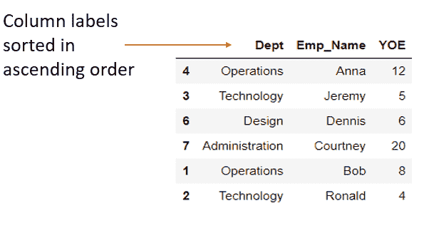

# Pandas sort_index()函数

> 原文：<https://www.askpython.com/python-modules/pandas/pandas-sort_index>

[Pandas](https://www.askpython.com/python-modules/pandas/python-pandas-module-tutorial) 是一个 Python 库，主要用于数据分析。熊猫让导入、清理、探索、操作和分析数据变得更加容易。在本教程中，我们将学习熊猫的`sort_index()`功能。

* * *

## sort_index()函数语法

```py
DataFrame.sort_index(axis=0, level=None, ascending=True, inplace=False, kind='quicksort', na_position='last', sort_remaining=True, ignore_index=False, key=None)

```

| **参数** | **描述** | **可能值** | **默认值** |
| 轴 | 按要排序的坐标轴排序。 | 0 /'索引'，
1 /'列' | Zero |
| 水平 | 引用数据帧排序的级别。如果不是 None，则按指定索引级别中的值排序。 | int 或 level 名称或 int 列表或 level 名称列表 | 钠 |
| 上升的 | 按升序或降序排序。 | 布尔值或布尔值列表:“真”、“假” | 真实的 |
| 适当的 | 修改现有数据框架或创建新的数据框架。 | bool: ‘True’, ‘False’ | 错误的 |
| 种类 | 要应用的排序算法的种类。 | “快速排序”、“合并排序”、“堆排序”、“稳定” | 快速分类 |
| na _ 位置 | 放置 NaNs 的位置。 | “第一个”，“最后一个” | 最后的 |
| 排序 _ 剩余 | 指定在按指定级别排序后，数据帧是否要按其他级别排序。 | bool: ‘True’, ‘False’ | 真实的 |
| 忽略 _ 索引 | 如果为真，结果轴将被标记为 0，1，…，n–1。 | bool: ‘True’, ‘False’ | 错误的 |
| 键 | 指定是否要根据某个自定义键对数据帧进行排序 | 用户定义的任何自定义键 | 钠 |

**返回:**一个排序后的对象，即 dataframe。如果`inplace=True`，原始数据帧本身被排序，否则用户必须指定一个新的数据帧来存储结果。如果没有分配新的数据帧和`inplace=False`，则不返回任何数据。

该函数既适用于数字索引值，也适用于非数字索引值。

* * *

### 创建数据帧

在跳到这里的例子之前，让我们先创建一个数据帧。这将帮助我们处理数据帧并理解 Python sort_index()函数的实现。

```py
import pandas as pd 
import numpy as np

data = {
    'Emp_Name' : ["Anna", "Jeremy", "Dennis", "Courtney", 
                            "Bob", "Ronald"],
    'Dept' : ["Operations", "Technology", "Design", "Administration",
                 "Operations", "Technology"],
    'YOE' : [12, 5, 6, 20, 8, 4]
}

Emp_Id = [4, 3, 6, 7, 1, 2]
emp_data = pd.DataFrame(data, index=Emp_Id)
emp_data

```

**输出:**


Dataframe for Sort Index Examples

这是一个用于存储公司员工信息的数据框架。由员工姓名**(员工姓名)**、工作部门**(部门)**和工作年限 **(YOE)** 组成。数据是根据上面代码中指定的雇员 Id **(Emp_Id)** 排列的。

* * *

## 例子

让我们直接进入例子来理解 sort_index()函数是如何实现的以及它是如何工作的。

### 1.按索引的升序排序

```py
# by default, axis=0 so sorting is done by row
emp_data2 = emp_data.sort_index()

emp_data2

```

**输出:**


Sort Index in Ascending order

在上面的示例中，我们创建了一个名为**‘Emp _ data 2’**的新数据帧，并根据索引对其进行排序，即按照**升序**对‘Emp _ Id’进行排序。结果，我们得到了上图所示的数据帧。

* * *

### 2.按索引的降序排序

```py
# by default, axis=0 so sorting is done by row
emp_data2.sort_index(ascending=False, inplace=True)

emp_data2

```

**输出:**


Sort Index in Descending order

这里，我们通过在代码中指定`ascending=False`对数据帧进行了降序排序。按照规定，`inplace=True`并且由于我们没有给函数分配任何新的数据帧，`emp_data2`被排序为**代替**。

* * *

### 3.根据列标签按升序排序

```py
# axis=1 implies sort by column
emp_data3 = emp_data.sort_index(axis=1)

emp_data3

```

**输出:**



Sort Index By Column In Ascending Order

在这种情况下，我们有一个名为**‘EMP _ data 3’**的结果数据帧，其中列标签按升序排序，即按字典顺序排序。列标签'雇员姓名'、'部门'和' YOE '的**字典顺序**是**、'部门'、'雇员姓名'、' YOE'** ，因此列现在按此顺序排列。

类似地，我们可以通过写`emp_data.sort_index(axis=1, ascending=False)`来按照列标签的降序对数据帧进行排序。这将导致下面的数据帧。


Sort Index By Column In Descending Order

* * *

### 4.使用 na_position 参数定位 nan

让我们考虑前面的 employee 数据框架的一个稍微修改的版本，如下所示。

```py
import pandas as pd 
import numpy as np

data = {
    'Emp_Name' : ["Anna", "Jeremy", "Dennis", "Courtney", 
                            "Bob", "Ronald"],
    'Dept' : ["Operations", "Technology", "Design", "Administration", 
                  "Operations", "Technology"],
    'YOE' : [12, 5, 6, 20, 8, 4]
}

Emp_Id = [4, np.nan, 6, np.nan, 1, 2]
emp_df = pd.DataFrame(data, index=Emp_Id)
emp_df

```


Dataframe With NaN

上面的数据帧在索引中有一些 NaN 值，即 Emp_Id。让我们看看如何定位这些价值。

### a.首先定位 NaNs

```py
emp_df2 = emp_df.sort_index(na_position='first')

emp_df2

```

**输出:**


NaN values Placed First

这里，数据帧基于其索引即 Emp_Id 进行排序，并且 NaN 值被放置在结果数据帧的第**个**中。

***也读作:[如何用 0 替换熊猫数据帧中的 NaN 值？](https://www.askpython.com/python-modules/pandas/replace-nan-values-with-zero-pandas)***

### b.定位 NaNs 最后

```py
emp_df3 = emp_df.sort_index(na_position='last')

emp_df3

```

**输出:**


NaN values Placed Last

在本例中，数据帧根据其索引(即 Emp_Id)进行排序，NaN 值放在结果数据帧的最后处**。**

* * *

## 结论

这教程里都有！我们已经学习了熊猫的 sort_index()函数。你可以通过跟随我们的教程[这里](https://www.askpython.com/python-modules/pandas)了解更多关于熊猫的知识。

* * *

## 参考

*   [sort_index()官方文档](https://pandas.pydata.org/docs/reference/api/pandas.DataFrame.sort_index.html)