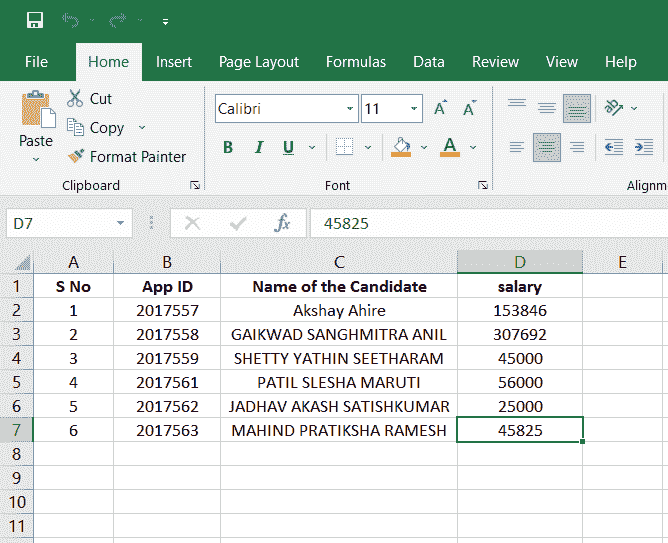
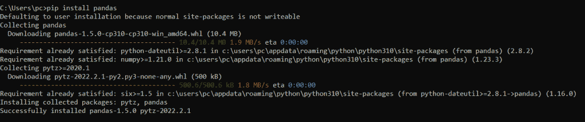
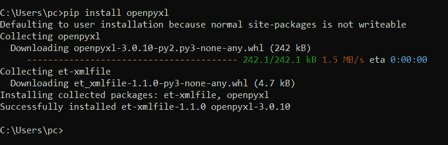
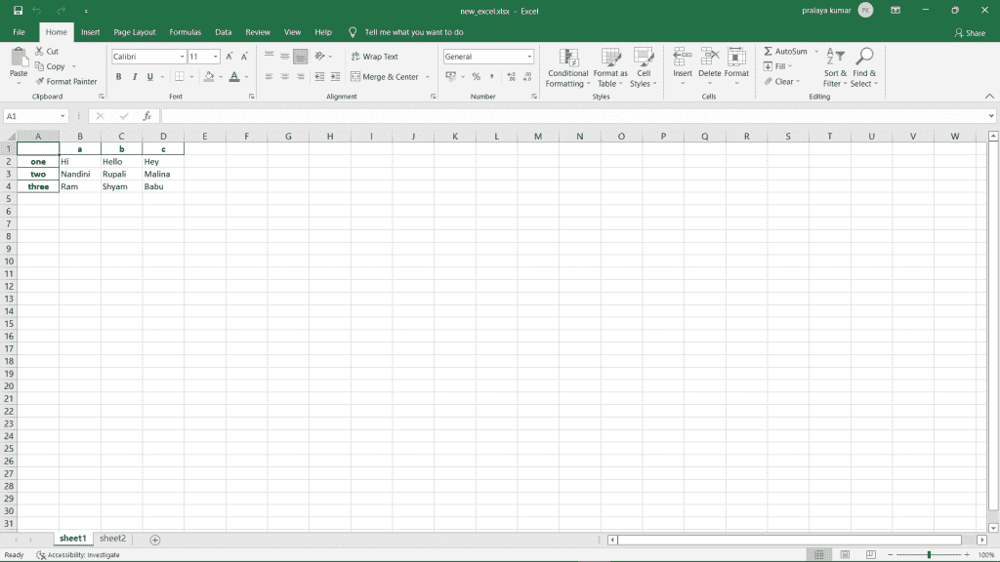
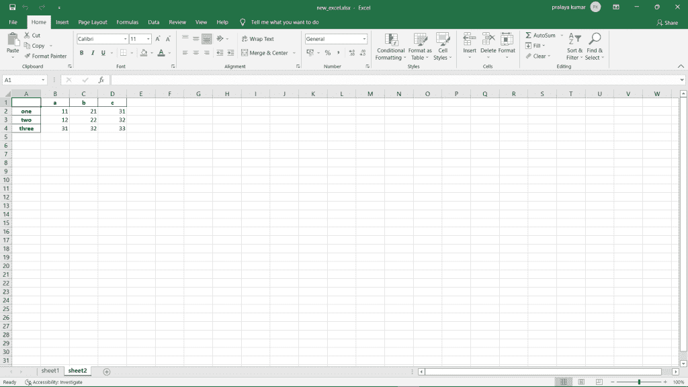

# 使用 Python 熊猫编写 Excel 文件

> 原文：<https://www.askpython.com/python-modules/pandas/pandas-write-to-excel>

如果你和我一样，喜欢寻找新的有趣的方法来处理数据。还有什么比在 Excel 中处理数据更有趣的呢？

Excel 是处理数据的强大工具，Python Pandas 使它变得更加简单。在这篇文章中，我将向您展示如何使用 Python Pandas 将数据写入 Excel 文件。

我将首先向您展示如何安装 Pandas 并创建一个数据框架。然后我将向您展示如何使用 Pandas 将数据写入 Excel 文件。

***也读:[xlrd 模块——如何用 Python 处理 Excel 文件？](https://www.askpython.com/python-modules/xlrd-module)***

## 什么是 Excel 文件？

Excel 文件是一种电子表格文件，包含行和列中的一些单元格(表格视图)，有助于数据的排列、计算、排序和管理。

电子表格中的数据可以是数字、文本、公式、超链接、函数等。XLS 文件将数据存储为二进制流。它只能由最流行的 MS Excel 或其他电子表格程序创建。文件格式。xlsx 总是单独表示一个 excel 文件。

下图描述了由 MS-excel 程序创建的 excel 文件:



The Excel File By MS Excel 1

## 熊猫模块

它是 Python 中的一个开源库或模块，提供了一些内置的数据结构和数据分析工具。 [**熊猫模块**](https://www.askpython.com/python-modules/pandas/python-pandas-module-tutorial) 的一些关键特性如下。

*   它提供了高效、快速的数据管理和访问方式。
*   它有能力处理集成到其库中的缺失数据。
*   它有一些独特的数据索引技术。
*   它提供了各种各样的内置工具，帮助我们读写数据。
*   它可以支持 JSON、CSV、HDF5 和 Excel 文件。
*   它非常负责合并各种数据集。
*   它让我们可以访问其他有用的库，如 MatPlotLib 和 NumPy。
*   它允许用户对数据集进行各种数学运算。

## 安装 Python 熊猫

在开始阅读本文之前，请确保您的计算机上已经安装了这个模块。您可以通过命令提示符下的以下命令下载该模块。

```py
pip install pandas

```

您可以按如下方式安装 pandas 模块。



Installing Panda Module 2

我们将在本文中使用另一个模块，让我们也理解这一点。

### 安装 openpyxl 模块

`Openpyxl`是一个 Python 库或模块，用于读取或写入 Excel 文件。这个模块需要安装使用 load_workbook()之类的某些方法，否则我们无法使用那些方法，它会抛出`error`。让我们使用命令提示符安装这个模块。

```py
C:\Users\pc> pip install openpyxl

```

上面的代码片段将安装我们的`openpyxl`模块。



Installing Openpyxl Module

## 将单个电子表格写入 Excel 文件

我们首先将它转换成熊猫数据帧，然后将数据帧写入 Excel。将熊猫数据帧导出为 Excel 文件(即。xlsx，。xls 文件)，我们将使用`to_excel()`方法。

遵循以下代码片段:

```py
>>> import pandas as pd
>>> import openpyxl

>>> df = pd.DataFrame([['Hi', 'Hello', 'Hey'], ['Nandini', 'Rupali', 'Malina'], ['Ram','Shyam', 'Babu']], index=['one', 'two', 'three'], columns=['a', 'b', 'c'])

```

如果我们打印上面的数据框，我们可以得到如下结果。

```py
>>> print(df)
             a       b       c
one         Hi   Hello     Hey
two    Nandini  Rupali  Malina
three      Ram   Shyam    Babu
>>>

```

现在，我们将使用下面的代码片段将上述数据框导出到 excel 文件。

```py
df.to_excel('new_excel.xlsx', sheet_name='new_sheet_name')

```

上面的代码片段会自动在我们的 PC 文件夹中创建一个. xlsx 文件。

## 将多个电子表格写入 Excel 文件

让我们创建另一个数据框。

```py
df2 = pd.DataFrame([[11, 21, 31], [12, 22, 32], [31, 32, 33]], index=['one', 'two', 'three'], columns=['a', 'b', 'c'])

```

现在，我们将 df 和 df2 数据框导出到 new_excel 文件中。遵循下面的代码片段

```py
with pd.ExcelWriter('new_excel.xlsx') as writer:
    df.to_excel(writer, sheet_name='sheet1')
    df2.to_excel(writer, sheet_name='sheet2')

```

它将创建一个包含如下两张幻灯片的 excel 文件。



sheet 1



sheet 2

## 摘要

在本文中，我们介绍了两个使用 Python 将数据写入 Excel 文件的例子。我们讨论了适当输出的两个流行模块。希望你喜欢这个快速演示。