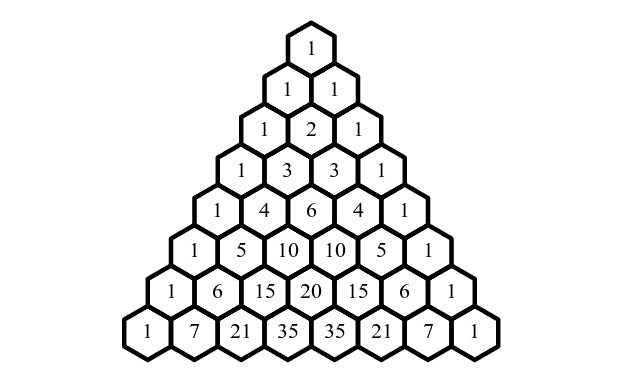

# 使用 Python 的帕斯卡三角形

> 原文：<https://www.askpython.com/python/examples/pascals-triangle-using-python>

帕斯卡三角形是一个由数字排列而成的漂亮形状。每个数字都是通过取上面两个数字的和而生成的。这个三角形的外边总是 1。三角形如下图所示。



Pascals Triangle

简单解释一下三角形，第一行是 1。下面一行有两个 1。这是第二行。

第三行是`1 2 1`,它是通过取前一行的和而形成的。类似地，第四行由交替模式中的 1 和 2 的和形成，以此类推。

## 用 Python 编写帕斯卡三角形

让我们从创建`PascalTriangle`函数开始。

在这个函数中，我们将首先使用`trow`变量初始化顶行。我们也初始化变量 y=0。现在我们将使用 for 循环来运行代码进行`n`迭代。

在循环的[中，我们将打印由`trow`变量初始化的列表。现在我们将添加 trow 的左右元素。除此之外，我们还在这里使用了](https://www.askpython.com/python/python-for-loop) [zip 函数](https://www.askpython.com/python/built-in-methods/python-zip-function)。该函数如下所示。

```py
def PascalTriangle(n):
   trow = [1]
   y = [0]
   for x in range(n):
      print(trow)
      trow=[left+right for left,right in zip(trow+y, y+trow)]
   return n>=1

```

现在只需给出一个带有参数的函数调用，说明所需的行数。如下图所示。

```py
PascalTriangle(6)

```

代码的输出如下所示:

```py
[1]
[1, 1]
[1, 2, 1]
[1, 3, 3, 1]
[1, 4, 6, 4, 1]
[1, 5, 10, 10, 5, 1]

```

## 结论

使用 Python 创建帕斯卡三角形的教程到此结束。试试这段代码，并在下面的评论区告诉我们你的反馈。