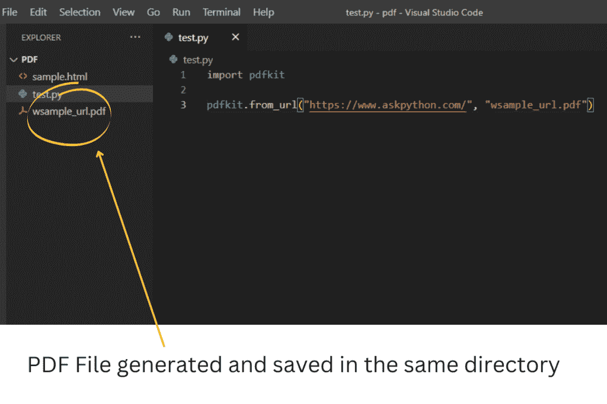
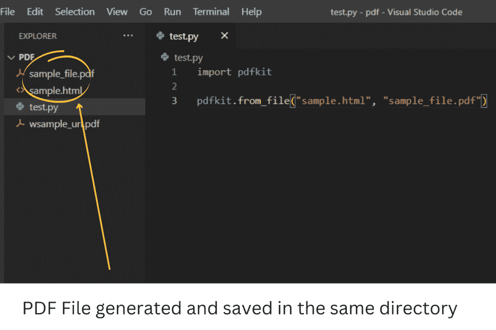
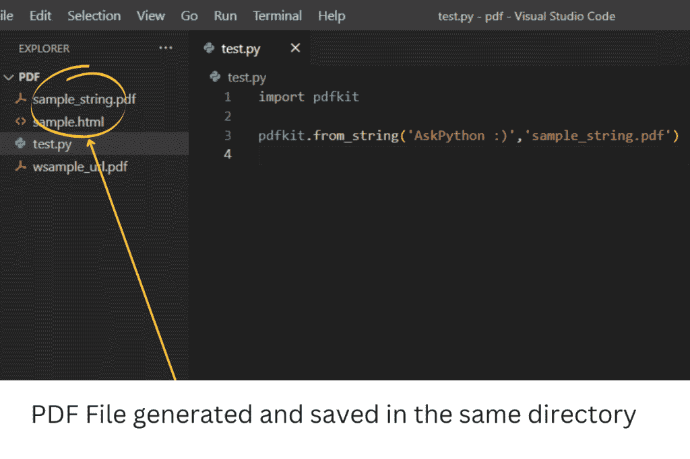

# Python 中的 PDFKit 模块–将 HTML 转换为 PDF

> 原文：<https://www.askpython.com/python-modules/pdfkit-module>

在本文中，让我们了解一个 PDFKit，它是一个 PDF 文档生成开源库。使用 Python 将任何网页转换成 PDF 是最简单的方法。

## 将 HTML 转换为 PDF 的先决条件

在我们开始代码 python 之前，请确保安装 PDFKit。要安装 PDFKit，下面是要使用的命令。

```py
$ pip install pdfkit  (or pip3 for python3)
```

一旦安装了库，安装`wkhtmltopdf`。它是一个开源命令行工具，用于使用 Qt WebKit 渲染引擎将 HTML 渲染为 PDF 和各种图像格式。

对于 Debian/Ubuntu:

```py
$ sudo apt-get install wkhtmltopdf
```

对于 macOS

```py
$ brew install homebrew/cask/wkhtmltopdf
```

对于 Windows [点击这里。](https://github.com/wkhtmltopdf/wkhtmltopdf/releases/download/0.12.4/wkhtmltox-0.12.4_msvc2015-win64.exe)

*记得给环境变量添加路径* `wkhtmltopdf` *以免出错。*

## 使用 Python 将 HTML 转换为 PDF

在实现时，如果你的编辑器抛出一个类似“import error:No module named pdf kit”的错误，请尝试配置当前目录中的路径。这可以通过事先在编辑器中执行以下代码来实现。

```py
path_wkthmltopdf = 'C:\Program Files\wkhtmltopdf\bin\wkhtmltopdf.exe'
config = pdfkit.configuration(wkhtmltopdf=path_wkthmltopdf)

```

**将网址转换成 PDF 格式**

```py
import pdfkit

pdfkit.from_url("https://www.askpython.com/", "sample_url.pdf")

```

**输出**



Pdfkit 1

**将 HTML 文件转换成 PDF**

*   记住你要转换成 PDF 的文件应该是`.HTML` 格式。
*   此外，该文件应该位于同一个目录中。

```py
import pdfkit

pdfkit.from_file("sample.html", "sample_file.pdf")

```

**输出**



Pdfkit 2

**将字符串转换成 PDF**

```py
import pdfkit

pdfkit.from_string('AskPython :)','sample_string.pdf')

```

**输出**



Pdfkit 3

## 摘要

在本文中，我们讨论了 PDFKit 包装器或库。PDFKit for python 是 ruby PDFKit 库的改编版本。此外，我们还学习了用 python 将网页、HTML 文件或字符串转换成 pdf 的最简单方法。