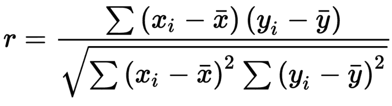
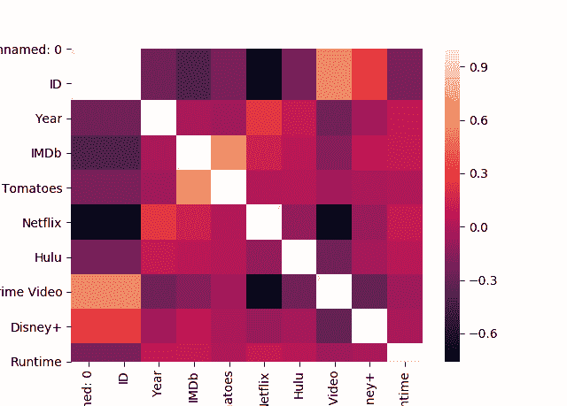

# 皮尔逊相关——在 Python 中实现皮尔逊相关

> 原文：<https://www.askpython.com/python/examples/pearson-correlation>

在本教程中，我将指导您完成**皮尔逊相关性**的 Python 实现。当两个或多个特性以这样的方式链接时，当一个特性的值增加或减少时，另一个特性的值同样增加或减少。这就是术语**【关联】**的含义。

* * *

## 相关性介绍

寻找变量之间的联系是相关性的全部。在数据科学中，我们利用相关性来发现彼此有利和不利关联的特征，以便我们可以使用最佳特征来训练机器学习模型。

**相关度的范围从-1 到 1。**

1.  当**特征之间的相关性为 1 时，特征彼此正相关**。
2.  当特征之间的**相关性为-1 时，特征彼此负相关**。
3.  当特征之间的**相关性等于零时，我们可以断定特征**之间没有关联。

* * *

## 皮尔逊相关简介

**Pearson correlation** 是一种统计方法，用于确定两个或多个特征之间的线性关系强度。

皮尔森相关性的最好例子之一是**需求和供给**。例如，当对一种产品的需求增加时，该产品的供应增加，当对该产品的需求减少时，该产品的供应减少。一种产品的需求和供给之间存在**正相关关系。**

### 皮尔逊相关公式



Pearson Correlation Formula

* * *

## Pearson 相关性在 Python 中的实现

为了观察相关性，我们需要遵循下面描述的一些步骤。

### 步骤 1–导入模块和加载数据集

任何程序的第一步都是加载必要的模块(如果需要的话)。对于这个程序，我们需要导入 [`pandas`模块](https://www.askpython.com/python-modules/pandas/python-pandas-module-tutorial)。稍后，我们将使用`read_csv`函数加载数据集。你可以在这里找到数据集。

```py
import pandas as pd
movies = pd.read_csv("MoviesOnStreamingPlatforms_updated.csv")

```

### 步骤 2–找出所有特征之间的相关性

为了找到相关性，我们将利用`corr`函数并将`method`作为`pearson`传递，因为我们的目标是找到特性之间的皮尔逊相关性。

```py
movies['Rotten Tomatoes'] = movies["Rotten Tomatoes"].str.replace("%", "").astype(float)
movies.drop("Type", inplace=True, axis=1)
correlations = movies.corr(method='pearson')

```

### 步骤 3–可视化关联

为了可视化这种关联，我们将利用`seaborn`图并导入`seaborn`和`matplotlib`模块。最后，我们利用`heatmap`函数并传递我们在上一步中创建的关联。

```py
import seaborn as sns
import matplotlib.pyplot as plt
sns.heatmap(correlations)
plt.show()

```



Pearson Correlation Visualization

* * *

我希望你喜欢这篇关于 Pearson 相关性及其 Python 实现的教程。继续多看教程，不断学习！😇

1.  [Python 中的热图——如何用 Python 创建热图？](https://www.askpython.com/python/examples/heatmaps-in-python)
2.  [用 Python 分析 Cars.csv 文件——完整指南](https://www.askpython.com/python/examples/analyzing-cars-dataset-in-python)
3.  [Python 中的相关矩阵——实际实现](https://www.askpython.com/python/examples/correlation-matrix-in-python)

* * *