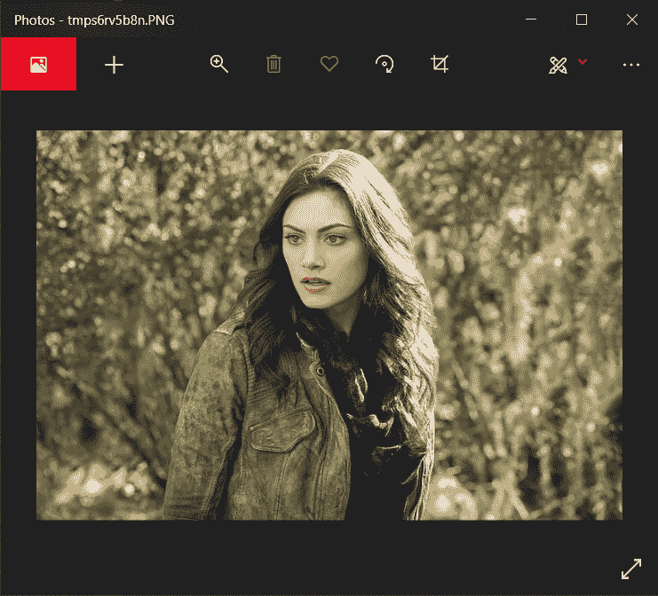
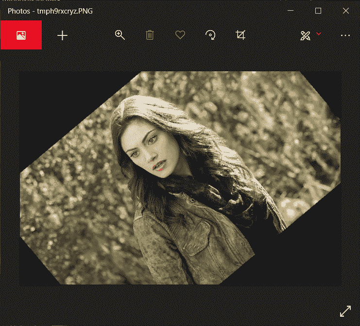
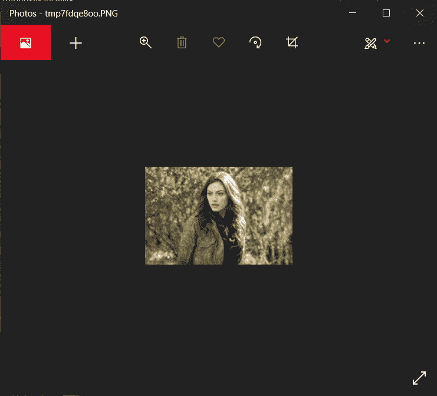
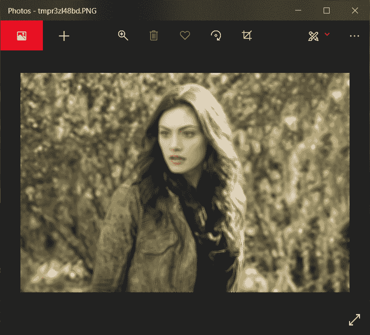
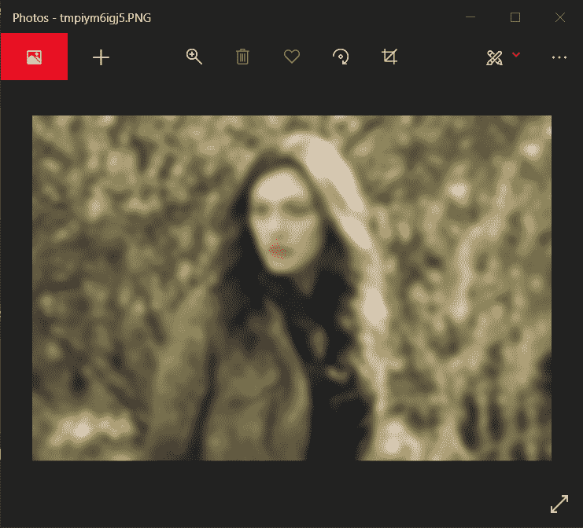
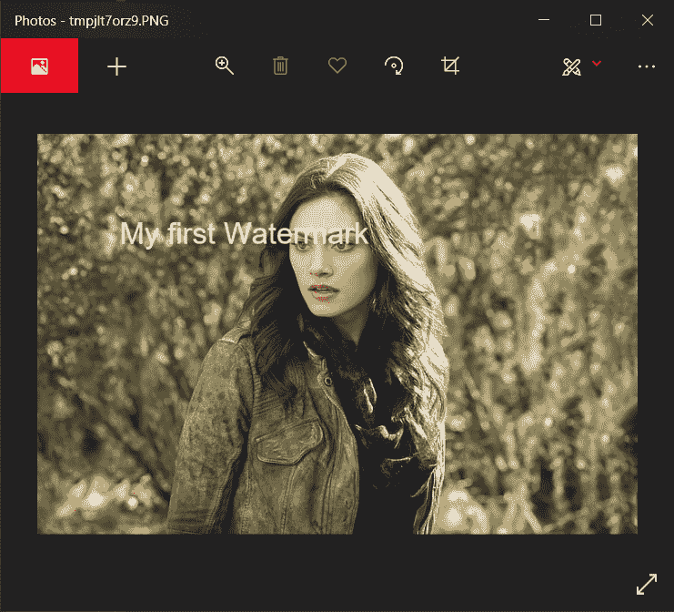

# Python 枕头模块——简介

> 原文：<https://www.askpython.com/python-modules/pillow-module>

你好，初学者！今天在本教程中，我们将学习 Python 中一个有趣但未知的模块——枕头模块。我们先来了解一下枕头模块是什么，为什么要用？

## 枕头模块是什么？

`Pillow`建立在众所周知的 PIL ( [Python 图像库](https://www.askpython.com/python/examples/edge-detection-in-images))模块之上，后者是图像处理最重要的模块之一。但是，现在 Python3 不支持 PIL 模块。

所以枕头模块基本上是 PIL 模块的替代品，但有更多的功能。Python3 也支持它。使用这个模块，人们可以在数字图像上实现几乎任何东西。

## Python 枕头模块的实现

现在我们对枕头模块有了一点了解。让我们来学习如何实现它。

### 1.导入模块并加载初始映像

枕头模块的导入与`PIL`模块完全相同，初始图像在图像子模块`open`功能的帮助下加载。

要查看图像，我们只需在加载图像时对之前创建的图像变量使用`show`函数。下面提到了相同的代码。

```py
from PIL import Image
im = Image.open("image1.jpg")
im.show()

```

输出图像显示在单独的窗口中，其结果如下所示。



Initial Loaded Image

### 2.旋转图像

要旋转图像，我们只需使用下面代码所示的`rotate`函数。输出也显示在代码的正下方。

```py
im_rotate = im.rotate(40)
im_rotate.show()

```



Rotate Image Output

### 3.从普通图像创建缩略图

要将所有图像缩小到某个较小的尺寸，可以使用缩略图功能将图像转换为缩略图。相同的代码如下所示。缩略图功能将输出图像的高度和宽度作为参数。

```py
img1 = Image.open('image1.jpg')
img1.thumbnail((200,200))
img1.show()

```



Thumbnail Output Image

### 4.模糊图像

在 PIL 模块的帮助下，只需使用`filter`函数和`ImageFilter`类，就可以轻松地给图像添加模糊效果。

我们首先需要从 PIL 模块导入 ImageFilter 类，然后在将图像转换为 RGB 格式后对加载的图像应用模糊效果，以获得 ImageFilter 工作的准确调色板。

谈到模糊图像，PIL 提出了三种类型的模糊效果:

1.  简单模糊
2.  框模糊
3.  高斯模糊

我们将学习一个接一个地实现它们。

#### 4.1.简单模糊

下面的代码输出带有简单模糊效果的图像。自己试试吧！

```py
from PIL import ImageFilter
img2 = Image.open('image1.jpg')
img2.convert('RGB')
img2.show()
blur_img = img2.filter(ImageFilter.BLUR)
blur_img.show()

```



Blur Effect Output

#### 4.2.框模糊

为了实现，框模糊一个需要指定`radius`，这是简单的模糊过滤器在图像上应用的强度。代码如下所述。看一看！

```py
from PIL import ImageFilter
img2 = Image.open('image1.jpg')
img2.convert('RGB')
blur_img = img2.filter(ImageFilter.BoxBlur(5))
blur_img.show()

```

在这段代码中，我们将半径设置为 5，得到的图像如下所示。好奇改变半径值会发生什么？来吧，你可以尽情地玩数字游戏！


Box Blur Radius5

#### 4.3 高斯模糊

高斯模糊采用完全相同的参数，`radius`，但不同之处在于，高斯模糊避免了图像中出现的哪怕是最轻微的边缘。这会产生更平滑的模糊效果。

```py
from PIL import ImageFilter
img2 = Image.open('image1.jpg')
img2.convert('RGB')
blur_img = img2.filter(ImageFilter.GaussianBlur(5))
blur_img.show()

```

你可以在下面显示的图像中看到，高斯模糊忽略了所有的边缘，并在图像上给出了清晰和均匀的模糊效果。



Gaussian Blur Radius5

### 5.在图像上添加水印

有没有想过创作者如何将他们自己的水印添加到他们的图像中？你可以借助 PIL 模块的 ImageDraw 功能给你的图片添加你自己的水印。

下面显示了相同的代码，并预先添加了注释来指导您完成这些步骤。

```py
from PIL import ImageDraw, ImageFont

## 1\. Loading the image
img = Image.open('image1.jpg')

## 2\. Creating a drawing object in order to draw on the image
draw = ImageDraw.Draw(img)

## 3\. Changing the font style and the size of the font to make the watermark clean
font = ImageFont.truetype('arial.ttf', 36)

## 4\. Drawing the text on the image : 
                # Add the x and y position values
                # Enter the text to be drawn
                # Set the font to font created in step 3
draw.text((100, 100),"My first Watermark",font=font)
img.show()

```



Watermark Added Image

## 结论

恭喜你！今天，您学习了一个新的图像处理模块。本模块中有更多内容需要探索，但可以在后面的教程中介绍。

希望你喜欢它！感谢您的阅读！

敬请关注更多教程！