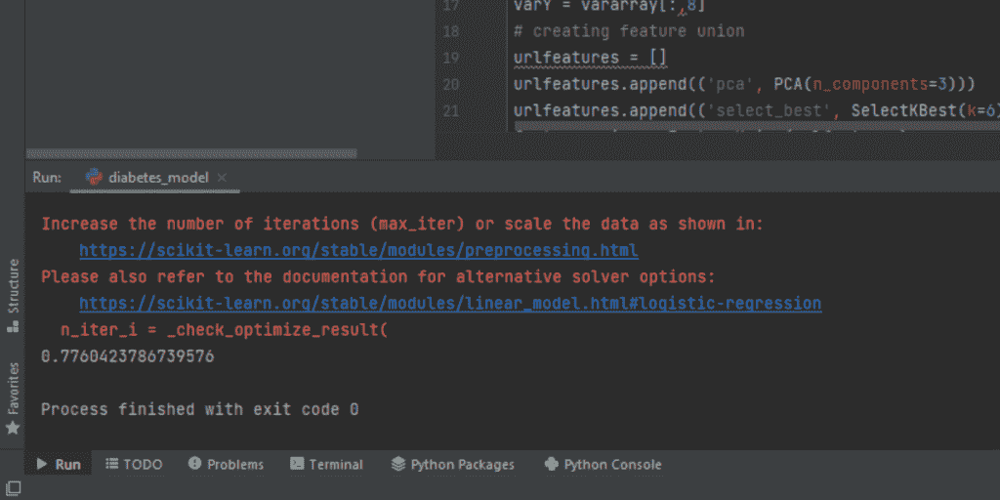
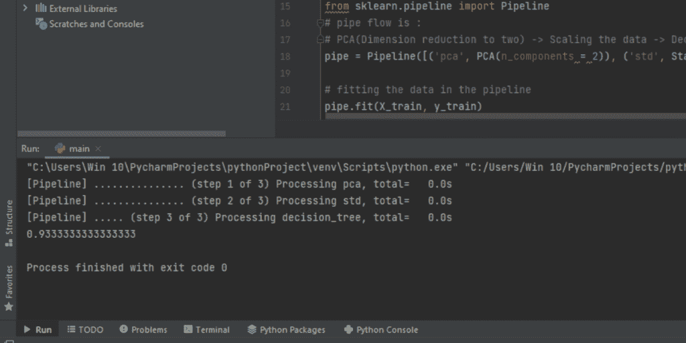

# Python 中的流水线技术——完全指南

> 原文：<https://www.askpython.com/python/examples/pipelining-in-python>

本文讨论 Python 中的管道技术。在应用的[机器学习](https://www.askpython.com/python/machine-learning-introduction)中，有典型的过程。它们是标准的，因为它们解决了测试设置中的数据泄漏等问题。

pipeline 是一个 Python scikit-learn 实用程序，用于编排机器学习操作。

管道的作用是允许一系列线性的数据转换链接在一起，产生一个可测量的建模过程。

目标是保证管道中的所有阶段，如训练数据集或交叉验证技术中涉及的每个折叠，仅限于评估可用的数据。

### Python 中流水线操作的数据准备和建模

从训练数据集到测试数据集的数据泄漏是机器学习和数据科学中的一个常见陷阱。

为了防止落入这个陷阱，您将需要一个可靠的测试工具，具有清晰的培训和测试分离。包括数据准备。

数据准备是算法获取对整个训练数据集的访问的一种简单方法。例如，在学习之前对整个训练数据集进行规范化或标准化将不是一个合适的测试，因为测试集中的数据规模会影响训练数据集。

管道确保数据准备(如规范化)被限制在交叉验证操作的每一个环节中，从而最大限度地减少测试工具中的数据泄漏。

这种关键的数据准备和模型评估方法将在下面的示例中演示。管道中有两个步骤:

*   确保数据是统一的。
*   了解如何使用线性判别分析模型。

让我们来了解一下如何在 python 中创建管道，以及如何在管道中训练数据集。

## 导入库

创建管道需要将大量导入包加载到系统中。请记住，您需要预先安装和配置所有这些 python 包，以便在程序中使用它们。

```py
from sklearn.linear_model import LogisticRegression
from sklearn.decomposition import PCA
from sklearn.feature_selection import SelectKBest
from pandas import read_csv
from sklearn.model_selection import KFold
from sklearn.model_selection import cross_val_score
from sklearn.pipeline import Pipeline
from sklearn.pipeline import FeatureUnion

```

## 数据加载

在本例中，将从包含糖尿病患者信息的公共域中获取数据。我们将使用这个数据库来训练我们的管道。

**下面的代码演示了如何加载公共域记录:**

```py
url_data = "https://raw.githubusercontent.com/jbrownlee/Datasets/master/pima-indians-diabetes.data.csv"
varnames = ['var_preg', 'var_plas', 'var_pres', 'var_skin', 'var_test', 'var_mass', 'var_pedi', 'var_age', 'var_class']
vardataframe = read_csv(url_data, names=varnames)
vararray = vardataframe.values
varX = vararray[:,0:8]
varY = vararray[:,8]

```

## 在 Python 中创建管道

```py
urlfeatures = []
urlfeatures.append(('pca', PCA(n_components=3)))
urlfeatures.append(('select_best', SelectKBest(k=6)))
feature_union = FeatureUnion(urlfeatures)
# Here, pipeline is created
estimators = []
estimators.append(('feature_union', feature_union))
estimators.append(('logistic', LogisticRegression()))
model = Pipeline(estimators)
# The pipelie is tested here
seed = 7
varkfold = KFold(n_splits=10)
dataresults = cross_val_score(model, varX, varY, cv=varkfold)
print(dataresults.mean())

```

## 流水线技术在 Python 中的完整实现

整个工作程序如下所示:

```py
# Create a pipeline that extracts features from the data then creates a model
from sklearn.linear_model import LogisticRegression
from sklearn.decomposition import PCA
from sklearn.feature_selection import SelectKBest
from pandas import read_csv
from sklearn.model_selection import KFold
from sklearn.model_selection import cross_val_score
from sklearn.pipeline import Pipeline
from sklearn.pipeline import FeatureUnion

# data laoded into global variables
url_data = "https://raw.githubusercontent.com/jbrownlee/Datasets/master/pima-indians-diabetes.data.csv"
varnames = ['var_preg', 'var_plas', 'var_pres', 'var_skin', 'var_test', 'var_mass', 'var_pedi', 'var_age', 'var_class']
vardataframe = read_csv(url_data, names=varnames)
vararray = vardataframe.values
varX = vararray[:,0:8]
varY = vararray[:,8]

# creating feature union
urlfeatures = []
urlfeatures.append(('pca', PCA(n_components=3)))
urlfeatures.append(('select_best', SelectKBest(k=6)))
feature_union = FeatureUnion(urlfeatures)

# Here, pipeline is created
estimators = []
estimators.append(('feature_union', feature_union))
estimators.append(('logistic', LogisticRegression()))
model = Pipeline(estimators)

# The pipelie is tested here
seed = 7
varkfold = KFold(n_splits=10)
dataresults = cross_val_score(model, varX, varY, cv=varkfold)
print(dataresults.mean())

```

### 输出



Mean calculation done through the pipeline

让我们看另一个例子来更好地理解管道测试。

在下面的代码中，一个[虹膜数据库](https://www.askpython.com/python/examples/principal-component-analysis)被加载到测试管道中。Iris 数据库是 sklearn 为测试管道而提供的数据库分类。在这个例子中，通过将管道分成相等的两半，使用单个数据库来训练和测试管道，即 50%的数据将被加载到测试管道中，而剩余的一半将用于训练管道中。

```py
from sklearn import datasets
from sklearn.model_selection import train_test_split
from sklearn.preprocessing import StandardScaler
from sklearn.decomposition import PCA
from sklearn.tree import DecisionTreeClassifier
# database is imported from inbuilt sklearn datasets
iris = datasets.load_iris()
X = iris.data
y = iris.target

#The data spliting is executed here
X_train, X_test, y_train, y_test = train_test_split(X, y, test_size = 0.50)
# importing pipes for making the Pipe flow
from sklearn.pipeline import Pipeline
# The sequence of pipe flow is :
# PCA dimension is reduced by 2 >> Data gets scaled >> Classification of decission tree
pipe = Pipeline([('pca', PCA(n_components = 2)), ('std', StandardScaler()), ('decision_tree', DecisionTreeClassifier())], verbose = True)

# fitting the data in the pipeline
pipe.fit(X_train, y_train)

# scoring data
from sklearn.metrics import accuracy_score
print(accuracy_score(y_test, pipe.predict(X_test)))

```

### 输出



Pipeline flow output

## 结论

在本文中，我们了解了管道以及如何对其进行测试和训练。我们还了解了 sklearn 导入包，以及它的数据库和函数如何帮助创建用于数据测试的管道。我们进一步了解了如何使用公共领域记录来训练管道，我们还观察了如何拆分 sklearn 的内置数据库来提供测试和训练数据。