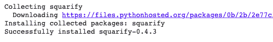
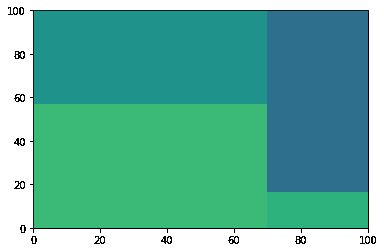
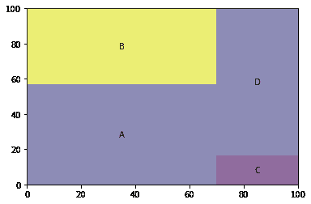
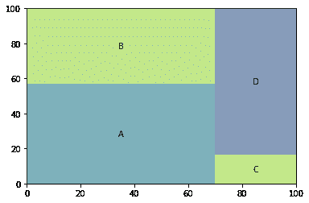
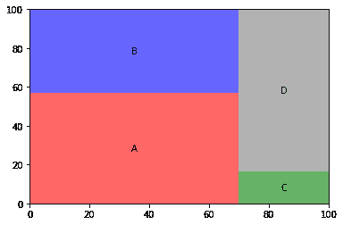
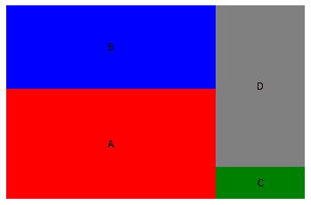
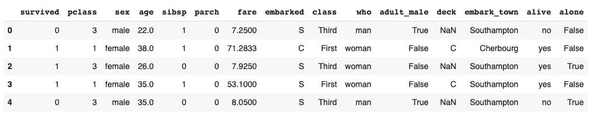
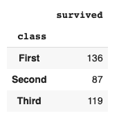
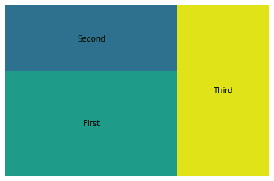

# 如何用 Python 绘制树形图？

> 原文：<https://www.askpython.com/python/examples/plot-a-treemap-in-python>

Python 中的树形图是将矩形分割成子部分的数据的可视化。每个子部分的大小与其代表的数据成比例。它有点像饼状图。尽管与饼图相比，树形图可以表示更复杂的数据。

它可以帮助你想象单个值是如何组成一个整体的。 **Treemap** 图表还可以让你使用嵌套的矩形来可视化分层数据。

在本教程中，我们将学习如何使用 python 中的 Squarify 库在 Python 中绘制树形图。

让我们从安装 Squarify 开始。

```py
pip install squarify

```



Squarify

## 使用 Squarify 在 Python 中绘制树形图

一旦我们安装了 Squarify，我们就可以开始将它导入到我们的笔记本中。让我们也导入 [matplotlib](https://www.askpython.com/python-modules/matplotlib/python-matplotlib) 。

```py
import matplotlib.pyplot as plt
import squarify 

```

### 1.绘制基本的树形图

为了绘制一个非常基本的树形图，我们只需要每个矩形的值。绘制树形图后，矩形将与这些值成比例。

```py
import matplotlib.pyplot as plt
import squarify 
sizes = [40, 30, 5, 25]
squarify.plot(sizes)
plt.show()

```



Treemap

### 2.向树状图添加标签

您可以使用以下代码行在 Python 中向树形图添加标签:

```py
import matplotlib.pyplot as plt
import squarify 
sizes=[40, 30, 5, 25]
label=["A", "B", "C", "D"]
squarify.plot(sizes=sizes, label=label, alpha=0.6 )
plt.show()

```



Labels

如果您再次运行同一段代码，您将得到以下输出:



您可以看到，每次运行 treemap 时，它的配色方案都是不同的。*矩形的颜色是随机选取的*。Treemap 还为您提供了提及颜色、尺寸和标签的选项。接下来我们将学习如何改变树形图的颜色。

### 3.更改树形图中的颜色

要在 Python 中更改树图的颜色，请列出您希望树图具有的颜色。然后将该列表传递给 squarify.plot 方法。

```py
import matplotlib.pyplot as plt
import squarify 
sizes=[40, 30, 5, 25]
label=["A", "B", "C", "D"]
color=['red','blue','green','grey']
squarify.plot(sizes=sizes, label=label, color=color, alpha=0.6 )
plt.show()

```



Changing Color

### 4.关闭绘图轴

要绘制不带绘图轴的树形图，请使用:

```py
plt.axis('off')

```

这行代码将关闭绘图轴。完整的代码如下:

```py
import matplotlib.pyplot as plt
import squarify 
sizes=[40, 30, 5, 25]
label=["A", "B", "C", "D"]
color=['red','blue','green','grey']
squarify.plot(sizes=sizes, label=label, color=color, alpha=0.6 )
plt.axis('off')
plt.show()

```



Plot Axis Off

## 为数据集绘制树状图

在教程的这一部分，我们将学习如何为数据集绘制树形图。我们将使用泰坦尼克号数据集。让我们从导入数据集开始。为了简化导入数据集的过程，我们将使用 **seaborn** 库。

### 1.导入数据集

要将 titanic 数据集从 [seaborn 库](https://www.askpython.com/python-modules/python-seaborn-tutorial)导入到 Python 笔记本中，请使用:

```py
import seaborn as sns
titanic = sns.load_dataset('titanic')
titanic.head()

```



Titanic Dataset

该数据集包含泰坦尼克号乘客的信息。

我们想根据幸存者所处的阶层为他们绘制一张树状图。

原始格式的数据无法绘制树状图。我们将执行一些操作，并尝试提取数据，我们可以使用绘制树状图。

为了得到每个类的幸存者，我们将对我们的数据使用**分组方法**。

### 2.准备用于打印的数据

您可以对数据集使用 groupby 函数，如下所示:

```py
n = titanic.groupby('class')[['survived']].sum()

```



Groupby

这给了我们按班级分组的幸存者总数。

现在我们需要从中提取数据和标签作为[列表](https://www.askpython.com/python/difference-between-python-list-vs-array)。

```py
a = titanic.groupby('class')[['survived']].sum().index.get_level_values(0).tolist()
print(a)

```

输出:

```py
['First', 'Second', 'Third']

```

这为我们提供了列表形式的标签。要获得对应于这些标签的值，请使用:

```py
d = titanic.groupby('class')[['survived']].sum().reset_index().survived.values.tolist()
print(d)

```

输出:

```py
[136, 87, 119]

```

现在我们有了列表形式的标签和数据。我们可以用这些来绘制树状图。

### 3.绘制树状图

要绘制树形图，请使用以下代码行:

```py
squarify.plot(sizes=d, label=a, alpha=.8)
plt.axis('off')
plt.show()

```



Titanic Treemap

将树状图可视化，我们可以大致了解第一类、第二类和第三类幸存者的数量。光看树状图，我们就可以很有信心地说，二班的幸存者最少。

### 用 Python 绘制树形图的完整代码

本节的完整代码如下所示:

```py
import seaborn as sns
import squarify 
import matplotlib.pyplot as plt

titanic = sns.load_dataset('titanic')

a = titanic.groupby('class')[['survived']].sum().index.get_level_values(0).tolist()

d = titanic.groupby('class')[['survived']].sum().reset_index().survived.values.tolist()

squarify.plot(sizes=d,label=a, alpha=.8 )
plt.axis('off')
plt.show()

```

## 结论

在本教程中，我们学习了如何使用 Squarify 在 python 中绘制树状图。希望你和我们一起学习愉快。