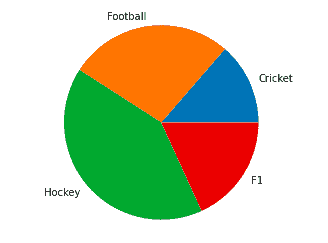
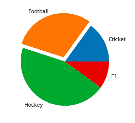
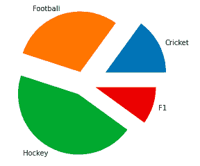
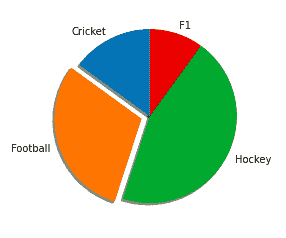
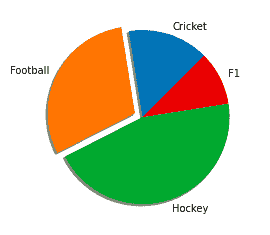
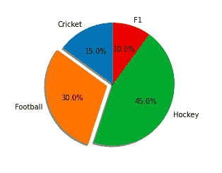
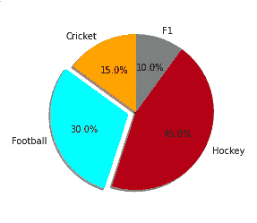
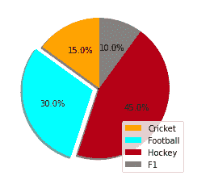

# 如何用 Python 绘制和自定义饼状图？

> 原文：<https://www.askpython.com/python/plot-customize-pie-chart-in-python>

饼图是一种圆形统计图形，它被分成若干片来说明数字比例。在饼图中，每个切片的弧长与其代表的数量成比例。

饼状图是表示民意调查结果的一种流行方式。在本教程中，我们将学习如何绘制饼图。此外，我们将学习如何用 python 定制饼图。

让我们开始吧。

## 创建示例数据

让我们创建一些在绘制饼图时可以使用的样本数据。

```py
labels = 'Cricket', 'Football', 'Hockey', 'F1'
sizes = [15, 30, 45, 10]

```

该数据代表了一项关于人们最喜欢的运动的民意调查。

## 如何绘制饼状图？

为了绘制饼图，我们将使用 [matplotlib](https://www.askpython.com/python-modules/matplotlib/python-matplotlib) 。

```py
import matplotlib.pyplot as plt

```

为了绘制一个基本的饼图，我们需要标签和与这些标签相关的值。

```py
labels = 'Cricket', 'Football', 'Hockey', 'F1'
sizes = [15, 30, 45, 10]

fig1, ax1 = plt.subplots()
ax1.pie(sizes, labels=labels)
ax1.axis('equal')  
plt.show()

```

运行上面的代码片段，我们得到以下输出:



Pie Chart

请注意，这是一个非常基本的饼图。

现在让我们看看如何定制饼图，使它看起来更有趣。

## 在 Python 中自定义饼图

Matplotlib 在绘制饼图时提供了许多定制选项。让我们一个一个地看看这些。

### 1.弹出一个切片

您可以使用“分解”选项弹出一个或多个饼图切片。

为此，我们声明一个包含爆炸值的数组。分解数组指定偏移每个切片的半径分数。

```py
import matplotlib.pyplot as plt

labels = 'Cricket', 'Football', 'Hockey', 'F1'
sizes = [15, 30, 45, 10]

explode = (0, 0.1, 0, 0)
fig1, ax1 = plt.subplots()
ax1.pie(sizes, explode=explode, labels=labels)
plt.show()

```

输出:



Explode

让我们尝试一些不同的爆炸值。

```py
import matplotlib.pyplot as plt

labels = 'Cricket', 'Football', 'Hockey', 'F1'
sizes = [15, 30, 45, 10]

explode = (0.4, 0.2, 0.2, 0.2) 
fig1, ax1 = plt.subplots()
ax1.pie(sizes, explode=explode, labels=labels)
plt.show()

```



Explode

### 2.旋转饼图

你可以通过设置一个**角度**来旋转饼图。

它将饼图的起点从 x 轴逆时针旋转指定的度数。

让我们来看看它的实际应用:

```py
import matplotlib.pyplot as plt

labels = 'Cricket', 'Football', 'Hockey', 'F1'
sizes = [15, 30, 45, 10]

fig1, ax1 = plt.subplots()
explode = (0, 0.1, 0, 0) 
ax1.pie(sizes, explode=explode, labels=labels,
        shadow=True, startangle=90)

plt.show()

```

输出:



Rotate 90

```py
import matplotlib.pyplot as plt

labels = 'Cricket', 'Football', 'Hockey', 'F1'
sizes = [15, 30, 45, 10]

fig1, ax1 = plt.subplots()
explode = (0, 0.1, 0, 0)
ax1.pie(sizes, explode=explode, labels=labels,
        shadow=True, startangle=45)

plt.show()

```



Rotate 45

### 3.显示百分比

您还可以使用以下代码行显示每个切片的百分比:

```py
import matplotlib.pyplot as plt

labels = 'Cricket', 'Football', 'Hockey', 'F1'
sizes = [15, 30, 45, 10]

fig1, ax1 = plt.subplots()
explode = (0, 0.1, 0, 0) 
ax1.pie(sizes, explode=explode, labels=labels,autopct='%1.1f%%',
        shadow=True, startangle=90)

plt.show()

```

输出:



Percentage

### 4.定制颜色

Matplotlib 让您可以发挥创意，让您的饼图看起来尽可能生动。

要改变饼图的颜色，使用下面几行代码。

```py
import matplotlib.pyplot as plt

labels = 'Cricket', 'Football', 'Hockey', 'F1'
sizes = [15, 30, 45, 10]

colors = ( "orange", "cyan", "brown", 
          "grey") 
fig1, ax1 = plt.subplots()
explode = (0, 0.1, 0, 0) 
ax1.pie(sizes, colors = colors, explode=explode, labels=labels,autopct='%1.1f%%',
        shadow=True, startangle=90)

plt.show()

```

这里我们声明了 4 种我们想在列表中使用的颜色。然后在绘制饼图时，我们将该列表作为参数传递。

输出结果如下:



Change Colours

### 5.显示颜色代码

除了您的饼图，您还可以显示一个包含饼图配色方案的框。当饼图中有很多切片时，这尤其有用。

要显示颜色代码，请使用以下代码片段:

```py
import matplotlib.pyplot as plt

labels = 'Cricket', 'Football', 'Hockey', 'F1'
sizes = [15, 30, 45, 10]

colors = ( "orange", "cyan", "brown", 
          "grey") 
fig1, ax1 = plt.subplots()
explode = (0, 0.1, 0, 0) 

ax1.pie(sizes, colors = colors, explode=explode, labels=labels,autopct='%1.1f%%', shadow=True, startangle=90)
patches, texts, auto = ax1.pie(sizes, colors=colors, shadow=True, startangle=90,explode=explode, autopct='%1.1f%%' )

plt.legend(patches, labels, loc="best")
plt.show()

```

输出:



Colour Codes

### 结论

本教程讲述了如何使用 Matplotlib 在 Python 中绘制和定制饼图。希望你和我们一起学习愉快。要浏览 matplotlib 的官方文档，使用这个[链接](https://matplotlib.org/3.1.1/api/_as_gen/matplotlib.pyplot.pie.html?highlight=pie#matplotlib.pyplot.pie)。