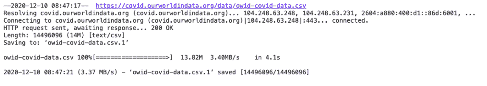
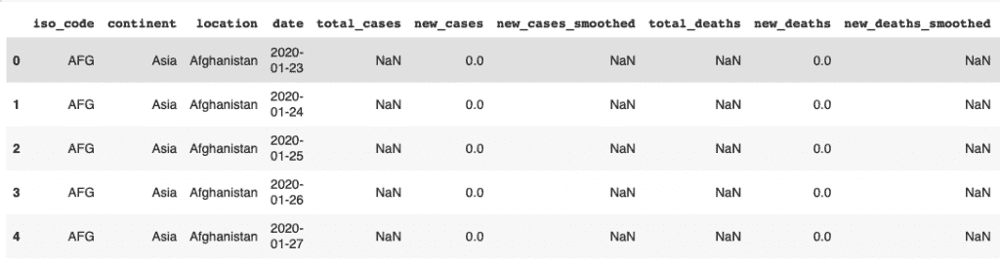
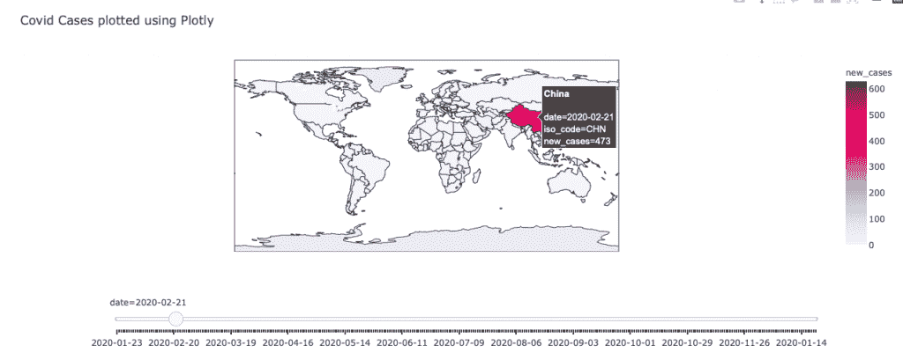
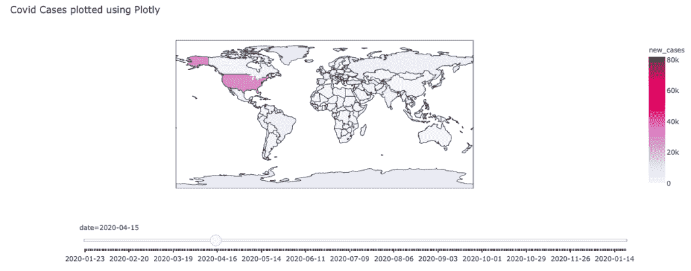
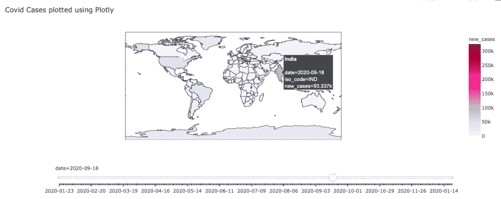

# 使用 Python Plotly 在地图上绘制地理数据

> 原文：<https://www.askpython.com/python/examples/plot-geographical-data-python-plotly>

在本教程中，我们将学习如何使用 Python Plotly 在地图上绘制地理数据。在本次演示中，我们将从[ourworldindata.org](https://ourworldindata.org/)数据集绘制新冠肺炎案例。

## 用 Python 在地图上绘制地理数据的步骤

让我们开始吧。

### 1.导入所需的库

让我们从[导入必要的库](https://www.askpython.com/python/python-import-statement)开始。我们需要导入以下两个库:

1.  熊猫
2.  [Plotly.express](https://www.askpython.com/python-modules/python-plotly-tutorial)

```py
import pandas as pd
import plotly.express as px

```

现在，我们可以进入下一步，即下载数据集。

### 2.下载并读取数据集

要下载和加载数据集，请使用下面这段代码。

```py
!wget https://covid.ourworldindata.org/data/owid-covid-data.csv

```

输出:



Download Dataset

[使用 pandas read_csv 方法读取 Python 中的 CSV 数据集](https://www.askpython.com/python-modules/python-csv-module):

```py
df = pd.read_csv('owid-covid-data.csv')
df.head()

```



Dataset

### 3.在地图上绘制新冠肺炎数据集

现在，我们可以使用 Plotly 来绘制上面数据集的数据。

我们正在绘制一张地图。它是一种地图，利用预先定义的区域内的阴影、颜色或符号放置的差异来表示这些区域内特定量的平均值。

我们将绘制每天新病例的**数量。Plotly 让我们通过动画来实现。**

下面是在地图上绘制颜色和阴影的代码:

```py
fig = px.choropleth(df, locations="iso_code",
                    color="new_cases",
                    hover_name="location",
                    animation_frame="date",
                    title = "Covid Cases plotted using Plotly",                 color_continuous_scale=px.colors.sequential.PuRd)

fig["layout"].pop("updatemenus")
fig.show()

```

**输出:**



Feb



April



September

输出显示了一年中三个不同月份的地图外观。我们可以看到病毒在二月份迅速在中国传播，四月份在美国传播，九月份在印度传播。

您还可以将鼠标悬停在地图的任何区域上，查看新案例的数量。

Plotly 动画可以方便地可视化时间序列数据。

### 4.使用 Python Plotly 绘制地理数据的完整代码

下面给出了本节的完整代码:

```py
import pandas as pd
import plotly.express as px

#download dataset
!wget https://covid.ourworldindata.org/data/owid-covid-data.csv

#import dataset
df = pd.read_csv('owid-covid-data.csv')

#plot
fig = px.choropleth(df, locations="iso_code",
                    color="new_cases",
                    hover_name="location",
                    animation_frame="date",
                    title = "Covid Cases plotted using Plotly",                 color_continuous_scale=px.colors.sequential.PuRd)

fig["layout"].pop("updatemenus")
fig.show()

```

### 6.绘制新冠肺炎亚洲数据

你也可以将地图的范围设置为亚洲。让我们看看如何为亚洲的内容绘制地理数据。

要将绘图范围设置为亚洲，请将参数*“范围*”设置为“*亚洲”*。

```py
import pandas as pd
import plotly.express as px

#download dataset
!wget https://covid.ourworldindata.org/data/owid-covid-data.csv

#import dataset
df = pd.read_csv('owid-covid-data.csv')

#select entries with the continent as asia
df = df[df.continent == 'Asia']

#plot
fig = px.choropleth(df, locations="iso_code",
                    color="new_cases",
                    hover_name="location",
                    animation_frame="date",
                    title = "Daily new COVID cases",
                    scope ='asia',  color_continuous_scale=px.colors.sequential.PuRd)

fig["layout"].pop("updatemenus")
fig.show()

```

输出:

<https://www.askpython.com/wp-content/uploads/2020/12/covid-cases-in-asia-1.mov>

该视频借助动画展示了每天的新冠肺炎新病例。

## 结论

本教程是关于用 Python Plotly 绘制地理数据的。我们使用 python 中的 Plotly 绘制了来自新冠肺炎数据集的数据。要了解 Plotly 允许您创建的其他类型的地图，请阅读他们的官方文档。