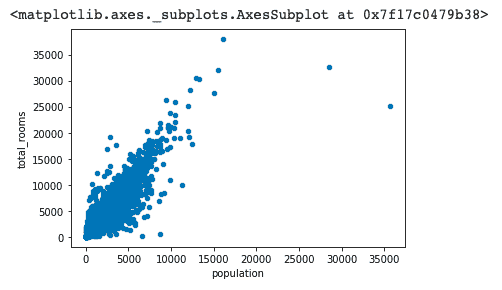

# 如何用 Python 为一个数据帧绘制图形？

> 原文：<https://www.askpython.com/python-modules/pandas/plot-graph-for-a-dataframe>

了解如何绘制数据框架将有助于您在几行代码中执行更好的数据分析。可视化数据帧是数据科学家为了更好地理解数据而首先开展的活动之一。

[可视化数据集](https://www.askpython.com/python-modules/data-visualization-using-python-bokeh)通常能提供更好的图片，并帮助你计划行动路线。它还可以很容易地发现异常值，并推测数据集中是否存在任何相关性。

简而言之，知道如何可视化数据帧是一项重要的技能。

## 用 Python 绘制数据帧的方法

让我们从导入数据集开始。

### 1.导入数据集

对于本教程的范围，我们将使用[加州住房数据集。](https://developers.google.com/machine-learning/crash-course/california-housing-data-description)

让我们从使用 [pandas](https://www.askpython.com/python-modules/pandas/python-pandas-module-tutorial) 将数据导入数据框开始。

```py
import pandas as pd
housing = pd.read_csv("/sample_data/california_housing.csv")
housing.head()

```


Housing Dataframe

## 使用熊猫绘图

您可以使用[绘制数据帧。Pandas Dataframe 中的 plot()方法](https://pandas.pydata.org/pandas-docs/stable/reference/api/pandas.DataFrame.plot.html)。

您需要将 matplotlib 导入到您的 python 笔记本中。使用以下代码行来完成此操作。

```py
import matplotlib.pyplot as plt

```

### 1.绘制数据帧直方图

要绘制与住房数据中所有列相对应的直方图，请使用以下代码行:

```py
housing.hist(bins=50, figsize=(15,15))
plt.show()

```


Plotting

当您需要看到所有列一起绘制时，这很好。接下来，让我们看看如何在两列之间制作散点图。

### 2.散点图

散点图有助于确定两个变量之间的相关性。

要绘制两个变量之间的散点图，请使用以下代码行:

```py
housing.plot(x='population', y = 'median_house_value', kind='scatter')
plt.show()

```

这将产生以下输出:


Scatter Plot

我们可以看到数据集中有一些异常值。我们看不出这两个变量之间有很强的相关性。

让我们试着绘制**中值收入**对**中值房价的图表。**

```py
housing.plot(x='median_income', y = 'median_house_value', kind='scatter')
plt.show()

```


Scatter Plot

这里我们可以看到两个变量之间的正相关关系。随着收入中位数的上升，住房价值中位数也趋于上升。

为了查看更强相关性的示例，让我们绘制另一个散点图。这个时间在**人口**和**总间。**逻辑上这两者应该有很强的正相关性。

正相关意味着两个变量倾向于一起增加和减少。

```py
housing.plot(x='population', y = 'total_rooms', kind='scatter')
plt.show()

```



Scatter Plot

我们的推测是对的，房间总数和人口确实有很强的正相关性。我们可以这样说，因为这两个变量往往一起增加，如图表所示。

绘制不同的图时，可以使用以下不同的参数:

*   “线条”:线条图(默认)
*   “条形图”:垂直条形图
*   “barh”:水平条形图
*   “历史”:直方图
*   “方框”:方框图
*   “kde”:核密度估计图
*   '密度' :与' kde '相同
*   “面积”:面积图
*   ‘pie’ : pie plot
*   “散点图”:散点图
*   “hex bin”:hex bin 图

## 使用 Seaborn 绘图

或者，您也可以使用 [Seaborn](https://seaborn.pydata.org) 绘制数据帧。它是一个基于 [matplotlib](https://www.askpython.com/python-modules/matplotlib/python-matplotlib) 的 Python 数据可视化库。它提供了一个高层次的界面来绘制有吸引力的和信息丰富的统计图形。

Seaborn 是一个非常强大的可视化工具。您可以获得许多定制选项。

### 1.进口海鲜

让我们从将 Seaborn 导入 python 笔记本开始。

```py
import seaborn as sns

```

### 2.使用 Distplot

Seaborn 提供了绘制[距离图](https://seaborn.pydata.org/generated/seaborn.distplot.html)的选项。distplot 是一个直方图，自动计算一个好的默认 bin 大小。

您可以使用以下代码行创建一个:

```py
sns.distplot(housing['median_house_value'])

```


Distplot

在这里你也可以发现异常值。让我们试着为中等收入也画一个。

```py
sns.distplot(housing['median_income'])

```


Distplot

## 结论

本教程是关于用 Python 绘制熊猫数据帧的。我们介绍了绘制数据帧的两种不同方法。希望你和我们一起学习愉快！