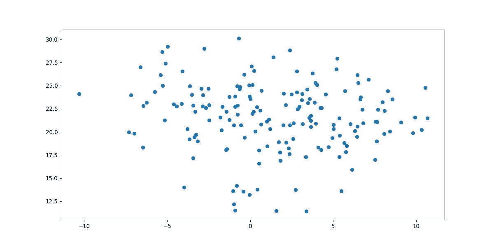
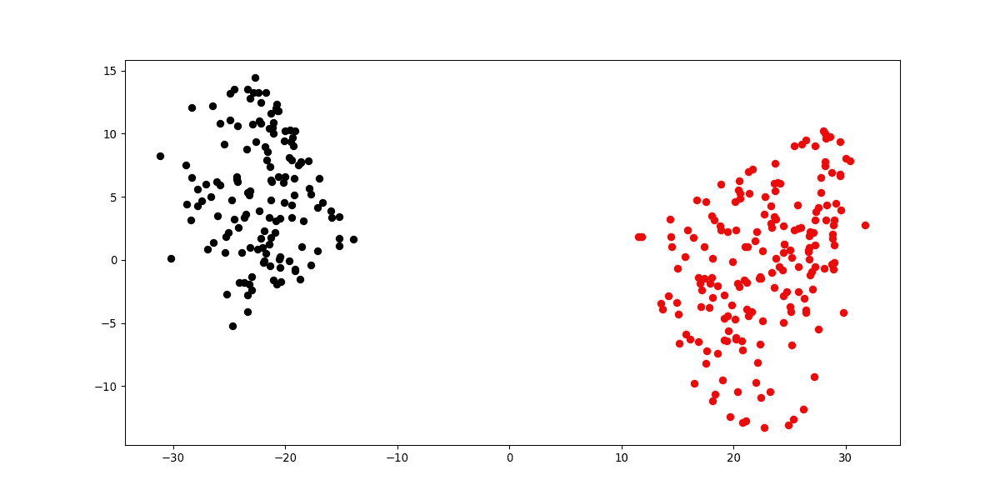
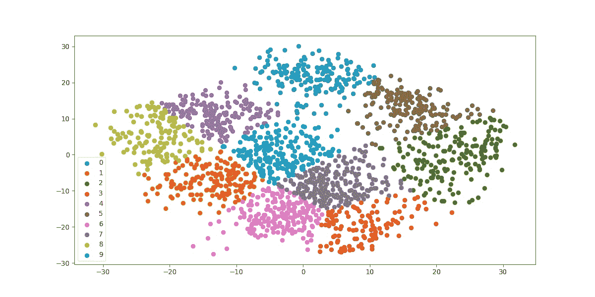
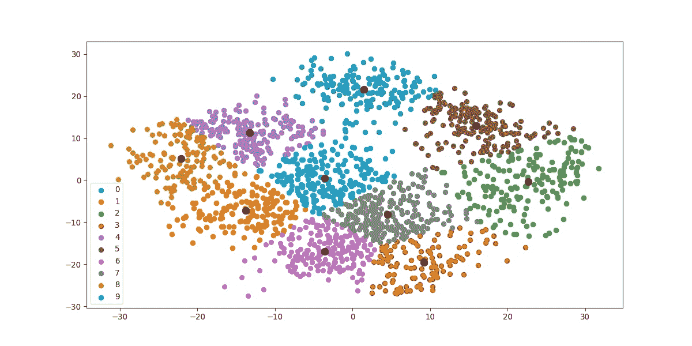

# 如何用 Python 绘制 K-Means 聚类？

> 原文：<https://www.askpython.com/python/examples/plot-k-means-clusters-python>

在本文中，我们将看到如何绘制 K 均值聚类。

K-means 聚类是一种迭代聚类方法，将数据分割成 *k* 个聚类，其中每个观察值属于具有最近均值(聚类质心)的聚类。

## 绘制 K 均值聚类的步骤

本文演示了如何可视化集群。我们将使用[数字](https://scikit-learn.org/stable/modules/generated/sklearn.datasets.load_digits.html)数据集来解释我们的原因。

### 1.准备用于打印的数据

首先让我们准备好数据。

```py
#Importing required modules

from sklearn.datasets import load_digits
from sklearn.decomposition import PCA
from sklearn.cluster import KMeans
import numpy as np

#Load Data
data = load_digits().data
pca = PCA(2)

#Transform the data
df = pca.fit_transform(data)

df.shape

```

**输出:**

```py
(1797, 2)

```

Digits 数据集包含大小为 8×8 像素的图像，将其展平以创建长度为 64 的特征向量。我们使用 [PCA](https://www.askpython.com/python/examples/principal-component-analysis-for-image-data) 来减少维数，这样我们可以使用 2D 散点图来可视化结果。

### 2.对数据应用 K 均值

现在，让我们对数据应用 K-mean 来创建聚类。

在数字数据集中，我们已经知道标签的范围从 0 到 9，所以我们有 10 个类(或聚类)。

但是在现实生活的挑战中，当执行 K-means 时，最具挑战性的任务是确定聚类的数量。

确定最佳聚类数的方法有多种，即肘形法、平均剪影法。但是确定星团的数量将是另一个话题。

```py
#Import required module
from sklearn.cluster import KMeans

#Initialize the class object
kmeans = KMeans(n_clusters= 10)

#predict the labels of clusters.
label = kmeans.fit_predict(df)

print(label)

```

**输出:**

```py
out: [0 3 7 ... 7 4 9]

```

`kmeans.fit_predict`方法返回每个数据点所属的聚类标签数组。

### 3.标绘标签 0k-均值聚类

现在，是时候了解并看看如何绘制单个集群了。

标签数组保存了数据点的索引或序列，因此我们可以利用这个特性，使用带有 [numpy](https://www.askpython.com/python-modules/numpy/python-numpy-module) 的布尔索引来过滤数据点。

让我们使用 [matplotlib 库](https://www.askpython.com/python-modules/matplotlib/python-matplotlib)可视化标签为 0 的集群。

```py
import matplotlib.pyplot as plt

#filter rows of original data
filtered_label0 = df[label == 0]

#plotting the results
plt.scatter(filtered_label0[:,0] , filtered_label0[:,1])
plt.show()

```



Plotting Label 0

上面的代码首先过滤并保留属于分类标签 0 的数据点，然后创建一个散点图。

看看我们如何传递一个布尔序列给 filter [label == 0]。将过滤后的数据编入索引，并作为(x，y)传递给`plt.scatter`进行绘图。x =筛选的标签 0[:，0]，y =筛选的标签 0[:，1]。

### 4.绘制额外的 K 均值聚类

现在，我们有了一些想法，让我们用标签 2 和 8 来绘制集群。

```py
#filter rows of original data
filtered_label2 = df[label == 2]

filtered_label8 = df[label == 8]

#Plotting the results
plt.scatter(filtered_label2[:,0] , filtered_label2[:,1] , color = 'red')
plt.scatter(filtered_label8[:,0] , filtered_label8[:,1] , color = 'black')
plt.show()

```



Plotting Labels 2 And 8

精彩！

### 5.绘制所有 K 均值聚类

现在，我们已经获得了工作机制，让我们将它应用到所有集群。

```py
#Getting unique labels

u_labels = np.unique(label)

#plotting the results:

for i in u_labels:
    plt.scatter(df[label == i , 0] , df[label == i , 1] , label = i)
plt.legend()
plt.show()

```



Final Clusters

上面的代码根据每个唯一的类一次一次地迭代过滤数据。我们得到的结果是所有集群的最终可视化。

### 6.绘制聚类质心

```py
#Getting the Centroids
centroids = kmeans.cluster_centers_
u_labels = np.unique(label)

#plotting the results:

for i in u_labels:
    plt.scatter(df[label == i , 0] , df[label == i , 1] , label = i)
plt.scatter(centroids[:,0] , centroids[:,1] , s = 80, color = 'k)
plt.legend()
plt.show()

```



Clusters With Their Respective Centroids

返回一个质心位置的数组。

这是我们刚刚在上面看到的完整代码。

```py
#Importing required modules

from sklearn.datasets import load_digits
from sklearn.decomposition import PCA
from sklearn.cluster import KMeans
import numpy as np

#Load Data
data = load_digits().data
pca = PCA(2)

#Transform the data
df = pca.fit_transform(data)

#Import KMeans module
from sklearn.cluster import KMeans

#Initialize the class object
kmeans = KMeans(n_clusters= 10)

#predict the labels of clusters.
label = kmeans.fit_predict(df)

#Getting unique labels
u_labels = np.unique(label)

#plotting the results:
for i in u_labels:
    plt.scatter(df[label == i , 0] , df[label == i , 1] , label = i)
plt.legend()
plt.show()

```

## 结论

在本文中，我们看到了如何[可视化](https://www.askpython.com/python/python-bar-plot)由 k-means 算法形成的聚类。下次再见，学习愉快！