# 绘制数学函数——如何用 Python 绘制数学函数？

> 原文：<https://www.askpython.com/python/examples/plot-mathematical-functions>

大家好！在本教程中，我们将学习如何使用 Python 绘制数学函数。所以让我们开始吧。

* * *

## 先决条件

为了使用 Python 绘制不同的数学函数，我们需要以下两个 Python 库:

### 1.NumPy

**NumPy** 是一个 Python 库，支持多维数组&矩阵，并提供广泛的数学函数来操作 NumPy 数组&矩阵。它是科学计算最基本的库之一。我们可以使用下面的命令在本地计算机上安装 NumPy。

```py
> python -m pip install numpy

```

### 2\. Matplotlib

Matplotlib 是一个 Python 库，广泛用于各种类型的绘图。使用 Matplotlib，我们可以非常容易地绘制静态和交互式可视化。我们可以使用以下命令在本地计算机上安装 Matplotlib。

```py
> python -m pip install matplotlib

```

## 绘制数学函数的步骤

首先在主 Python 程序中导入`numpy`和`matplotlib.pyplot`模块(。py)或者 [Jupyter 笔记本](https://www.askpython.com/python/jupyter-notebook-for-python)(。ipynb)使用以下 Python 命令。

```py
import numpy as np
import matplotlib.pyplot as plt

```

对于所有的绘图，除了在各自的绘图中使用特定的[数字数学函数](https://www.askpython.com/python/numpy-trigonometric-functions)外，我们将遵循几乎相同的步骤。

### 1.Plot (y = x)恒等函数

```py
x = np.arange(0, 11, 1)
y = x
print('Values of x: ', x)
print('Values of y: ', y)
plt.plot(x, y)
plt.title("Identity Function")
plt.xlabel("Values of x")
plt.ylabel("Values of y")
plt.show()

```

**输出:**

```py
Values of x:  [ 0  1  2  3  4  5  6  7  8  9 10]
Values of y:  [ 0  1  2  3  4  5  6  7  8  9 10]

```

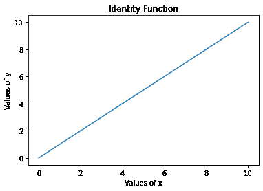

Identity Function Plot

### 2.plot(y = a . x²+b . x²+c)二次函数

```py
x = np.arange(-11, 11, 1)
a = 2
b = 9
c = 10
y = a*(x**2) + b*x + c 

print('Values of x: ', x)
print('Values of y: ', y)
plt.plot(x, y)
plt.title("Quadratic Function")
plt.xlabel("Values of x")
plt.ylabel("Values of y")
plt.show()

```

**输出:**

```py
Values of x:  [-11 -10  -9  -8  -7  -6  -5  -4  -3  -2  -1   0   1   2   3   4   5   6   7   8   9  10]
Values of y:  [153 120  91  66  45  28  15   6   1   0   3  10  21  36  55  78 105 136 171 210 253 300]

```

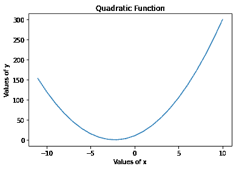

Quadratic Function Plot

### 3.plot(y = a . x³+b . x²+c . x+d)三次函数

```py
x = np.arange(-11, 11, 1)
a = 2
b = 3
c = 4
d = 9
y = a*(x**3) + b*(x**2) + c*x + d 

print('Values of x: ', x)
print('Values of y: ', y)

plt.plot(x, y)

plt.title("Cubic Function")
plt.xlabel("Values of x")
plt.ylabel("Values of y")
plt.show()

```

**输出:**

```py
Values of x:  [-11 -10  -9  -8  -7  -6  -5  -4  -3  -2  -1   0   1   2   3   4   5   6   7   8   9  10]
Values of y:  [-2334 -1731 -1242  -855  -558  -339  -186   -87   -30    -3     6     9    18    45   102   201   354   573   870  1257  1746  2349]

```

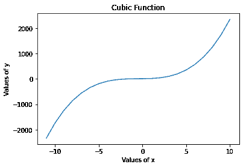

Cubic Function Plot

### 4.Plot (y = ln(x)或 log [e] (x))自然对数函数

```py
x = np.arange(1, 11, 0.001)
y = np.log(x)
print('Values of x: ', x)
print('Values of y: ', y)

plt.plot(x, y)

plt.title("Natural logarithm Function")
plt.xlabel("Values of x")
plt.ylabel("Values of y")
plt.show()

```

**输出:**

```py
Values of x:  [ 1\.     1.001  1.002 ... 10.997 10.998 10.999]
Values of y:  [0.00000000e+00 9.99500333e-04 1.99800266e-03 ... 2.39762251e+00 2.39771344e+00 2.39780436e+00]

```

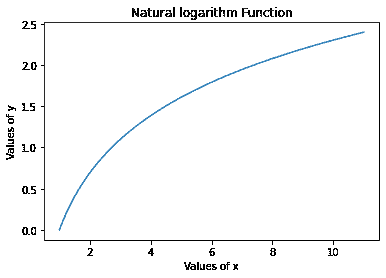

Natural Logarithm Function Plot

### 5.Plot (y = log [10] x)常用/十进制对数函数

```py
x = np.arange(1, 11, 0.001)
y = np.log10(x)
print('Values of x: ', x)
print('Values of y: ', y)

plt.plot(x, y)

plt.title("Common logarithm Function")
plt.xlabel("Values of x")
plt.ylabel("Values of y")
plt.show()

```

**输出:**

```py
Values of x:  [ 1\.     1.001  1.002 ... 10.997 10.998 10.999]
Values of y:  [0.00000000e+00 4.34077479e-04 8.67721531e-04 ... 1.04127423e+00 1.04131372e+00 1.04135320e+00]

```

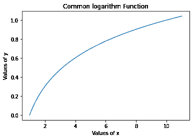

Common Logarithm Function Plot

### 6.Plot (y = e^x )自然指数函数

```py
x = np.arange(-11, 11, 0.01)
y = np.exp(x) 
print('Values of x: ', x)
print('Values of y: ', y)

plt.plot(x, y)

plt.title("Natural exponential Function")
plt.xlabel("Values of x")
plt.ylabel("Values of y")
plt.show()

```

**输出:**

```py
Values of x:  [-11\.   -10.99 -10.98 ...  10.97  10.98  10.99]
Values of y:  [1.67017008e-05 1.68695557e-05 1.70390975e-05 ... 5.81045934e+04 5.86885543e+04 5.92783841e+04]

```

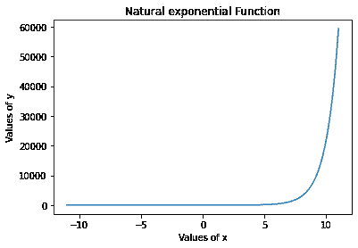

Natural Exponential Function Plot

### 7.Plot (y = a^x )一般指数函数

```py
x = np.arange(-11, 11, 0.01)
a = 8
y = a**x 
print('Values of x: ', x)
print('Values of y: ', y)

plt.plot(x, y)

plt.title("General exponential Function")
plt.xlabel("Values of x")
plt.ylabel("Values of y")
plt.show()

```

**输出:**

```py
Values of x:  [-11\.   -10.99 -10.98 ...  10.97  10.98  10.99]
Values of y:  [1.16415322e-10 1.18861455e-10 1.21358987e-10 ... 8.07043896e+09 8.24001604e+09 8.41315629e+09]

```

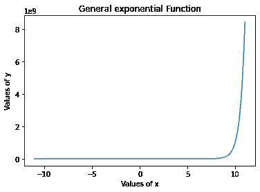

General Exponential Function Plot

### 8.Plot (y =符号(x))希格诺函数

```py
x = np.arange(-11, 11, 0.001)
y = np.sign(x)

print('Values of x: ', x)
print('Values of y: ', y)

plt.plot(x, y)

plt.title("Signum Function")
plt.xlabel("Values of x")
plt.ylabel("Values of y)")

plt.show()

```

**输出:**

```py
Values of x:  [-11\.    -10.999 -10.998 ...  10.997  10.998  10.999]
Values of y:  [-1\. -1\. -1\. ...  1\.  1\.  1.]

```

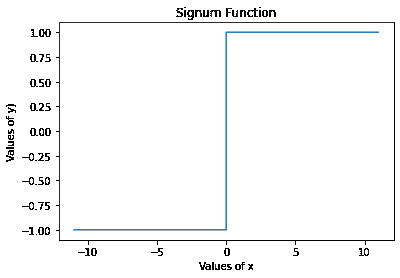

Signum Function Plot

### 9.Python 中的 Plot (y = a.sin(b.x + c))正弦函数

```py
x = np.arange(-11, 11, 0.001)
a = 5
b = 3
c = 2
y = a*np.sin(b*x + c)

print('Values of x: ', x)
print('Values of y: ', y)

plt.plot(x, y)

plt.title("Sinusoidal Function")
plt.xlabel("Values of x")
plt.ylabel("Values of y")

plt.show()

```

**输出:**

```py
Values of x:  [-11\.    -10.999 -10.998 ...  10.997  10.998  10.999]
Values of y:  [ 2.02018823  2.03390025  2.04759397 ... -2.10016104 -2.11376421 -2.12734835]

```

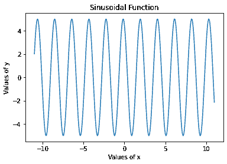

Sinusoidal Function Plot

### 10\. Plot (y = sinc(x)) Sinc function

```py
x = np.arange(-11, 11, 0.01)
y = np.sinc(x)

print('Values of x: ', x)
print('Values of y: ', y)

plt.plot(x, y)

plt.title("Sinc function")
plt.xlabel("Values of x")
plt.ylabel("Values of y")

plt.show()

```

**输出:**

```py
Values of x:  [-11\.   -10.99 -10.98 ...  10.97  10.98  10.99]
Values of y:  [1.41787526e-16 9.09768439e-04 1.82029537e-03 ... 2.73068428e-03
 1.82029537e-03 9.09768439e-04]

```

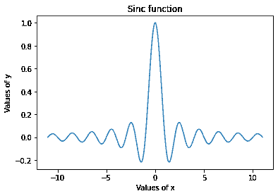

Sinc Function Plot

### 11.Plot (y = cosh(x))双曲函数

```py
x = np.arange(-11, 11, 0.001)
y = np.cosh(x) 

print('Values of x: ', x)
print('Values of y: ', y)

plt.plot(x, y)

plt.title("Hyperbolic Function")
plt.xlabel("Values of x")
plt.ylabel("Values of y")

plt.show()

```

**输出:**

```py
Values of x:  [-11\.    -10.999 -10.998 ...  10.997  10.998  10.999]
Values of y:  [29937.07086595 29907.14875865 29877.2565585  ... 29847.39423524 29877.25655813 29907.14875828]

```

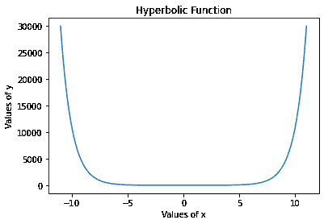

Hyperbolic Cosine Function Plot

## 总结

在本教程中，我们学习了如何使用 Numpy 和 Matplotlib 库绘制不同类型的数学函数。希望你已经了解了不同数学函数的作图过程，准备好自己实验了。感谢阅读！请继续关注我们，获取关于 Python 编程的惊人学习资源。