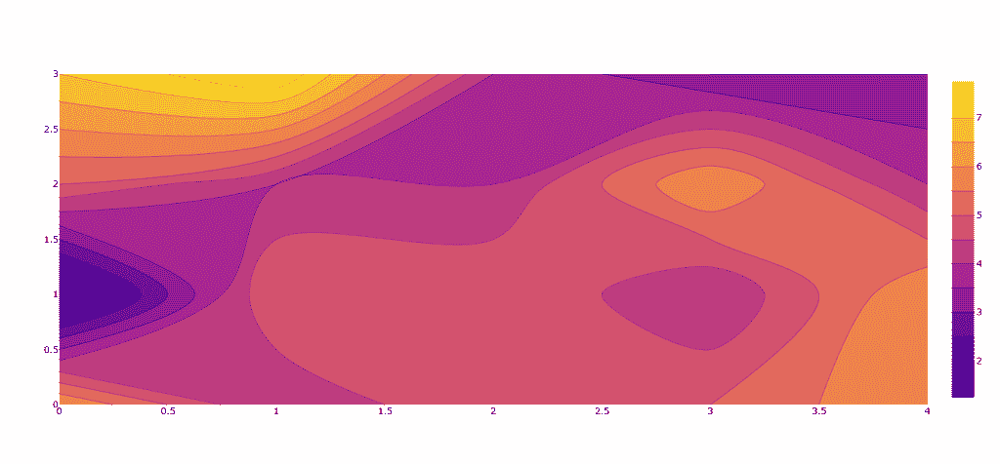
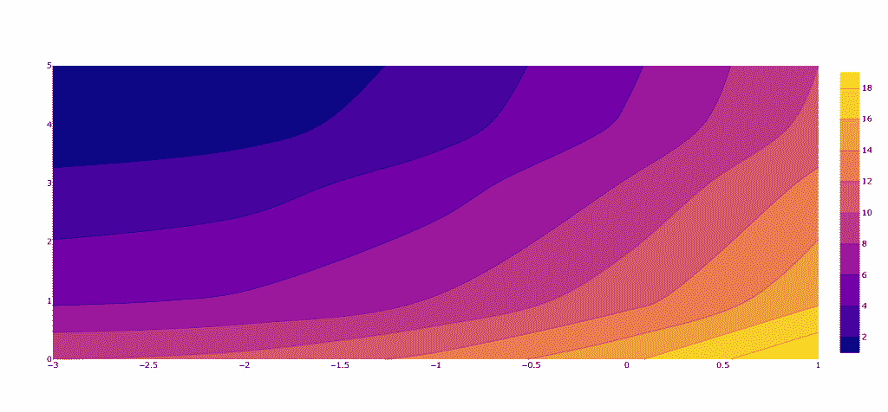
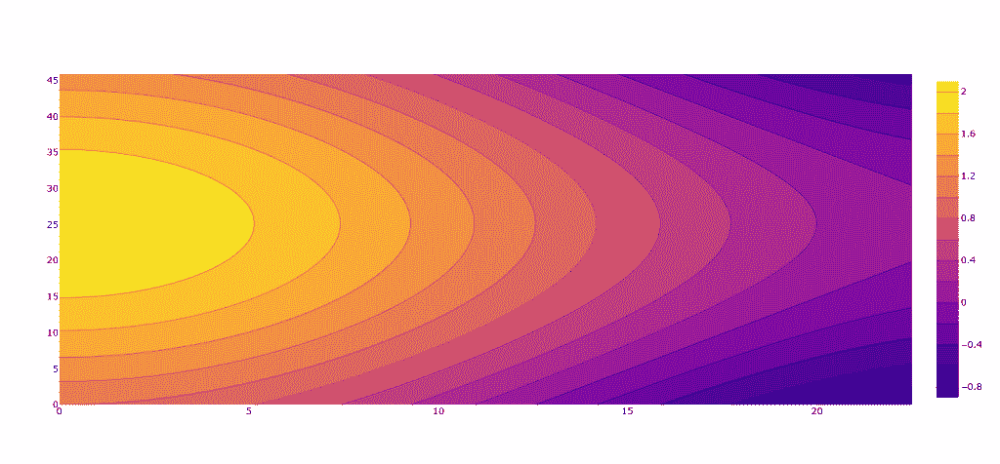
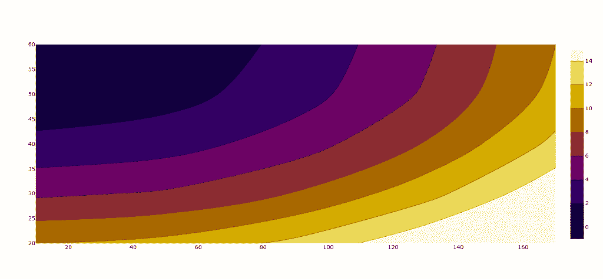
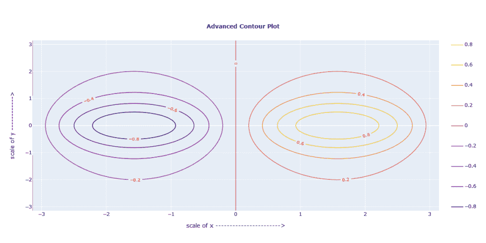

# Plotly 等高线图-完整指南

> 原文：<https://www.askpython.com/python-modules/plotly-contour-plot>

在本文中，我们将学习 Python 的 Plotly 库，以及创建迷人等高线图的各种方法。我们将看到各种等高线图的例子，每个例子都有详细的代码分析。我们还将学习多种方法来定制一个人的轮廓图。所以，让我们从基础开始。

## 什么是等高线图？



轮廓是三维表面的二维描述，包括关节和曲线。它是在等高线函数(Z)的帮助下绘制的，等高线函数是两个变量(X 轴和 Y 轴坐标)的函数。

***也读作:[【Matplotlib 等高线图——完整参考](https://www.askpython.com/python-modules/matplotlib/matplotlib-contour-plot)***

## 什么是 Plotly 库？

[Plotly](https://www.askpython.com/python-modules/python-plotly-tutorial) 提供了各种数据可视化库来绘制图表和图形。我们可以从大量的绘图库和工具中进行选择，这些工具专用于创建各种不同类型的图表。在本文中，我们将主要使用单个导入包和单个绘图函数。这就是我们在使用 Plotly 时获得的易用性。

## 安装 Plotly

要在您的系统中安装 [Plotly](https://www.askpython.com/python-modules/python-plotly-tutorial) ，请键入以下命令:

```py
Pip install plotly==5.5.0 

```

## 使用 Plotly 创建等高线图

让我们用 Plotly 来创建这些等高线图。

### 基本等高线图

首先，我们将使用 Plotly 绘制一个简单的等高线图。首先需要的是导入库。

下面的**导入包** **就像一个通用的 Plotly 语法，它完成了大部分工作。**

```py
import plotly.graph_objects as grob

```

### Plotly 轮廓函数

轮廓函数使用初始化数据来绘制曲线。我们必须向它提供 x，y 坐标和 z 函数。

创建等高线图有两个部分:数据初始化和使用等高线函数创建对象，有多种不同的方法来完成这两个步骤，每种方法都会影响等高线。为了简单起见，让我们假设我们的坐标是用变量‘data’初始化的。

如下所示，代码告诉编译器获取轮廓的 z 函数的数据值。

```py
grid_fig = grob.Figure(data =
	grob.Contour(z = data))

```

让我们看几个程序例子来理解所有的方法。

### 使用坐标数组作为 z 函数绘制等高线图:

```py
import plotly.graph_objects as grob

# This 5X5 matrix stores the coordinate values required for z function
data = [[6, 4, 5, 5, 6],
	[1, 5, 5, 4, 6],
	[5, 4, 4, 6, 4],
	[7, 8, 4, 3, 3]]

grid_fig = grob.Figure(data =
	grob.Contour(z = data))

grid_fig.show()

```

### 输出:


### 用特定的 X，Y，Z 值绘制等值线图

```py
import plotly.graph_objects as grob

fig = grob.Figure(data =
    grob.Contour(

        z=[[10, 10.625, 12.5, 15.625, 20],
           [5.625, 6.25, 8.125, 11.25, 15.625],
           [2.5, 3.125, 5., 8.125, 12.5],
           [0.625, 1.25, 3.125, 6.25, 10.625],
           [0, 0.625, 2.5, 5.625, 10]],

        x=[-3, -2, -1, 0, 1], # horizontal axis
        y=[0, 1, 3, 4, 5] # vertical axis
    ))
fig.show()

```

### 输出:



这里的 z 函数是一个类似于前面例子的坐标数组。使用 Numpy 导入包进一步允许我们为等高线图使用更复杂的数据。在下一个例子中，我们将观察如何为 z 函数设置一个三角恒等式。

### 使用 Numpy 的等高线图

```py
import plotly.graph_objects as grob
import numpy as nump

# variables are initialised with x,y co-ordinates
cordof_x = nump.arange(0, 23, 0.5)
cordof_y = nump.arange(0, 46, 0.3)

# A mesh is created with the given co-ordinates by this numpy function
[X, Y] = nump.meshgrid(cordof_x, cordof_y)

contour_function = nump.cos(X*(1/8)) + nump.sin(Y*(1/16))

contour_plot = grob.Figure(data =
	grob.Contour(x = cordof_x, y = cordof_y, z = contour_function))

contour_plot.show()

```

### 输出:



希望上面的例子已经完全清楚了基本等高线图是如何创建的。到目前为止，我们已经学习了为等高线图创建输入和 z 函数的不同方法。现在，我们将冒险对我们的轮廓图的样式方面。

## 自定义 Plotly 等高线图

在本文的这一部分，我们将主要讨论轮廓图的前端方面或简单的样式方面。

#### 设置绘图的颜色和比例

让我们以一个程序为例，其中我们有一个初始化为 z 函数的坐标数组。现在，在我们的等高线图中，如果我们想用一个**自定义比例来表示我们的图，**我们可以这样做:

```py
dx=40,
x0=10,
dy=10,
y0=20,

```

现在，在比例设置好之后，让我们假设我们想要**改变我们情节的主题**。我们可以通过以下方式做到这一点:

```py
colorscale='hot',

```

运筹学

```py
colorscale='electric',

```

为了添加一些最后的润色，我们还可以**添加一个色标**到我们的绘图中。这可以通过以下方式实现:

```py
contours=dict(
            start=0,
            end=14,
            size=2,
        ),

```

让我们把所有的东西都放进一个程序里，观察它是如何运行的。

```py
import plotly.graph_objects as grob

grid_fig = grob.Figure(data =
    grob.Contour(
        z=[[10, 10.625, 12.5, 15.625, 20],
           [5.625, 6.25, 8.125, 11.25, 15.625],
           [2.5, 3.125, 5., 8.125, 12.5],
           [0.625, 1.25, 3.125, 6.25, 10.625],
           [0, 0.625, 2.5, 5.625, 10]],
        dx=40,
        x0=10,
        dy=10,
        y0=20,
        colorscale='electric',
        contours=dict(
            start=0,
            end=14,
            size=2,
        ),
     ))

grid_fig.show()

```

### 输出:



## 创建高级等高线图

到目前为止，我们已经了解了使用 Plotly 绘制等高线图的基本方面。现在，我们将把到目前为止所学的一切放在一起，创建一个高级的等值线图，以便我们能够了解为实际应用创建的等值线图是怎样的。

以下代码:

```py
import numpy as np
import math
import plotly.graph_objects as grob

x = np.linspace(-np.pi, np.pi, num=80)
y = x
def pf(a, b):
    return math.sin(b) / (1 + a**2)
f = np.empty((len(x), len(y)))

for i in range(len(x)):
    for j in range(len(y)):
        f[i,j] = pf(x[i], y[j])

grid_fig = grob.Figure()
grid_fig.add_trace(grob.Contour(z=f, x=x, y=y,
                         contours_coloring='lines',
                         line_width=1.5,
                         contours={"showlabels":True,
                                   "labelfont":{"size":10,
                                                "color":'red'}}))

grid_fig.update_layout(

{   "title": {"text": "<b>Advanced Contour Plot</b>", "x": 0.5, "y": 0.9, "font": {"size": 14} },
    "showlegend": True,
    "xaxis": {"title": "scale of x ----------------------->", "showticklabels":True, "dtick": 1},
    "yaxis": {"title": "scale of y ------------>", "showticklabels": True, "dtick": 1},
    "autosize":False,
    "width":1200,
    "height":600})

grid_fig.show()

```

### 输出:



## 结论

在这篇文章中，我们学习了 Plotly 的基本概念，以及如何根据我们的需求定制它。我们知道如何将特定的坐标值或坐标数组用于我们的输入法，以及 numpy 的集成如何支持三角函数的等高线绘制。最后，我们还观察了如何编写高级剧情。希望这篇文章能帮助你更好地学习和理解 Plotly。