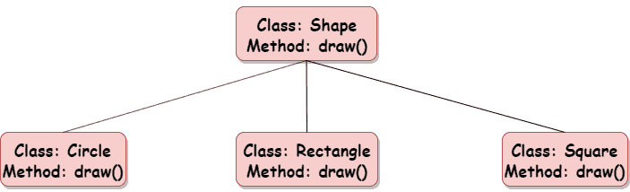

# Python 中的多态性

> 原文：<https://www.askpython.com/python/oops/polymorphism-in-python>

多态性意味着具有生动的或不同的形式。在编程领域，多态性指的是同名函数携带不同功能的能力。它创建了一个可以使用多种对象形式的结构。

这允许[函数](https://www.askpython.com/python/python-functions)/参数在不同时间使用不同类型的实体。

在面向对象编程中，多态性允许引用特定类的特定对象以类似的方式使用，就好像它是引用完全不同的类的不同对象一样。



Polymorphism In Python

* * *

## 用类在 Python 中实现多态性

Python 可以使用不同类型的[类](https://www.askpython.com/python/oops/python-classes-objects)，以同样的方式，使用多态性。为了达到这个目的，我们可以创建一个循环来遍历一组对象。Post which，您可以调用这些方法，而不必查看对象所属的类的类型。

### 示例:类和对象的多态性

```py
class Rabbit(): 
    def age(self): 
        print("This function determines the age of Rabbit.") 

    def color(self): 
        print("This function determines the color of Rabbit.") 

class Horse(): 
    def age(self): 
        print("This function determines the age of Horse.") 

    def color(self): 
        print("This function determines the color of Horse.") 

obj1 = Rabbit() 
obj2 = Horse() 
for type in (obj1, obj2): # creating a loop to iterate through the obj1, obj2
    type.age() 
    type.color() 

```

**输出**:

这个函数决定了兔子的年龄。
此功能决定兔子的颜色。
此功能决定马的年龄。
这个函数决定了马的颜色。

* * *

## 用继承在 Python 中实现多态性

我们将在派生类中定义与基类中的函数同名的函数。这里，我们重新实现了派生类中的函数。在派生类中重新实现一个函数的现象被称为**方法覆盖**。

### 示例:带有继承的多态性

```py
class Animal: 
  def type(self): 
    print("Various types of animals") 

  def age(self): 
    print("Age of the animal.") 

class Rabbit(Animal): 
  def age(self): 
    print("Age of rabbit.") 

class Horse(Animal): 
  def age(self): 
    print("Age of horse.") 

obj_animal = Animal() 
obj_rabbit = Rabbit() 
obj_horse = Horse() 

obj_animal.type() 
obj_animal.age() 

obj_rabbit.type() 
obj_rabbit.age() 

obj_horse.type() 
obj_horse.age() 

```

**输出**:

各种类型的动物
动物的年龄。
各种类型的动物
年龄的兔子。
各种类型的动物
马的年龄。

**推荐阅读:**

*   [Python 中的继承](https://www.askpython.com/python/oops/inheritance-in-python)
*   [Python 中的多重继承](https://www.askpython.com/python/oops/python-multiple-inheritance)

* * *

## 编译时多态还是方法重载？

与许多其他流行的面向对象编程语言(如 Java)不同，Python 不支持编译时多态性或方法重载。如果一个类或 Python 脚本有多个同名的方法，最后一个定义的方法将覆盖前面的方法。

Python 不对方法签名使用函数参数，这就是为什么 Python 不支持方法重载。

* * *

## Python 中的运算符重载

Python 支持运算符重载。这是另一种类型的多态性，其中操作符根据操作数的类型表现不同。

*   +运算符将两个数相加并连接两个字符串
*   *运算符将两个数字相乘，当与字符串和 int 一起使用时，将字符串重复给定的 int 次，并将它们连接起来。

阅读 Python 中的[操作符重载。](https://www.askpython.com/python/operator-overloading-in-python)

* * *

## 多态性的优势

*   一次编写的代码和类可以多次重用和实现。
*   它有助于减少不同功能和对象行为之间的耦合。

* * *

## 参考

*   [Python 面向对象编程](https://www.askpython.com/python/oops/object-oriented-programming-python)
*   Python 函数