# Python 中的多项式回归–Python 中的完整实现

> 原文：<https://www.askpython.com/python/examples/polynomial-regression-in-python>

欢迎阅读这篇关于机器学习中多项式回归的文章。为了更好的理解这篇文章，你可以浏览一下关于[简单线性回归](https://www.askpython.com/python/examples/linear-regression-in-python)和[多元线性回归](https://www.askpython.com/python/examples/multiple-linear-regression)的文章。

然而，让我们快速回顾一下这些概念。

## 简单线性回归和多元线性回归的快速修订

简单线性回归用于预测一系列数值数据的有限值。有一个独立变量 x 用于预测变量 y。还有像 b0 和 b1 这样的常数作为参数添加到我们的方程中。

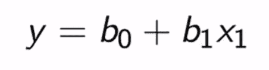

Simple Linear Regression equation

说到多元线性回归，我们使用多个独立变量来预测值。这些自变量被制成特征矩阵，然后用于因变量的预测。该等式可以表示如下:

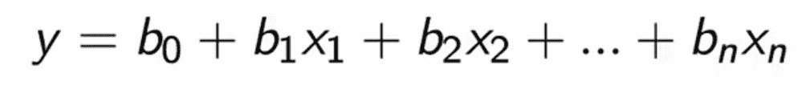

Multiple Linear Regression equation

## 什么是多项式回归？

多项式回归也是一种线性回归，通常用于使用独立变量的多项式幂进行预测。使用下面的等式可以更好地理解这个概念:

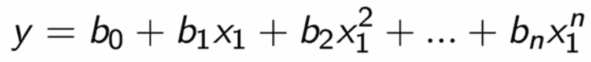

Polynomial Regression equation

## 什么时候用多项式回归？

在简单线性回归的情况下，有些数据高于或低于直线，因此是不准确的。这就是可以使用多项式回归的地方。

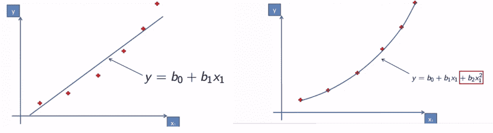

Simple Linear regression Vs Polynomial Regression

在左侧显示的图像中，您可以注意到有些点位于回归线上方，有些点位于回归线下方。这使得模型不太精确。这就是线性回归的情况。

现在，看看右边的图像，它是多项式回归的。在这里，我们的回归线或曲线拟合并通过所有的数据点。因此，使我们的模型回归更准确。

## 多项式回归为什么叫线性？

多项式回归有时也称为多项式线性回归。为什么这样

即使它有巨大的力量，它仍然被称为线性的。这是因为当我们谈论线性时，我们不是从 x 变量的角度来看的。我们讨论系数。

y 是 X 的函数，这个函数能否表示为系数的线性组合，因为最终用于插入 X 和预测 y。

因此，从系数的角度来看，这个方程是线性的。有趣吧？

现在我们将通过一个例子来理解如何执行这种回归。

## Python 中多项式回归的一个简单例子

让我们快速地看一下如何执行多项式回归。对于这个例子，我使用了一个工资预测数据集。

假设，你是一家公司的人力资源团队，想要核实他们将要雇用的一名新的潜在雇员过去的工作细节。然而，他们得到的信息仅仅是他们职位上的 10 份薪水。

有了这个，人力资源团队就可以与这个人的职位(比如 6.5 级)联系起来，并可以检查这个员工是否一直在虚张声势地谈论他以前的工资。

因此，我们将建造一个 bluffy 探测器。

数据集可以在这里找到-[https://github . com/content-anu/dataset-多项式-回归](https://github.com/content-anu/dataset-polynomial-regression)

### 1.导入数据集

为了导入和读取数据集，我们将使用 [Pandas 库](https://www.askpython.com/python-modules/pandas/python-pandas-module-tutorial)并使用 read_csv 方法将列读入数据框。

```py
import numpy as np
import matplotlib.pyplot as plt
import pandas as pd

dataset = pd.read_csv('Position_Salaries.csv')
dataset

```

上述代码的输出显示了如下数据集:


Output of the dataset

### 2.数据预处理

观察数据集时，您会看到只有“级别”和“薪金”列是必需的，并且职位已经被编码到级别中。因此它可以被忽略。所以从特征矩阵中跳过“位置”。

```py
X = dataset.iloc[:,1:2].values  
y = dataset.iloc[:,2].values

```

因为我们只有 10 个观察值，所以我们不会将其分成测试集和训练集。这有两个原因:

1.  小的观察没有意义，因为我们没有足够的信息在一组上训练，在另一组上测试模型。
2.  我们想做一个非常准确的预测。我们需要更多关于列车组的信息。因此，整个数据集仅用于训练。

### 3.拟合线性回归模型

我们用它来比较多项式回归的结果。

```py
from sklearn.linear_model import LinearRegression
lin_reg = LinearRegression()
lin_reg.fit(X,y)

```

上面代码的输出是一行声明模型已经被拟合的代码。

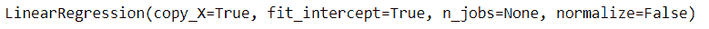

Linear regression fit

### 4.线性回归模型的可视化结果

```py
plt.scatter(X,y, color='red')
plt.plot(X, lin_reg.predict(X),color='blue')
plt.title("Truth or Bluff(Linear)")
plt.xlabel('Position level')
plt.ylabel('Salary')
plt.show()

```

上面的代码生成了一个包含回归线的图形，如下所示:

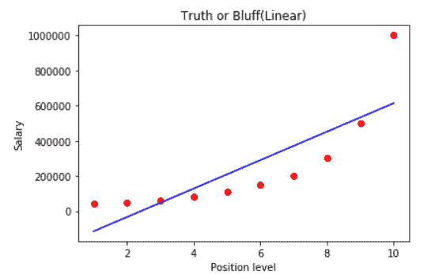

Linear regression model visual representation

### 5.拟合多项式回归模型

我们将导入`PolynomialFeatures`类。`poly_reg`是一个转换工具，将特征矩阵 X 转换为新的特征矩阵 X_poly。它包含 x1，x1^2,……，x1^n.

`degree`参数指定 X_poly 中多项式特征的次数。我们考虑默认值 ie 2。

```py
from sklearn.preprocessing import PolynomialFeatures
poly_reg = PolynomialFeatures(degree=2)
X_poly = poly_reg.fit_transform(X)

X     # prints X

```

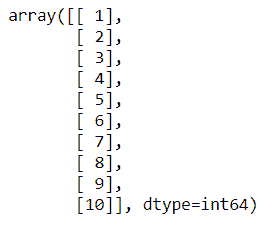

Output of X

```py
X_poly     # prints the X_poly

```

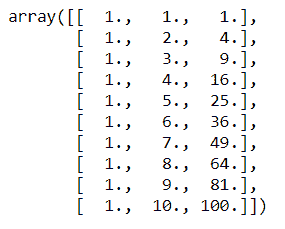

Output of X_poly

`X` 是原始值。`X_poly`有三列。第一列是常数为 1 的列。包含实数值的 x 是中间的列，即 x1。第二列是 x1 的平方。

拟合必须包含在多元线性回归模型中。为此，我们必须创建一个新的线性回归对象`lin_reg2`，它将用于包含我们用 poly_reg 对象和 X_poly 进行的拟合。

```py
lin_reg2 = LinearRegression()
lin_reg2.fit(X_poly,y)

```

上述代码产生以下输出:

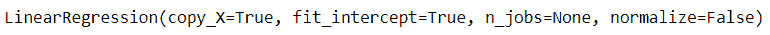

Output

### 6.可视化多项式回归模型

```py
from sklearn.preprocessing import PolynomialFeatures
poly_reg = PolynomialFeatures(degree=4)
X_poly = poly_reg.fit_transform(X)
lin_reg2 = LinearRegression()
lin_reg2.fit(X_poly,y)

X_grid = np.arange(min(X),max(X),0.1)
X_grid = X_grid.reshape(len(X_grid),1) 
plt.scatter(X,y, color='red') 

plt.plot(X_grid, lin_reg2.predict(poly_reg.fit_transform(X_grid)),color='blue') 

plt.title("Truth or Bluff(Polynomial)")
plt.xlabel('Position level')
plt.ylabel('Salary')
plt.show()

```

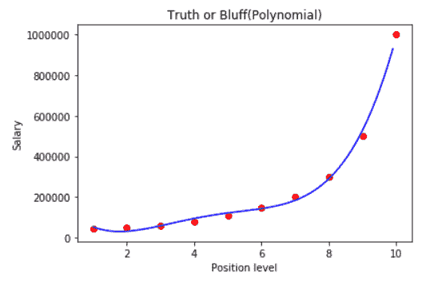

Visualizing the polynomial regression

### 7.预测结果

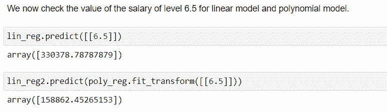

Prediction

## Python 中多项式回归的完整代码

```py
import numpy as np
import matplotlib.pyplot as plt
import pandas as pd

dataset = pd.read_csv('Position_Salaries.csv')
dataset

X = dataset.iloc[:,1:2].values  
y = dataset.iloc[:,2].values

# fitting the linear regression model
from sklearn.linear_model import LinearRegression
lin_reg = LinearRegression()
lin_reg.fit(X,y)

# visualising the linear regression model
plt.scatter(X,y, color='red')
plt.plot(X, lin_reg.predict(X),color='blue')
plt.title("Truth or Bluff(Linear)")
plt.xlabel('Position level')
plt.ylabel('Salary')
plt.show()

# polynomial regression model
from sklearn.preprocessing import PolynomialFeatures
poly_reg = PolynomialFeatures(degree=2)
X_poly = poly_reg.fit_transform(X)

X_poly     # prints X_poly

lin_reg2 = LinearRegression()
lin_reg2.fit(X_poly,y)

# visualising polynomial regression
from sklearn.preprocessing import PolynomialFeatures
poly_reg = PolynomialFeatures(degree=4)
X_poly = poly_reg.fit_transform(X)
lin_reg2 = LinearRegression()
lin_reg2.fit(X_poly,y)

X_grid = np.arange(min(X),max(X),0.1)
X_grid = X_grid.reshape(len(X_grid),1) 
plt.scatter(X,y, color='red') 

plt.plot(X_grid, lin_reg2.predict(poly_reg.fit_transform(X_grid)),color='blue') 

plt.title("Truth or Bluff(Polynomial)")
plt.xlabel('Position level')
plt.ylabel('Salary')
plt.show()

```

上面的代码输出如下图所示:

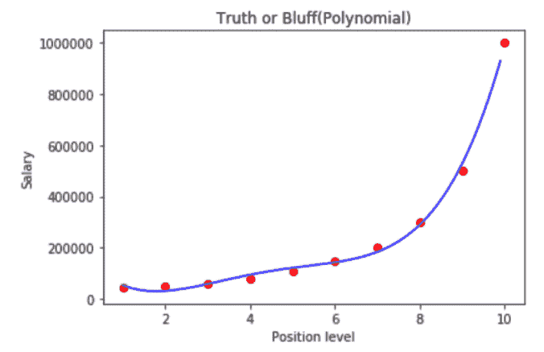

Output of the code

## 结论

关于多项式回归的这篇文章到此结束。希望您已经理解了多项式回归的概念，并且已经尝试了我们举例说明的代码。请在下面的评论区告诉我们您的反馈。