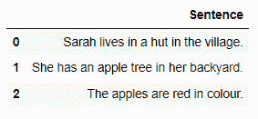
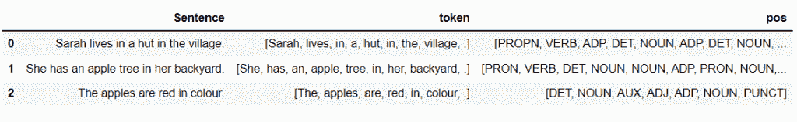
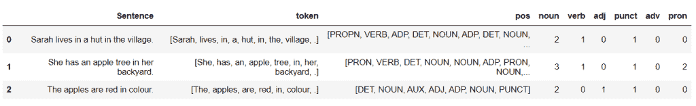

# 使用空间的自然语言处理中的词性标注

> 原文：<https://www.askpython.com/python/examples/pos-tagging-in-nlp-using-spacy>

词类是在句子中扮演不同角色的词。英语有 8 个词类。它们是:

1.  名词
2.  代词
3.  动词
4.  副词
5.  形容词
6.  介词
7.  连词
8.  交叉连接

词性标签提供了关于一个词及其相邻词的大量信息。它可以用于各种任务，如情感分析、文本到语音转换等。

***也读:[NLP 简介](https://www.askpython.com/python/examples/introduction-to-nlp)***

* * *

## 什么是词性标注？

标记意味着将令牌分类到预定义的类别中。**词性(POS)** 标注是给定语料库中的每个单词标注一个合适的记号，即基于上下文的词性。它也被称为**语法标记**。

* * *

## 词性标注技术

主要有四种类型的位置标签:

1.  **基于规则的标记器:**基于规则的标记器根据一些预定义的规则和提供给它们的信息的上下文来为单词分配词性。
2.  **随机/概率标记:**这是最简单的词性标记方法。它使用概率、频率和统计。这些标记器找到在训练数据中考虑的文本中给定单词最频繁使用的标记，并将该标记分配给测试数据中的单词。有时，这可能会导致语法错误的标记。
3.  **基于内存的标记:**一组案例保存在内存中，每个案例都有一个单词、它的上下文和一个适当的标记。基于保存在存储器中的案例中的最佳匹配，新的句子被标记。
4.  **基于转换的标签:**它是基于规则和随机标签的结合。在这种类型中，规则是从数据中自动生成的。此外，还考虑了一些预定义的规则。这两个因素都用于在基于转换的词性标注器中执行词性标注。

* * *

现在，让我们尝试用 Python 实现词性标注。我们将看到如何使用 Python 中可用的`spacy`库来执行词性标注。

考虑下面的文本是我们的语料库，目的是执行词性标注。

```py
Sarah lives in a hut in the village.
She has an apple tree in her backyard.
The apples are red in colour.

```

让我们创建一个上述句子的数据框架。

```py
import pandas as pd 

text = ['Sarah lives in a hut in the village.', 
      'She has an apple tree in her backyard.', 
      'The apples are red in colour.']

df = pd.DataFrame(text, columns=['Sentence'])

df

```



POS Tagging Dataframe

## 使用空间的词性标注

**让我们开始使用 Python spacy 进行词性标注。**

```py
import spacy

#load the small English model
nlp = spacy.load("en_core_web_sm")

#list to store the tokens and pos tags 
token = []
pos = []

for sent in nlp.pipe(df['Sentence']):
    if sent.has_annotation('DEP'):
        #add the tokens present in the sentence to the token list
        token.append([word.text for word in sent])
        #add the pos tage for each token to the pos list
        pos.append([word.pos_ for word in sent])

```

***如需了解更多 spacy 车型，请参考此[链接](https://stackoverflow.com/questions/50487495/what-is-difference-between-en-core-web-sm-en-core-web-mdand-en-core-web-lg-mod)。***

在上面的代码中，

*   我们首先导入了空间库。
*   创建了两个列表——一个用于存储标记(**标记**，另一个(**位置**)用于存储词性标签。
*   然后，我们循环遍历数据帧(df)的“句子”列中的每个句子
    *   将每个句子中的标记添加到标记列表中。
    *   将令牌的相应词性标签添加到词性列表中。

`token`列表如下所示:

```py
[['Sarah', 'lives', 'in', 'a', 'hut', 'in', 'the', 'village', '.'],
 ['She', 'has', 'an', 'apple', 'tree', 'in', 'her', 'backyard', '.'],
 ['The', 'apples', 'are', 'red', 'in', 'colour', '.']]

```

而`pos`列表是:

```py
[['PROPN', 'VERB', 'ADP', 'DET', 'NOUN', 'ADP', 'DET', 'NOUN', 'PUNCT'],
 ['PRON', 'VERB', 'DET', 'NOUN', 'NOUN', 'ADP', 'PRON', 'NOUN', 'PUNCT'],
 ['DET', 'NOUN', 'AUX', 'ADJ', 'ADP', 'NOUN', 'PUNCT']]

```

如果我们想在一个句子中看到它旁边的标记和 POS 标签，我们可以写

```py
df['token'] = token 
df['pos'] = pos

```

它将产生以下数据帧:



POS And Token Dataframe

如果我们想知道特定 POS 标签的数量，我们将使用`count`方法。

```py
# counting the number of a specific pos tag in each sentence 
# (in the 'pos' col) and adding a new col for it in the df 
df['noun'] = df.apply(lambda x: x['pos'].count('NOUN'), axis=1)
df['verb'] = df.apply(lambda x: x['pos'].count('VERB'), axis=1)
df['adj'] = df.apply(lambda x: x['pos'].count('ADJ'), axis=1)
df['punct'] = df.apply(lambda x: x['pos'].count('PUNCT'), axis=1)

df

```

上面的代码使用了一个 lambda 函数，该函数计算给定的 POS 标签在提到的列中出现的次数。我们可以根据需要清点其他 POS 标签。

这样的输出是:



POS Count Dataframe

* * *

## 结论

仅此而已！在本教程中，我们已经学习了**词性标注**及其使用**空间**的实现。请随时查看我们网站上的更多 Python 教程！

* * *

## 参考

*   [空间官方文件](https://spacy.io/usage/linguistic-features)