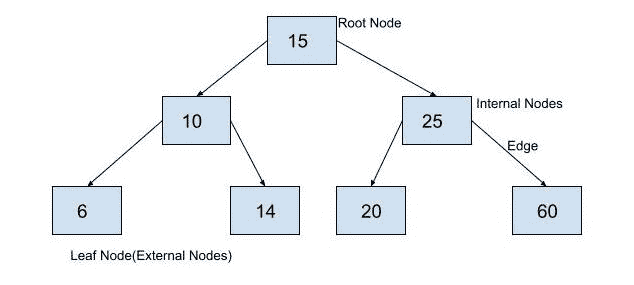

# Python 中的后序树遍历

> 原文：<https://www.askpython.com/python/examples/postorder-tree-traversal-in-python>

在本文中，我们将研究后序树遍历的概念和算法。然后我们将在 python 中实现后序遍历算法，并在一棵[二叉树](https://www.askpython.com/python/examples/binary-tree-implementation)上运行它。

## 什么是后序树遍历？

后序遍历是一种[深度优先的树遍历算法](https://www.askpython.com/python/examples/depth-first-search-algorithm)。在深度优先遍历中，我们从根节点开始，然后探索树的一个分支，直到结束，然后我们回溯并遍历另一个分支。

在后序遍历中，首先，我们遍历当前节点的左侧子树或左侧子树，然后我们遍历当前节点的右侧子树或右侧子树。最后，我们遍历当前节点。

我们递归地执行这个操作，直到所有的节点都被遍历。我们使用后序遍历来删除一棵二叉树。我们也可以使用后序树遍历从表达式树中找到后缀表达式。

## 后序遍历算法

下面是后序遍历的算法。

*   **算法后置:**
*   输入:对根节点的引用
*   输出:打印树的所有节点
*   开始吧。
*   如果根为空，则返回。
*   遍历根的左子树。// postorder(root.leftChild)
*   遍历根的右边子树。// postorder(root.rightChild)
*   遍历根节点。//打印节点
    末端的值。

## python 中后序遍历算法的实现

现在我们将实现上面的算法，以后序遍历的方式打印下面的二叉树的节点。



Binary Tree

在下面的代码中，首先创建了上面的二叉树，然后输出二叉树的后序遍历。

```py
class BinaryTreeNode:
  def __init__(self, data):
    self.data = data
    self.leftChild = None
    self.rightChild=None

def insert(root,newValue):
    #if binary search tree is empty, make a new node and declare it as root
    if root is None:
        root=BinaryTreeNode(newValue)
        return root
    #binary search tree is not empty, so we will insert it into the tree
    #if newValue is less than value of data in root, add it to left subtree and proceed recursively
    if newValue<root.data:
        root.leftChild=insert(root.leftChild,newValue)
    else:
        #if newValue is greater than value of data in root, add it to right subtree and proceed recursively
        root.rightChild=insert(root.rightChild,newValue)
    return root
def postorder(root):
    #if root is None return
        if root==None:
            return
        #traverse left subtree
        postorder(root.leftChild)
        #traverse right subtree
        postorder(root.rightChild)  
        #traverse root
        print(root.data)                 
root= insert(None,15)
insert(root,10)
insert(root,25)
insert(root,6)
insert(root,14)
insert(root,20)
insert(root,60)
print("Printing values of binary tree in postorder Traversal.")
postorder(root)

```

输出:

```py
Printing values of binary tree in postorder Traversal.
6
14
10
20
60
25
15

```

在这里，我们可以看到，在处理当前节点之前，遍历了节点的每个子节点。所以**我们可以使用后序遍历来删除一棵二叉树，因为我们可以从一个叶子开始删除节点，然后向上到根。**

## 结论

在本文中，我们学习了后序树遍历的概念。我们还研究了该算法，并用 Python 实现了它来遍历二叉树。请继续关注更多内容丰富的文章。