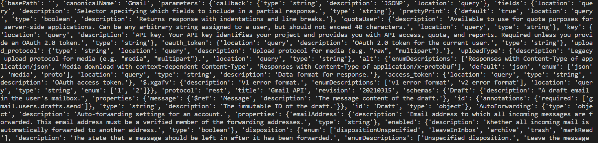
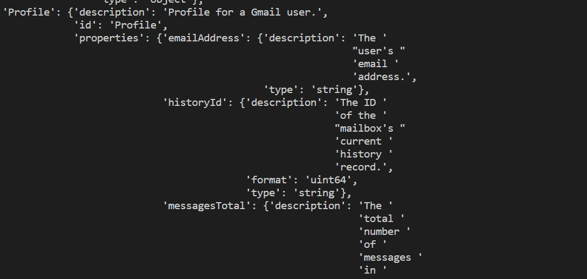

# Python pprint 模块

> 原文：<https://www.askpython.com/python-modules/pprint-module>

读者朋友们，你们好！在本文中，我们将详细关注 **Python pprint 模块**的功能。所以，让我们开始吧！🙂

* * *

## 了解 Python pprint 模块

无论是哪种编程语言，在表示最终产品或应用程序时，数据的表示总是起着关键的作用。除了开发人员之外，功能团队中的许多其他人利用特定模块的结果来进一步进行操作或分析。同样，输出也必须漂亮清晰。

特别是对于 [API 调用](https://www.askpython.com/python/examples/pull-data-from-an-api)，我们经常从调用中获得大量无格式数据，作为键值对形式的 [JSON](https://www.askpython.com/python-modules/python-json-module) 文件。对于我们来说，要实现和浏览大量未格式化的数据似乎太难了。

考虑到这一点，我们有 Python 的 pprint 模块来解决这个问题。

Python pprint 模块格式化传递给它的整个输出，并以结构化的格式表示。

那么，Python print()函数有什么问题呢？虽然 print()函数表示输出，但它不对输出进行格式化，因此不适合大量数据值。

看看下面的例子来理解 print()函数的问题

* * *

## 为什么不用 print()函数呢？

在下面的例子中，我们从 API 获取数据，并将其加载到 JSON 格式。我们尝试使用 [print()函数](https://www.askpython.com/python/built-in-methods/python-print-function)打印大量数据。

```py
import json
response_API = requests.get('https://gmail.googleapis.com/$discovery/rest?version=v1')
#print(response_API.status_code)
data = response_API.text
parse_json = json.loads(data)
print(parse_json)

```

**输出:**



**Python print Function**

如您所见，大量数据以非结构化格式表示，因此任何人都很难分析 JSON 数据。

* * *

## 用 API 调用的数据实现 pprint()模块

另一方面，我们现在尝试表示从上述示例中的 API 获取的相同数据，并尝试使用 pprint()模块来表示它。

**举例:**

```py
import requests
import json
from pprint import pprint
response_API = requests.get('https://gmail.googleapis.com/$discovery/rest?version=v1')
#print(response_API.status_code)
data = response_API.text
parse_json = json.loads(data)
pprint(parse_json)

```

**输出**:



**Python pprint Module**

如上所述，使用 pprint()函数以结构化且美观的格式表示整个庞大的数据，这使得读取和分析数据更加容易。

* * *

## 结论

尝试在其他场景中实现 pprint()函数，并在评论部分告诉我们您对相同内容的理解。如果你遇到任何问题，请随时留言。更多与 Python 编程相关的帖子，请继续关注我们。

在那之前，学习愉快！！🙂