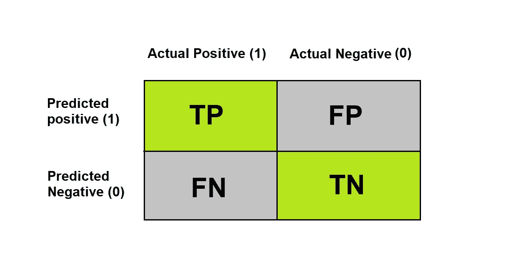
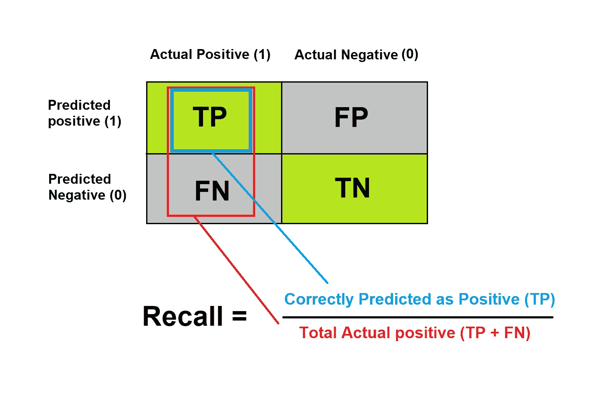
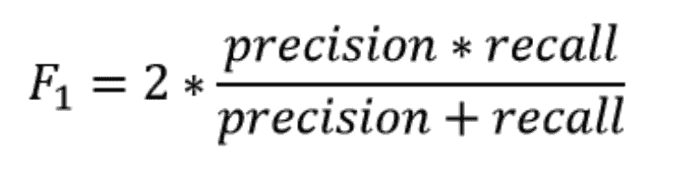
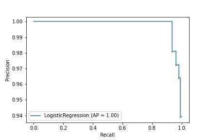

# Python 中的精度和召回

> 原文：<https://www.askpython.com/python/examples/precision-and-recall-in-python>

今天的文章就来说说精准和召回。每当我们实现一个分类问题*(即[决策树](https://www.askpython.com/python/examples/decision-trees) )* 来分类数据点时，总有一些点经常被错误分类。

即使准确性给出了模型有多好的一般概念，我们需要更健壮的度量来评估我们的模型。

让我们考虑一个例子。

假设您是一名在公司工作的数据科学家，您被分配了一项识别欺诈交易的任务。现在你必须建立一个模型，它看起来有很好的准确性，但是有一个问题。

我想让你想象一下这个问题的两种情况。

*   **场景 1** :你的模型将一个非欺诈交易归类为欺诈。
*   **场景 2** :您的模型将欺诈交易归类为非欺诈交易。

在这两种情况中，考虑到欺诈交易会带来巨大损失，哪种情况是最需要注意的？

我希望你猜对了。

这是第二种情况。如果您的模型将欺诈交易归类为非欺诈交易，可能会使您的组织遭受重大损失。你不想那样，是吗？🙂

准确性不能提供任何处理这类问题的方法。

在本文中，我们将了解如何通过获取关于精确度和召回率的知识来处理此类问题。

## 理解混淆矩阵

在深入精确和回忆之前，我们必须知道混淆矩阵。

二元分类问题的[混淆矩阵](https://www.askpython.com/python/examples/confusion-matrix)看起来是这样的。其中我们要么正确地对点进行分类，要么没有，但是这些错误分类的点可以进一步分为假阳性和假阴性。



Confusion Matrix

**现在让我们来理解一下术语。**

*   真正(TP):实际的正类被预测为正。
*   真阴性(TN):实际的阴性类被预测为阴性。
*   误报(FP):实际类别为阴性，但预测为阳性。
*   假阴性(FN):实际类别为阳性，但预测为阴性。

从混淆矩阵中可以解释出**精度**和**召回**。让我们看看它们是什么。

## 你说的精确是什么意思？

用最简单的话来说，精度是真正的阳性与被分类为阳性的所有点之间的比率。

为了计算模型的精度，我们需要混淆矩阵中的正数和负数。

*精度= TP/(TP + FP)*

为了审视精度，我们只是把它看作某种奇特的数学比率，但它究竟意味着什么呢？

参考上面的欺诈交易示例。这意味着在所有被分类为正面(欺诈)的交易中，有多少实际上是正面的。

## 你说的召回是什么意思？

简单来说，召回是我们的模型正确识别真正积极的措施。它也被称为真阳性率。

它是真阳性与真阳性和假阴性之和的比值。这意味着在所有实际上为正的点中，我们正确预测为正的占多少？

*召回= TP/(TP + FN)*

参照我们之前的例子。我们说，在所有实际上是欺诈的交易中，我们预测其中有多少是欺诈。



Recall Intuition

## F1 的分数是多少？

F1 分数是精确度和召回率的调和平均值

它可以计算为:



F1 Score

当存在不平衡的班级时，F1 分数是一个更好的指标。当你想在精确度和召回率之间寻求平衡时，它是需要的。

在大多数现实生活的分类问题中，存在不平衡的类别分布，因此 F1-score 是评估我们的模型的更好的度量。

## 用 Python 计算精度和召回率

让我们看看如何在分类问题上使用 python 计算精度和召回率。

我们将利用 sklearn.metrics 模块。

```py
#Importing the required libraries
from sklearn import datasets
import pandas as pd
from sklearn.linear_model import LogisticRegression
from sklearn.model_selection import train_test_split
from sklearn.metrics import precision_recall_curve
from sklearn.metrics import plot_precision_recall_curve
from sklearn.metrics import precision_score
from sklearn.metrics import recall_score
import matplotlib.pyplot as plt

#Loading the data
data = datasets.load_breast_cancer()
df = pd.DataFrame(data.data, columns=data.feature_names)
df['target'] = data.target

#Splitting the data into training and test set
X_train, X_test, y_train, y_test = train_test_split(
                                    df.iloc[:,:-1], df.iloc[:,-1], test_size=0.3, random_state=42)

# Initialize and fit the Model
model = LogisticRegression()
model.fit(X_train, y_train)

#Make prediction on the test set
pred = model.predict(X_test)

#calculating precision and reall
precision = precision_score(y_test, pred)
recall = recall_score(y_test, pred)

print('Precision: ',precision)
print('Recall: ',recall)

#Plotting Precision-Recall Curve
disp = plot_precision_recall_curve(model, X_test, y_test)

```

```py
Precision:  0.963963963963964
Recall:  0.9907407407407407

```



Precision Recall Curve

来自`sklearn.metrics`模块的`precision_score( )`和`recall_score( )`函数需要真实标签和预测标签作为输入参数，分别返回精度和召回分数。

## 结论

拥有高精度和高召回率的能力总是被期望的，但是很难达到。根据应用程序的类型，我们需要提高精度或召回率。这篇文章是关于理解两个非常非常重要的模型评估标准。

快乐学习！