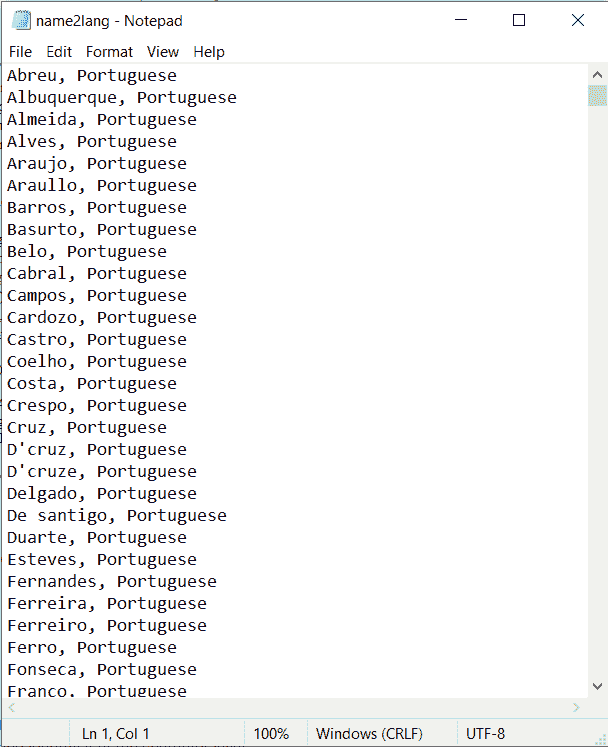
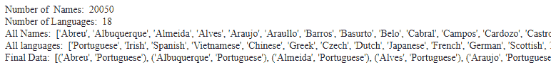
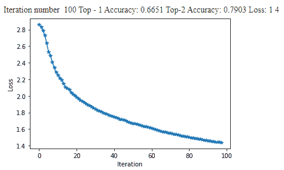
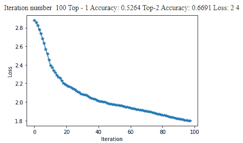

# 根据 Python 中的名称预测国籍

> 原文：<https://www.askpython.com/python/examples/predict-nationality-using-names>

嘿伙计们！在本教程中，我们将建立一个 RNN 和 LSTM 模型，帮助我们根据每个角色的名字来预测国籍。

让我们从了解我们拥有的数据集开始。

* * *

## **了解数据集**

Dataset 是一个文本文件，包含每个行中用逗号分隔的人名和姓名的国籍。该数据集包含超过 2 万个名字和 18 个独特的国籍，如葡萄牙语、爱尔兰语、西班牙语等等。

数据的快照如下所示。你可以在这里下载数据集[。](https://www.kaggle.com/rp1985/name2lang)



Dataset Snapshot Nationality Predictor

* * *

## **用 Python 中的人名预测国籍**

让我们直接进入代码实现。我们将从导入模块开始，然后导入我们为本次演示选择的名称和国籍数据集。

### **第一步:导入模块**

在开始构建任何模型之前，我们需要将所有需要的库导入到我们的程序中。

```py
from io import open
import os, string, random, time, math
import matplotlib.pyplot as plt
import seaborn as sns
import numpy as np
from sklearn.model_selection import train_test_split
import torch 
import torch.nn as nn
import torch.optim as optim
from IPython.display import clear_output

```

### **第二步:加载数据集**

为了加载数据集，我们遍历数据中的每一行，并创建一个包含姓名和国籍的元组列表。这将使模型更容易理解后面部分中的数据。

```py
languages = []
data = []
X = []
y = []

with open("name2lang.txt", 'r') as f:
    #read the dataset
    for line in f:
        line = line.split(",")
        name = line[0].strip()
        lang = line[1].strip()
        if not lang in languages:
            languages.append(lang)
        X.append(name)
        y.append(lang)
        data.append((name, lang))

n_languages = len(languages)
print("Number of  Names: ", len(X))
print("Number of Languages: ",n_languages)
print("All Names: ", X)
print("All languages: ",languages)
print("Final Data: ", data)

```



Load Dataset Nationality Predictor

### **第三步:列车测试分割**

我们将[将数据按 80:20 的比例分成培训和测试](https://www.askpython.com/python/examples/split-data-training-and-testing-set)，其中 80%的数据用于培训，其余 20%用于测试。

```py
X_train, X_test, y_train, y_test = train_test_split(X, y, test_size = 0.2, random_state = 123, stratify = y)
print("Training Data: ", len(X_train))
print("Testing Data: ", len(X_test))

```

```py
Training Data:  16040
Testing Data:  4010

```

### **步骤 4:编码数据**

字符编码将被用作序列模型的输入，而不是原始文本数据。因此，我们必须对输入进行加密，并在字符级别对其进行识别。

一旦我们在字符级创建了编码，我们需要连接所有的字符级编码来获得整个单词的编码。这一过程适用于所有姓名和国籍。

```py
all_letters = string.ascii_letters + ".,;"
print(string.ascii_letters)
n_letters = len(all_letters)

def name_rep(name):
  rep = torch.zeros(len(name), 1, n_letters)
  for index, letter in enumerate(name):
    pos = all_letters.find(letter)
    rep[index][0][pos] = 1
  return rep

```

上面的函数 name_rep 为名称生成一次性编码。首先，我们声明一个零张量，输入大小等于名字的长度，外部大小等于列表中的全部字符数。

接下来，我们循环遍历每个字符以标识字母的索引，并将该索引位置值设置为 1，其余值为 0。

```py
def nat_rep(lang):
    return torch.tensor([languages.index(lang)], dtype = torch.long)

```

对国籍进行编码遵循的逻辑比对姓名进行编码简单得多。我们只需确定特定国籍在我们的国籍列表中出现的索引，以对国籍进行编码。然后，索引被指定为编码。

### **第五步:建立神经网络模型**

我们将使用 Pytorch 建立一个 RNN 模型，我们创建一个类来实现这个目标。

**init** 函数(构造函数)帮助我们初始化网络特征，例如与隐藏层相关的权重和偏差。

```py
class RNN_net(nn.Module):

    def __init__(self, input_size, hidden_size, output_size):
        super(RNN_net, self).__init__()
        self.hidden_size = hidden_size
        self.i2h = nn.Linear(input_size + hidden_size, hidden_size)
        self.i2o = nn.Linear(input_size + hidden_size, output_size)
        self.softmax = nn.LogSoftmax(dim = 1)

    def forward(self, input_, hidden):
        combined = torch.cat((input_, hidden), 1)
        hidden = self.i2h(combined)
        output = self.i2o(combined)
        output = self.softmax(output)
        return output, hidden

    def init_hidden(self):
        return torch.zeros(1, self.hidden_size)

```

forward 函数首先连接角色的输入和隐藏表示，然后使用 i2h、i2o 和 softmax 层将其作为输入来计算输出标签。

```py
def infer(net, name):
    net.eval()
    name_ohe = name_rep(name)
    hidden = net.init_hidden()
    for i in range(name_ohe.size()[0]):
        output, hidden = net(name_ohe[i], hidden)
    return output
n_hidden = 128
net = RNN_net(n_letters, n_hidden, n_languages)
output = infer(net, "Adam")
index = torch.argmax(output)
print(output, index)

```

网络实例和人名作为输入参数传递给 infer 函数。我们将网络设置为评估模式，并在此函数中计算输入人名的一键表示。

接下来，我们将根据隐藏大小计算隐藏表示，并在将计算的隐藏表示返回到网络之前循环所有字符。

最后，我们将计算输出，即这个人的国籍。

### **第六步:计算 RNN 模型的精度**

在继续训练模型之前，让我们创建一个函数来计算模型的准确性。

为了达到同样的目的，我们将创建一个评估函数，将以下内容作为输入:

1.  网络实例
2.  数据点的数量
3.  k 的值
4.  x 和 Y 测试数据

```py
def dataloader(npoints, X_, y_):
    to_ret = []
    for i in range(npoints):
        index_ = np.random.randint(len(X_))
        name, lang = X_[index_], y_[index_]
        to_ret.append((name, lang, name_rep(name), nat_rep(lang)))

    return to_ret

def eval(net, n_points, k, X_, y_):
     data_ = dataloader(n_points, X_, y_)
     correct = 0

     for name, language, name_ohe, lang_rep in data_:
         output = infer(net, name)
         val, indices = output.topk(k)
         if lang_rep in indices:
             correct += 1
     accuracy = correct/n_points
     return accuracy 

```

在函数内部，我们将执行以下操作:

1.  使用`data loader`加载数据。
2.  迭代数据加载器中出现的所有人名。
3.  对输入调用模型并获得输出。
4.  计算预测类。
5.  计算正确预测的类别总数
6.  返回最终百分比。

### **第七步:训练 RNN 模型**

为了训练模型，我们将编写一个简单的函数来训练我们的网络。

```py
def train(net, opt, criterion, n_points):
    opt.zero_grad()
    total_loss = 0
    data_ = dataloader(n_points, X_train, y_train)
    for name, language, name_ohe, lang_rep in data_:
        hidden = net.init_hidden()
        for i in range(name_ohe.size()[0]):
            output, hidden = net(name_ohe[i], hidden)
        loss = criterion(output, lang_rep)
        loss.backward(retain_graph=True)
        total_loss += loss  
    opt.step()       
    return total_loss/n_points

def train_setup(net, lr = 0.01, n_batches = 100, batch_size = 10, momentum = 0.9, display_freq = 5):
    criterion = nn.NLLLoss()
    opt = optim.SGD(net.parameters(), lr = lr, momentum = momentum)
    loss_arr = np.zeros(n_batches + 1)
    for i in range(n_batches):
        loss_arr[i + 1] = (loss_arr[i]*i + train(net, opt, criterion, batch_size))/(i + 1)
        if i%display_freq == display_freq - 1:
            clear_output(wait = True)
            print("Iteration number ", i + 1, "Top - 1 Accuracy:", round(eval(net, len(X_test), 1, X_test, y_test),4), 'Top-2 Accuracy:', round(eval(net, len(X_test), 2, X_test, y_test),4), 'Loss:', round(loss_arr[i]),4)
            plt.figure()
            plt.plot(loss_arr[1:i], "-*")
            plt.xlabel("Iteration")
            plt.ylabel("Loss")
            plt.show()
            print("\n\n")
n_hidden = 128
net = RNN_net(n_letters, n_hidden, n_languages)
train_setup(net, lr = 0.0005, n_batches = 100, batch_size = 256)

```

在对 100 个批次的模型进行训练之后，我们能够利用 RNN 模型实现 66.5%的前 1 名准确度和 79%的前 2 名准确度。



Loss Plot Nationality Predictor

### **第八步:LSTM 模式培训**

我们还将讨论如何实现 LSTM 模型来对人名的国籍进行分类。为了达到同样的目的，我们将使用 Pytorch 并创建一个自定义的 LSTM 类。

```py
class LSTM_net(nn.Module):
    def __init__(self, input_size, hidden_size, output_size):
        super(LSTM_net, self).__init__()
        self.hidden_size = hidden_size
        self.lstm_cell = nn.LSTM(input_size, hidden_size) #LSTM cell
        self.h2o = nn.Linear(hidden_size, output_size)
        self.softmax = nn.LogSoftmax(dim = 2)

    def forward(self, input_, hidden):
        out, hidden = self.lstm_cell(input_.view(1, 1, -1), hidden)
        output = self.h2o(hidden[0])
        output = self.softmax(output)
        return output.view(1, -1), hidden

    def init_hidden(self):
        return (torch.zeros(1, 1, self.hidden_size), torch.zeros(1, 1, self.hidden_size))

n_hidden = 128
net = LSTM_net(n_letters, n_hidden, n_languages)
train_setup(net, lr = 0.0005, n_batches = 100, batch_size = 256)

```

在对 100 个批次的模型进行训练之后，我们能够利用 LSTM 模型实现 52.6%的前 1 名准确度和 66.9%的前 2 名准确度。



Loss Plot Nationality Predictor LSTM

* * *

## **结论**

恭喜你！您刚刚学习了如何使用 Pytorch 构建国籍分类模型。希望你喜欢它！😇

喜欢这个教程吗？无论如何，我建议你看一下下面提到的教程:

1.  [用 Python 分类服装图像——完全指南](https://www.askpython.com/python/examples/classifying-clothing-images)
2.  [使用 Python 进行葡萄酒分类——简单易懂](https://www.askpython.com/python/wine-classification)

感谢您抽出时间！希望你学到了新的东西！！😄

* * *