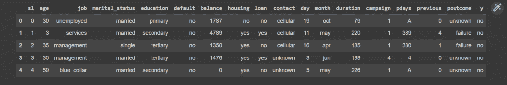
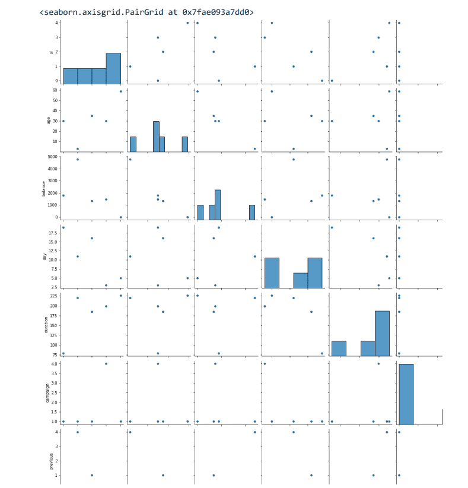
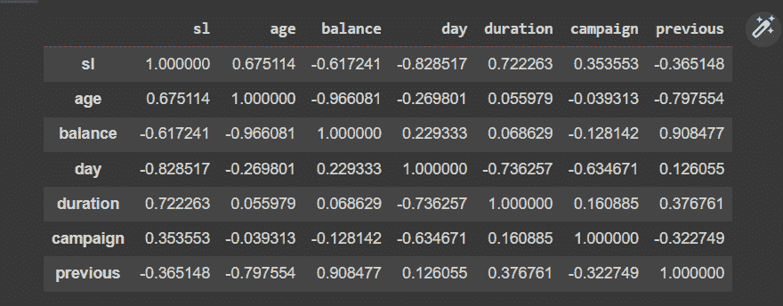
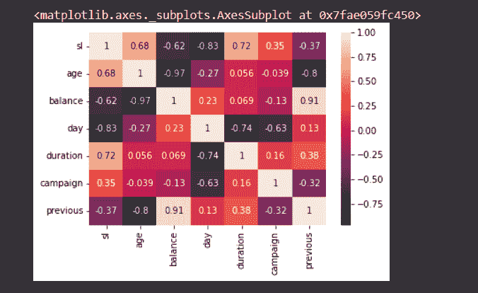
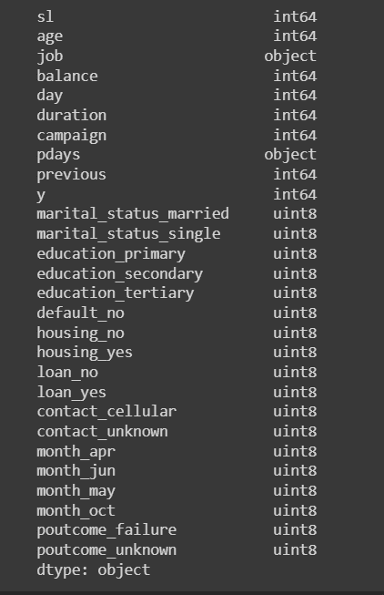
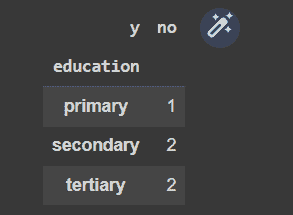
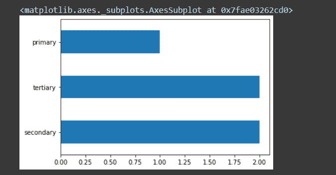
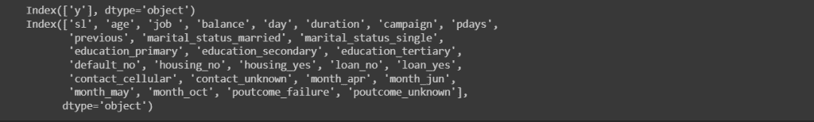

# 用 Python 构建预测模型

> 原文：<https://www.askpython.com/python/examples/predictive-model-in-python>

今天我们将学习一个有趣的话题，如何用 python 创建一个预测模型。这是机器学习和数据科学中的一个基本概念。在深入探讨之前，我们需要了解什么是预测分析。让我们看看目录。

## 什么是预测分析？

预测分析是数据科学的一个领域，涉及对未来事件进行预测。我们可以创建关于火灾或未来几天的新数据的预测，并使机器支持相同的数据。我们使用各种统计技术来分析目前的数据或观察结果，并预测未来。

## 我们为什么要使用预测分析？

如果做得正确，预测分析可以提供几个好处。对选择预测分析高度负责的一些关键特征如下。

*   即时反馈系统
    *   它也提供了一个更好的营销策略。
    *   以营销服务或任何业务为例，我们可以了解人们喜欢它的程度，以及最重要的是，他们真正想要添加的额外功能。
    *   它指出了当前的趋势。
*   最佳化
    *   我们可以使用预测分析优化我们的预测以及即将到来的战略。
    *   类似于修改。
    *   它包括对现在、过去和未来战略的比较。
*   更好的策略
    *   使用这种即时反馈系统和优化流程，我们最终会有一个更好的策略。
    *   它还提供了多种策略。
    *   它引导更好的决策。
*   降低风险
    *   当我们不知道优化，不知道反馈系统时，我们也可以降低风险。
    *   最适合新人。

## 预测分析用例

*   防止流失
    *   它允许我们预测一个人是否会在我们的策略中。不管他/她是否满意。
    *   我们获得基于 pon 客户使用的分析。利用这一点，我们可以赢得报价，并了解他们真正想要的是什么。
*   质量保证
    *   我们可以通过提供表格、访谈等方式了解客户使用我们服务的感受。
    *   人们到底想要什么，不同的人和不同的想法。
    *   需要安装的新特性以及它们的环境如何？
*   风险建模
    *   它让我们知道将要涉及的风险程度。这样我们也可以投资它。
    *   分析当前策略和预测未来策略。
*   销售预测
    *   在目前的策略中它是如何进行的，在接下来的日子里它会是什么样的。
    *   分析这些数据并创建有组织的数据。

## 预测分析中涉及的步骤

*   问题定义
    *   它旨在确定我们的问题是什么。我们需要解决同样的问题。我们需要预测的主要问题。
    *   预测分析的每个领域都需要基于这个问题定义。
*   数据采集
    *   我们从多个来源收集数据，并收集数据来分析和创建我们的角色模型。
*   数据清理
    *   我们可以看看缺失的值和哪些不重要。它们需要被移除。
    *   我们需要通过这种方式优化来提高这个模型的质量。
    *   我们需要删除超出边界级别的值。
*   数据分析
    *   它包括管理收集的数据。
    *   管理数据指的是检查数据是否组织良好。
*   建模
    *   这一步包括通过使用先决条件算法来安装我们的机器，从而保存最终确定的或有组织的数据
*   模型检验
    *   我们需要测试这台机器是否符合标准。
    *   我们需要检查或比较输出结果/值和预测值。
    *   在 0 到 1 的范围内分析比较的数据，其中 0 表示 0%，1 表示 100 %。
*   部署
    *   一旦我们的模型被创建，或者它表现良好，或者它获得了成功的准确性分数，那么我们需要部署它以供市场使用。

## 预测分析的应用

Predictive 可以构建未来预测，这将有助于许多业务，如下所示:

*   定价
*   需求计划
*   活动管理
*   客户获取
*   预算和预测
*   欺诈检测
*   促销

## 创建我们的预测模型(示例)

让我们使用 google collab 来尝试一个预测分析的演示，方法是从一个针对特定优惠的银行活动中收集数据集。分析数据，通过抽样采访了解他们是否会利用这一机会。

| 指数 | 海平面 | 年龄 | 工作 | 婚姻状况 | 教育 | 系统默认值 | 平衡 | 房屋 | 贷款 | 接触 | 天 | 月 | 期间 | 运动 | pdays | 以前的 | 结果 | y |
| --- | --- | --- | --- | --- | --- | --- | --- | --- | --- | --- | --- | --- | --- | --- | --- | --- | --- | --- |
| Zero | Zero | Thirty | 失业的 | 已婚的 | 主要的 | 不 | One thousand seven hundred and eighty-seven | 不 | 不 | 细胞的 | Nineteen | 十月 | Seventy-nine | one | A | Zero | 未知的 | 不 |
| one | one | three | 服务 | 已婚的 | 副手 | 不 | Four thousand seven hundred and eighty-nine | 是 | 是 | 细胞的 | Eleven | 可能 | Two hundred and twenty | one | Three hundred and thirty-nine | four | 失败 | 不 |
| Two | Two | Thirty-five | 管理 | 单一的 | 第三的 | 不 | One thousand three hundred and fifty | 是 | 不 | 细胞的 | Sixteen | 四月 | One hundred and eighty-five | one | Three hundred and thirty | one | 失败 | 不 |
| three | three | Thirty | 管理 | 已婚的 | 第三的 | 不 | One thousand four hundred and seventy-six | 是 | 是 | 未知的 | three | 六月 | One hundred and ninety-nine | four | four | Zero | 未知的 | 不 |
| four | four | Fifty-nine | 蓝领 | 已婚的 | 副手 | 不 | Zero | 是 | 不 | 未知的 | five | 可能 | Two hundred and twenty-six | one | A | Zero | 未知的 | 不 |

```py
#importing modules
import pandas as pd
import numpy as np
from sklearn.model_selection import train_test_split
from sklearn.metrics import accuracy_score
from sklearn.linear_model import LogisticRegression

import seaborn as sns
import matplotlib.pyplot as plt
%matplotlib inline

data = pd.read_csv("/dataset.csv", delimiter = ",", header = "infer")
data.head()

```



```py
sns.pairplot(data)

```



Capture 2

```py
data.corr()

```



Capture 3

```py
sns.heatmap(data.corr(), annot = True)

```



Capture 4

```py
data.dtypes

sl                 int64
age                int64
job               object
marital_status    object
education         object
default           object
balance            int64
housing           object
loan              object
contact           object
day                int64
month             object
duration           int64
campaign           int64
pdays             object
previous           int64
poutcome          object
y                 object
dtype: object

```

```py
data_new = pd.get_dummies(data, columns=['marital_status',	'education',	'default',	'housing',	'loan',	'contact',	'month', 'poutcome'	])
data_new.y.replace(('yes','no'), (1,0), inplace = True)
data_new.dtypes

```



Capture 5

```py
print(data.shape)
  (5, 18)
data.education.unique()
  array(['primary', 'secondary', 'tertiary'], dtype=object)
pd.crosstab(index = data["education"], columns = data["y"])

```



Capture 6

```py
data.education.value_counts().plot(kind = "barh")

```



Capture 7

```py
data_y = pd.DataFrame(data_new['y'])
data_x = data_new.drop(['y'], axis = 1)
print(data_y.columns)
print(data_x.columns)

```



Capture 8

```py
x_train, x_test, y_train, y_test = train_test_split(data_x, data_y, test_size = 0.3, random_state = 2, stratify = data_y)
print(x_train.shape)
print(x_test.shape)
print(y_train.shape)
print(y_test.shape)

```

```py
#OUTPUT FOR THE ABOVE CODE
(3, 27)
(2, 27)
(3, 1)
(2, 1)

```

## 摘要

今天，我们讲述了预测分析，并尝试使用样本数据集进行演示。希望您已经尝试过我们的代码片段。你也可以尝试获取更多的数据集。我们必须带着一些更令人兴奋的话题再次访问。