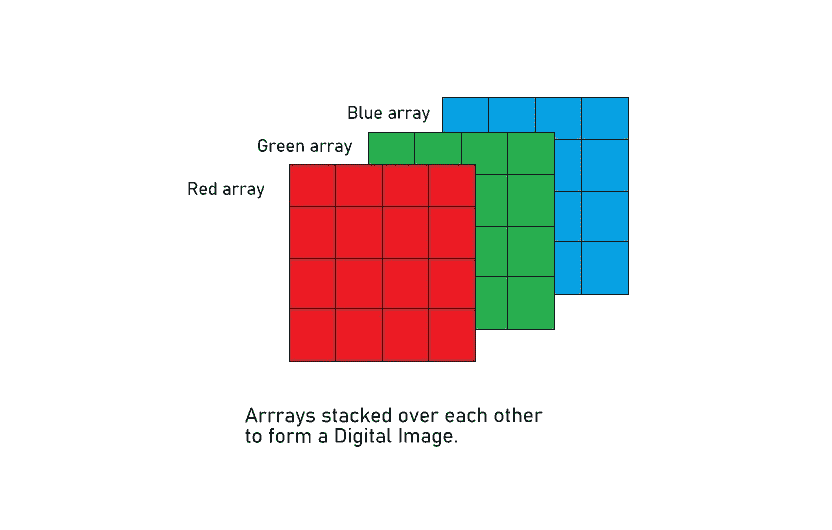
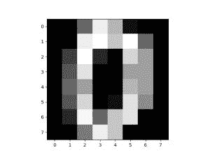
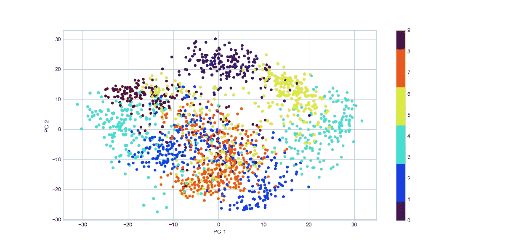
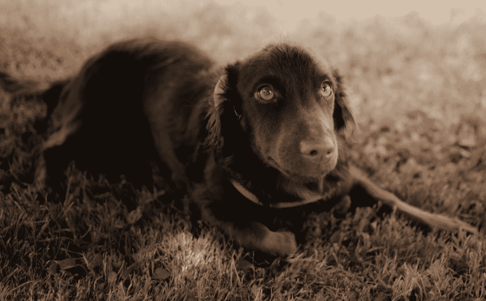
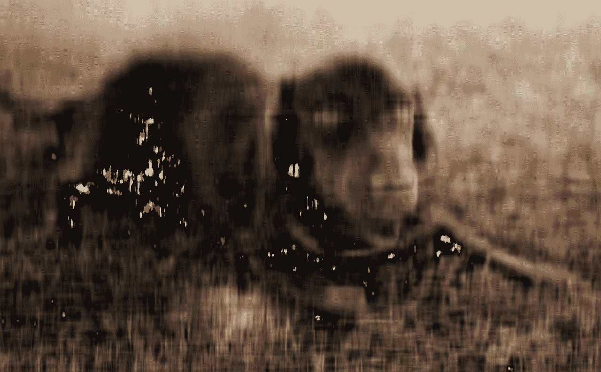
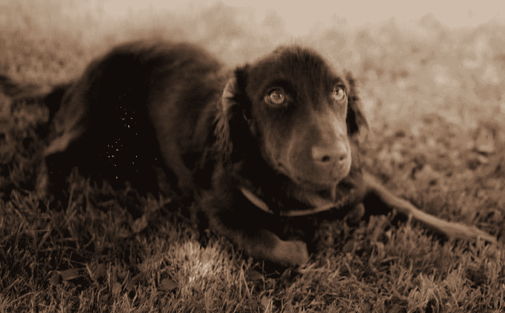
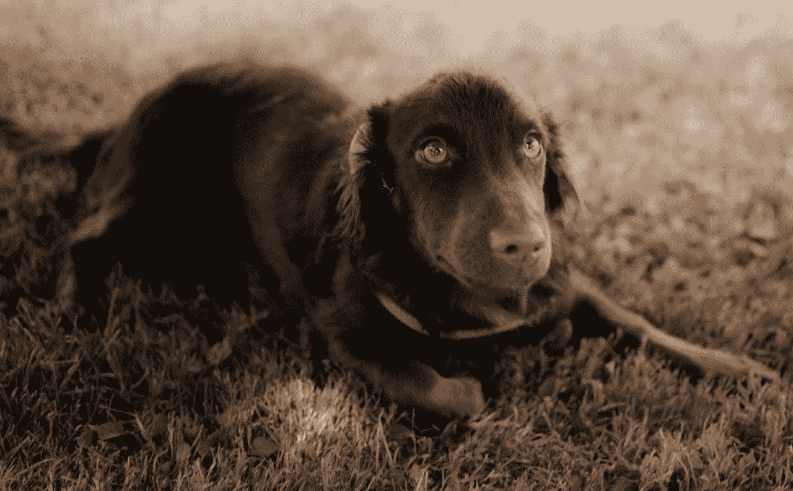

# Python 中图像数据的主成分分析

> 原文：<https://www.askpython.com/python/examples/principal-component-analysis-for-image-data>

我们已经在[之前的文章](https://www.askpython.com/python/examples/principal-component-analysis)中研究过 PCA。在本文中，让我们对图像数据进行主成分分析。主成分分析是一种著名的无监督降维技术，每当维数灾难困扰我们时，它就来拯救我们。

使用影像数据与通常的数据集略有不同。一幅典型的彩色图像是由微小的像素(简称为“像素”)组成的，许多像素以阵列的形式聚集在一起形成一幅数字图像。

典型的数字图像是通过堆叠强度范围从 0 到 255 的红、蓝和绿像素阵列制成的。



**RGB Arrays Combined To Make Digital Image**

灰度图像不包含颜色，只包含灰色阴影。灰度图像的像素强度从黑色(0 强度)到白色(255 全强度)不等，这就是我们通常所说的黑白图像。

## 将主成分分析应用于数字数据集

[数字](https://scikit-learn.org/stable/auto_examples/datasets/plot_digits_last_image.html)数据集是具有 1797 个 8×8 图像的手写数字的灰度图像数据集。

```py
#importing the dataset
import numpy as np
import matplotlib.pyplot as plt
from sklearn.datasets import load_digits

digits = load_digits()
data = digits.data
data.shape

```

`sklearn.datasets`模块通过导入`load_digits`类来快速导入数字数据。数字数据的形状是(1797，64)。展平 8×8 像素，为每个图像创建长度为 64 的向量。

让我们看看我们的数据是什么样的。

```py
#taking a sample image to view
#Remember image is in the form of numpy array.
image_sample = data[0,:].reshape(8,8)
plt.imshow(image_sample)

```



Sample Image from Digit Dataset

### 1.缩小图像尺寸

现在，使用 PCA，让我们将图像尺寸从 64 减少到 2，这样我们就可以使用[散点图](https://www.askpython.com/python-modules/data-visualization-using-python-bokeh)来可视化数据集。

sklearn 为我们提供了一个非常简单的 PCA 实现。

```py
#Import required modules
from sklearn.decomposition import PCA

pca = PCA(2) # we need 2 principal components.
converted_data = pca.fit_transform(digits.data)

converted_data.shape

```

数据从(1797，64)减少到(1797，2)。

### 2.可视化生成的数据集

我们将使用`sklearn.decomposition`提供的`PCA()`类来实现主成分分析算法。

它接受整数作为输入参数，描述我们希望转换后的数据集中主成分的数量。

我们也可以传递一个小于 1 的浮点值，而不是一个整数。即 PCA(0.90)，这意味着该算法将找到解释数据中 90%方差的主成分。

让我们想象一下结果。

```py
plt.style.use('seaborn-whitegrid')
plt.figure(figsize = (10,6))
c_map = plt.cm.get_cmap('jet', 10)
plt.scatter(converted_data[:, 0], converted_data[:, 1], s = 15,
            cmap = c_map , c = digits.target)
plt.colorbar()
plt.xlabel('PC-1') , plt.ylabel('PC-2')
plt.show()

```



Visualizing Digits Data In 2 Dimensions

## 图像数据压缩的主成分分析

PCA 的另一个很酷的应用是图像压缩。让我们来看看如何用 python 来实现这一点。

```py
# Importing required libraries
import cv2
import numpy as np
import matplotlib.pyplot as plt
from sklearn.decomposition import PCA

```

### 1.加载图像

我们将使用 **[OpenCV](https://opencv.org/about/)** (开源计算机视觉库)。 [OpenCV](https://www.askpython.com/python-modules/read-images-in-python-opencv) 是一个开源的计算机视觉和机器学习库。

```py
# Loading the image 
img = cv2.imread('my_doggo_sample.jpg') #you can use any image you want.
plt.imshow(img)

```



Sample Original Image Output

### 2.将图像分割成 R、G、B 阵列

众所周知，数字彩色图像是 R、G 和 B [阵列](https://www.askpython.com/python-modules/numpy/python-numpy-arrays)相互堆叠的组合。这里，我们必须从图像中分离每个通道，并从每个通道中提取主成分。

```py
# Splitting the image in R,G,B arrays.

blue,green,red = cv2.split(img) 
#it will split the original image into Blue, Green and Red arrays.

```

这里要注意的重要一点是，OpenCV 将分成蓝色、绿色和红色通道，而不是红色、蓝色和绿色。请注意这里的顺序。

### 3.将主成分应用于单个阵列

现在，对每个阵列应用 PCA。

```py
#initialize PCA with first 20 principal components
pca = PCA(20)

#Applying to red channel and then applying inverse transform to transformed array.
red_transformed = pca.fit_transform(red)
red_inverted = pca.inverse_transform(red_transformed)

#Applying to Green channel and then applying inverse transform to transformed array.
green_transformed = pca.fit_transform(green)
green_inverted = pca.inverse_transform(green_transformed)

#Applying to Blue channel and then applying inverse transform to transformed array.
blue_transformed = pca.fit_transform(blue)
blue_inverted = pca.inverse_transform(blue_transformed)

```

这里，我们应用 PCA，仅保留前 20 个主成分，并将其分别应用于 RGB 阵列。

### 4.压缩图像

逆变换对于重新创建基础图像的原始尺寸是必要的。

在从缩减的维度重建原始维度的过程中，由于我们只保留选定的主成分，在本例中为 20 个，因此丢失了一些信息。

```py
img_compressed = (np.dstack((red_inverted, red_inverted, red_inverted))).astype(np.uint8)

```

使用`dstack`函数堆叠倒置的数组。这里指定数组的数据类型很重要，因为大多数图像是 8 位的。每个像素由一个 8 位字节表示。

```py
#viewing the compressed image
plt.imshow(img_compressed)

```



**Compressed Image With First 20 Principal Components**

上面的输出是我们只考虑 20 个主成分时得到的结果。

如果我们增加主成分的数量，输出图像将变得清晰。

**使用前 50 个主成分:**


**Compressed Image With First 50 Principal Components**

**现在，用 100 个主成分:**



**Compressed Image With First 100 Principal Components**

有了前 100 个主成分，我们的输出变得更加清晰。现在让我们使用前 200 个主成分来应用 PCA。



**Compressed Image With First 200 Principal Components**

瞧啊。有了 200 个主要成分，我们就能创造出和原始图像一样清晰的图像。

要考虑的元件数量完全是任意的。从某个小值开始，逐渐增加，直到达到所需的输出。请随意试验这些代码。

## 结论

在本文中，我们探索了 PCA 作为降维技术的应用，并将其应用于图像数据。我们还看到了 PCA 如何在图像压缩中得到应用。

快乐学习！