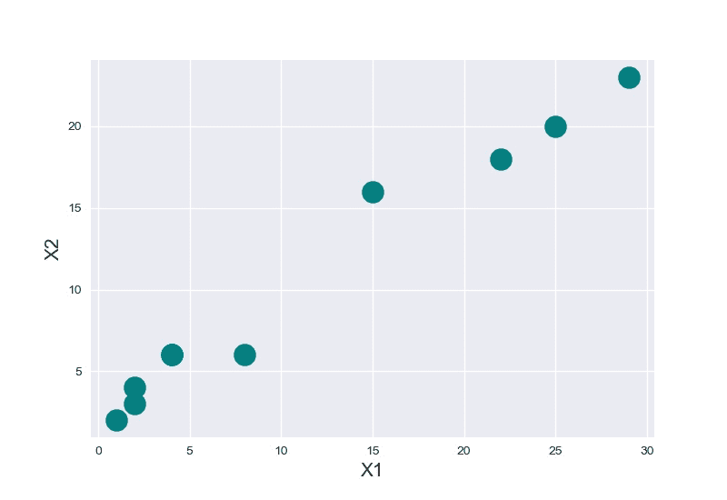
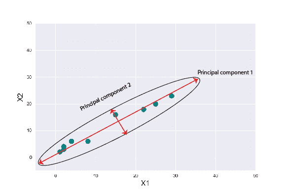
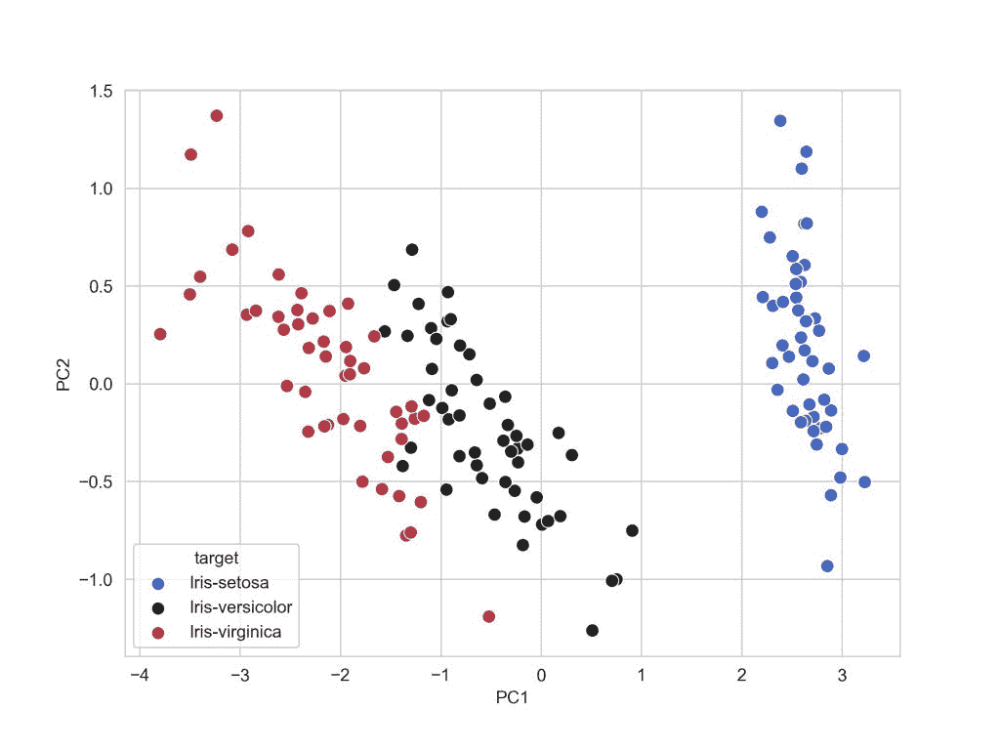

# Python 中从头开始的主成分分析

> 原文：<https://www.askpython.com/python/examples/principal-component-analysis>

主成分分析，简称 PCA，是一种著名的降维技术。

它自 1901 年以来一直存在，并且仍然被用作机器学习和统计中的主要降维方法。PCA 是一种无监督的统计方法。

在本文中，我们将对 PCA 有一些直觉，并将使用 Python 和 NumPy 从头开始自己实现它。

## 为什么首先要使用 PCA？

为了支持使用 PCA 的原因，让我们看一个例子。

**假设我们有一个数据集**，它有两个变量和 10 个数据点。如果要求我们将数据点可视化，我们可以非常容易地做到。结果也很好解释。

| X1 | Two | eight | one | four | Twenty-two | Fifteen | Twenty-five | Twenty-nine | four | Two |
| X2 | three | six | Two | six | Eighteen | Sixteen | Twenty | Twenty-three | six | four |

Example Data points



**Plotting Data On Two Dimensions**

现在，如果我们试图增加变量的数量，我们几乎不可能想象出比三维更高的维度。

我们在分析高维数据集时面临的这个问题就是通常所说的“*”维度的诅咒。这个术语是由理查德·e·贝尔曼首先提出的。*

*主成分分析将高维数据降低到较低的维度，同时捕捉数据集的最大可变性。数据可视化是 PCA 最常见的应用。PCA 还用于通过减少数据的维数来使算法的训练更快。*

## *用 python 实现主成分分析*

*为了从下面给出的内容中获得最大的直觉，我们假设你必须了解一点线性代数和[矩阵](https://www.askpython.com/python/python-matrix-tutorial)。如果没有，那么我们强烈建议你在 YouTube 上观看格兰特·桑德森的 3Blue1Brown 的[线性代数系列，以重温这些概念，因为它将被证明对你未来的机器学习之旅非常有益。](https://www.youtube.com/watch?v=fNk_zzaMoSs)*

*我们可以认为主成分分析就像将一个 n 维椭球体拟合到数据上，使得椭球体的每个轴都代表一个主成分。主成分轴越大，它所代表的数据的可变性就越大。*

*

Example: **Fitting An Ellipse To Data*** 

## *用 Python 实现 PCA 的步骤*

```py
*#Importing required libraries
import numpy as np* 
```

### *1.减去每个变量的平均值*

*从数据集中减去每个变量的平均值，使数据集以原点为中心。事实证明，这样做在计算协方差矩阵时非常有用。*

```py
*#Generate a dummy dataset.
X = np.random.randint(10,50,100).reshape(20,5) 
# mean Centering the data  
X_meaned = X - np.mean(X , axis = 0)* 
```

*由上述代码生成的数据具有维度(20，5)，即 20 个示例和每个示例的 5 个变量。我们计算了每个变量的平均值，并从相应列的每一行中减去它。*

### *2.计算协方差矩阵*

*计算以平均值为中心的数据的协方差矩阵。你可以在这篇内容丰富的维基百科文章[中了解更多关于协方差矩阵的信息。](https://en.wikipedia.org/wiki/Covariance_matrix)*

*协方差矩阵是表示元素之间的协方差的方阵。一个元素与其自身的协方差只不过是它的方差。*

*这就是为什么协方差矩阵的对角元素就是元素的方差。*

```py
*# calculating the covariance matrix of the mean-centered data.
cov_mat = np.cov(X_meaned , rowvar = False)* 
```

*我们可以发现用`numpy.cov( )`方法很容易计算协方差矩阵。`rowvar`的默认值设置为`True`，记住将其设置为`False`以获得所需维度的协方差矩阵。*

### *3.计算特征值和特征向量*

*现在，计算协方差矩阵的特征值和特征向量。我们得到的协方差矩阵的特征向量是相互正交的，每个向量代表一个主轴。*

*较高的特征值对应于较高的可变性。因此，具有较高特征值的主轴将是捕捉数据中较高可变性的轴。*

*正交意味着向量相互垂直。特征值和向量看起来很吓人，直到我们得到背后的思想和概念。*

```py
*#Calculating Eigenvalues and Eigenvectors of the covariance matrix
eigen_values , eigen_vectors = np.linalg.eigh(cov_mat)* 
```

*NumPy `linalg.eigh( )`方法返回一个复埃尔米特或实对称矩阵的特征值和特征向量。*

### *4.按降序排列特征值*

*按照降序对特征值及其对应的特征向量进行排序。*

*请记住，特征向量矩阵中的每一列都对应一个主成分，因此按照特征值的降序排列它们将自动按照可变性的降序排列主成分。*

*因此，我们重新排列的特征向量矩阵中的第一列将是捕获最高可变性的主分量。*

```py
*#sort the eigenvalues in descending order
sorted_index = np.argsort(eigen_values)[::-1]

sorted_eigenvalue = eigen_values[sorted_index]
#similarly sort the eigenvectors 
sorted_eigenvectors = eigen_vectors[:,sorted_index]* 
```

*`np.argsort`返回相同形状的索引数组。*

### *5.从重新排列的特征值矩阵中选择子集*

*根据我们的需要从重新排列的特征值矩阵中选择一个子集，即 number_comp = 2。这意味着我们选择了前两个主成分。*

```py
*# select the first n eigenvectors, n is desired dimension
# of our final reduced data.

n_components = 2 #you can select any number of components.
eigenvector_subset = sorted_eigenvectors[:,0:n_components]* 
```

*n_components = 2 意味着我们的最终数据应该减少到只有 2 个变量。如果我们把它改成 3，那么我们的数据就减少到 3 个变量。*

### *6.转换数据*

*最后，通过在特征向量子集的转置和以平均值为中心的数据的转置之间进行点积来变换数据。通过对换点积的结果，我们得到的结果是数据从较高的维度降低到较低的维度。*

```py
*#Transform the data 
X_reduced = np.dot(eigenvector_subset.transpose(),X_meaned.transpose()).transpose()* 
```

*X_reduced 的最终维数将是(20，2)，而最初数据的维数更高(20，5)。*

*现在，我们可以用现有的工具来可视化我们的数据。万岁！任务完成。*

## *Python 中主成分分析的完整代码*

*现在，让我们通过建立一个函数来结合上面的一切，并在一个例子上从头开始尝试我们的主成分分析。*

```py
*import numpy as np

def PCA(X , num_components):

    #Step-1
    X_meaned = X - np.mean(X , axis = 0)

    #Step-2
    cov_mat = np.cov(X_meaned , rowvar = False)

    #Step-3
    eigen_values , eigen_vectors = np.linalg.eigh(cov_mat)

    #Step-4
    sorted_index = np.argsort(eigen_values)[::-1]
    sorted_eigenvalue = eigen_values[sorted_index]
    sorted_eigenvectors = eigen_vectors[:,sorted_index]

    #Step-5
    eigenvector_subset = sorted_eigenvectors[:,0:num_components]

    #Step-6
    X_reduced = np.dot(eigenvector_subset.transpose() , X_meaned.transpose() ).transpose()

    return X_reduced* 
```

*我们定义了一个名为 PCA 的函数，接受数据矩阵和组件数量作为输入参数。*

*我们将使用[虹膜数据集](https://archive.ics.uci.edu/ml/machine-learning-databases/iris/iris.data)并对其应用 PCA 函数。*

```py
*import pandas as pd

#Get the IRIS dataset
url = "https://archive.ics.uci.edu/ml/machine-learning-databases/iris/iris.data"
data = pd.read_csv(url, names=['sepal length','sepal width','petal length','petal width','target'])

#prepare the data
x = data.iloc[:,0:4]

#prepare the target
target = data.iloc[:,4]

#Applying it to PCA function
mat_reduced = PCA(x , 2)

#Creating a Pandas DataFrame of reduced Dataset
principal_df = pd.DataFrame(mat_reduced , columns = ['PC1','PC2'])

#Concat it with target variable to create a complete Dataset
principal_df = pd.concat([principal_df , pd.DataFrame(target)] , axis = 1)* 
```

***重要提示:**在对数据应用任何 ML 算法之前，我们应该[标准化数据](https://www.askpython.com/python/examples/standardize-data-in-python)。在上面的代码中，我们没有标准化我们的数据，但是我们在实现 PCA 的时候做到了。*

*让我们使用 [seaborn](https://www.askpython.com/python-modules/python-seaborn-tutorial) 和 [matplotlib](https://www.askpython.com/python-modules/matplotlib/python-matplotlib) 库来绘制我们的结果。*

```py
*import seaborn as sb
import matplotlib.pyplot as plt

plt.figure(figsize = (6,6))
sb.scatterplot(data = principal_df , x = 'PC1',y = 'PC2' , hue = 'target' , s = 60 , palette= 'icefire')* 
```

*

**Reduced Dimension Plot*** 

*就是这样！效果非常好。*

## *结论*

*在本文中，我们已经了解了 PCA，PCA 是如何工作的，并使用 [NumPy](https://www.askpython.com/python-modules/numpy/python-numpy-module) 实现了 PCA。快乐学习！*