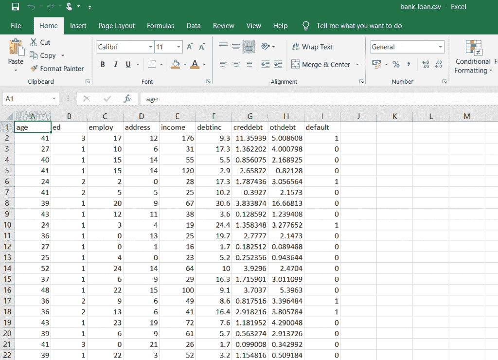

# 用 Python 打印列名的 3 种简单方法

> 原文：<https://www.askpython.com/python-modules/pandas/print-column-names-in-python>

读者朋友们，你们好！在本文中，我们将关注用 Python 打印列名的不同**方式。**

所以，让我们开始吧！

* * *

## 首先，在 Python 中哪里可以找到列？

我们经常会遇到这样的问题和问题陈述:我们觉得需要处理 **excel** 或 **csv** 文件中的数据，即以行和列的形式。

[Python](https://www.askpython.com/python) 作为一种编程语言，为我们提供了一种叫做‘data frame’的数据结构来处理行和列。

一个 **[Python 数据帧](https://www.askpython.com/python-modules/pandas/dataframes-in-python)** 由行和列组成，而 [Pandas 模块](https://www.askpython.com/python-modules/pandas/python-pandas-module-tutorial)为我们提供了各种函数来操作和处理这些行和列中的数据。

今天，我们将了解获取和显示数据帧或 csv 文件的列标题/名称的各种不同方法。

我们将在下面的例子中引用下面的 csv 文件



**Dataset-Bank Loan**

* * *

## 1.使用 pandas.dataframe.columns 在 Python 中打印列名

我们可以使用`pandas.dataframe.columns`变量轻松打印列标签或标题。看看下面的语法！

```py
data.columns

```

**举例:**

```py
import pandas

file = pandas.read_csv("D:/Edwisor_Project - Loan_Defaulter/bank-loan.csv")
for col in file.columns:
    print(col)

```

在本例中，我们已经将 [csv 文件](https://www.askpython.com/python-modules/python-csv-module)加载到环境中。此外，我们使用 dataframe.columns 变量通过 for 循环打印了列名。

**输出:**

```py
age
ed
employ
address
income
debtinc
creddebt
othdebt
default

```

* * *

## 2.使用 pandas . data frame . columns . values

Python 为我们提供了`pandas.dataframe.columns.values`来从 dataframe 或 csv 文件中提取列名并打印出来。

**语法**:

```py
data.columns.values

```

**举例:**

```py
import pandas

file = pandas.read_csv("D:/Edwisor_Project - Loan_Defaulter/bank-loan.csv")
print(file.columns.values)

```

因此，data.columns.values 为我们提供了数据帧中的列名/标题的列表。

**输出:**

```py
['age' 'ed' 'employ' 'address' 'income' 'debtinc' 'creddebt' 'othdebt' 'default']

```

* * *

## 3.Python sorted()方法来获取列名

Python 的`sorted()`方法可以用来获得一个数据帧的列名列表，列的顺序是**、**、**、**。

看看下面的语法！

**语法:**

```py
sorted(dataframe)

```

**举例:**

```py
import pandas

file = pandas.read_csv("D:/Edwisor_Project - Loan_Defaulter/bank-loan.csv")
print(sorted(file))

```

**输出:**

```py
['address', 'age', 'creddebt', 'debtinc', 'default', 'ed', 'employ', 'income', 'othdebt']

```

* * *

## 结论

到此，我们就结束了这个话题。我希望这篇文章对你来说是一个针对单个问题陈述的不同解决方案的技巧。

更多与 Python 相关的帖子，敬请关注，在此之前，祝你学习愉快！！🙂