# 使用 PySpark 打印数据——完整指南

> 原文：<https://www.askpython.com/python-modules/print-data-using-pyspark>

现在让我们学习如何使用 PySpark 打印数据。数据是当今可用的最基本的东西之一。它可以以加密或解密格式提供。事实上，我们也倾向于每天创建大量的信息。无论是点击智能手机上的按钮还是在电脑上上网。但是，为什么我们要谈论这么多呢？

前几年研究人员遇到的主要问题是如何管理如此大量的信息？技术是这个问题的答案。Apache Spark 应运而生，并构建出 PySpark 来解决这个问题。

如果你是 PySpark 的新手，这里有一个 [PySpark 教程](https://www.askpython.com/python-modules/pyspark-tutorial)可以帮你入门。

## 使用 Pyspark 介绍 spark

Apache Spark 是一个数据管理引擎，它帮助我们发明与大型软件开发项目的分析相关的解决方案。

也是大数据工程师和数据科学家的选择工具。了解 Spark 是各种科技公司招聘的必备技能之一。

它附带了许多扩展和管理选项。其中之一是来自 Python 并面向 Python 开发者的 **Pyspark** 。这是支持在每台计算机中明确安装库的 **API** 之一。因此，这可以很容易地管理实现。众所周知，在 python 中安装库非常容易。

## 在我们使用 PySpark 打印数据之前

在我们开始学习使用 PySpark **打印数据的不同方式之前，我们需要考虑一些先决条件:**

1.  对 Python 的核心理解
2.  对 Pyspark 及其支持包的核心理解。
3.  Python 3.6 及以上版本
4.  Java 1.8 及以上版本(最必需)
5.  像 Jupyter Notebook 或者 VS 代码这样的 IDE。

要进行同样的检查，请转到命令提示符并键入命令:

```py
python --version 

```

```py
java -version

```

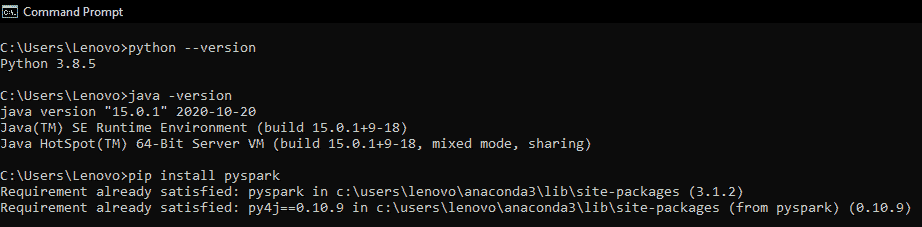

Version Check

您可以通过以下方式使用 PySpark 打印数据:

*   *打印原始数据*
*   *格式化打印数据*
*   *显示前 20-30 行*
*   *显示底部 20 行*
*   *显示前排序数据*

**教程剩余部分使用的资源和工具:**

*   数据集:*[titanic . CSV](https://www.kaggle.com/c/titanic/data)*
*   环境: *[蟒蛇](https://www.askpython.com/python-modules/python-anaconda-tutorial)*
*   IDE: *[Jupyter 笔记本](https://www.askpython.com/python/jupyter-notebook-for-python)*

### 创建会话

spark 环境中的会话是我们活动的所有实例的记录持有者。为了创建它，我们使用 spark 库中的 **SQL** 模块。

这个 SparkSession 类有一个 **builder** 属性，它有一个 **appname()** 函数。这个函数将应用程序的名称作为一个字符串形式的参数。

然后我们使用 **getOrCreate()** 方法创建应用程序，该方法使用**点“.”调用**操作员。使用这些代码，我们创建了名为“ **App** 的应用程序。

给我们创建的应用程序起任何名字都是完全自由的。 ***永远不要忘记创建一个会话，因为我们无法继续。***

**代码:**

```py
import pyspark 
from pyspark.sql import SparkSession 

session = SparkSession.builder.appName('App').getOrCreate() # creating an app

```

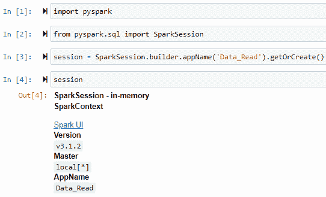

Creating A Session

## 使用 PySpark 打印数据的不同方法

既然你都准备好了，让我们进入正题。现在我们将在这里学习使用 PySpark 打印数据的不同方法。

### 1.打印原始数据

在本例中，我们将使用原始数据集。在 ***【人工智能】*** 领域中，我们将一组数据称为**数据集**。

它有多种形式，如 **excel、逗号分隔值文件、文本文件或服务器文档**模型。所以，记录下我们打印原始数据时使用的文件格式。

在这个例子中，我们使用了一个扩展名为 **a .csv** 的数据集。会话的 **read** 属性具有读取文件的各种功能。

这些函数通常根据不同的文件类型来命名。因此，我们对数据集使用 csv()函数。我们把一切都存储在数据变量中。

**代码:**

```py
data = session.read.csv('Datasets/titanic.csv')
data # calling the variable

```

默认情况下，Pyspark 以**字符串**的形式读取所有数据。因此，我们调用我们的数据变量，然后它以字符串的形式返回每一列及其编号。

要打印原始数据，请使用点运算符-**调用带有数据变量的 **show()** 函数**

```py
data.show()

```

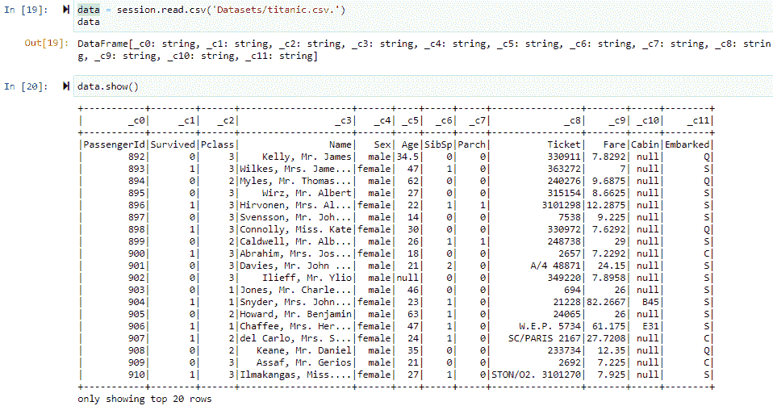

Reading The Dataset

### 2.格式化数据

在 Pyspark 中格式化数据意味着显示数据集中出现的**列**的适当的**数据类型**。为了显示所有的标题，我们使用了**选项()**函数。这个函数接受两个字符串形式的参数。

1.  键
2.  价值

对于**键**参数，我们给出的值为**头**，值为**真**。这样做的目的是，它将扫描需要显示的标题，而不是顶部的列号。

最重要的是扫描每一列的数据类型。为此，我们需要激活 csv()函数中的 **inferschema** 参数，我们之前使用它来读取数据集。它是**布尔**数据类型的一个参数，也就是说，我们需要设置它为**真**来激活它。我们用点运算符连接每个函数。

**代码:**

```py
data = session.read.option('header', 'true').csv('Datasets/titanic.csv', inferSchema = True)
data

```

```py
data.show()

```

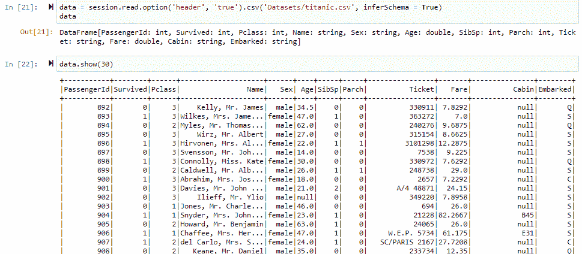

Showing The Data In Proper Format

**输出:**

正如我们所看到的，适当的数据类型的标题是可见的。

### 3.显示前 20-30 行

要显示前 20-30 行，我们只用一行代码就可以做到。 **show()** 函数为我们做到了这一点。如果数据集太大，默认情况下将显示前 20 行。但是，我们可以让它显示尽可能多的行。Jut 将该数字作为参数放入 **show()** 函数中。

```py
data.show() # to display top 20 rows

```

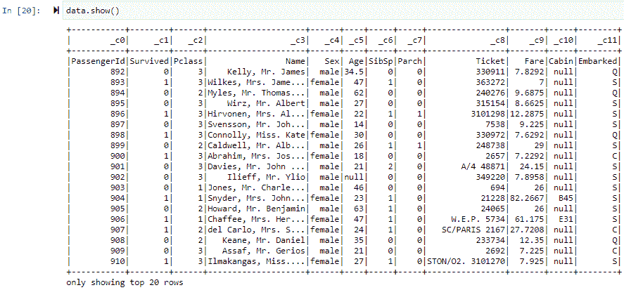

Showing Top 20 Rows

```py
data.show(30) # to display top 30 rows

```

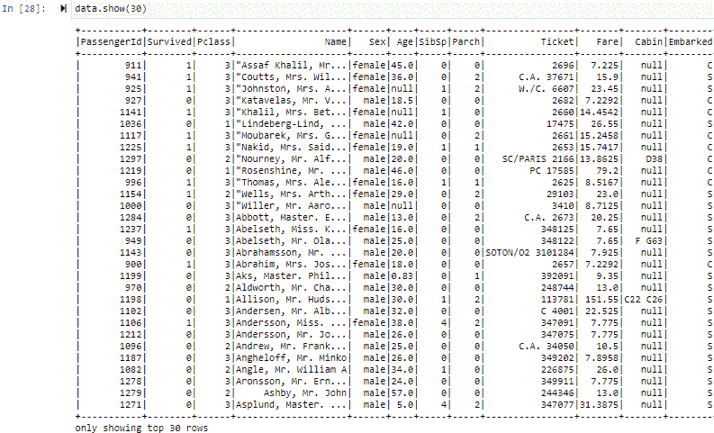

Showing Top 30 Rows

我们可以使用 **head()** 函数实现同样的功能。该函数专门提供对数据集最顶端部分的行的访问。它将行数作为参数，按照行数显示。例如，**显示前 10 行**

```py
data.head(10)

```

但是，结果是以数组或列表的形式。最令人失望的是，我们不能将 head()函数用于具有数千行的大型数据集。这就是证据。

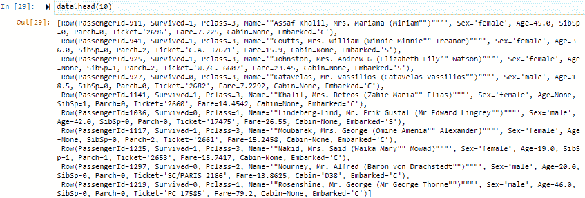

Using The Head Method To Print First 10 Rows

### 4.显示底部的 20-30 行

这也是一个简单的任务。tail()函数可以帮助我们做到这一点。用数据框变量调用它，然后给出我们希望作为参数显示的行数。例如，要显示最后 20 行，我们将代码编写为:

```py
data.tail(20)

```

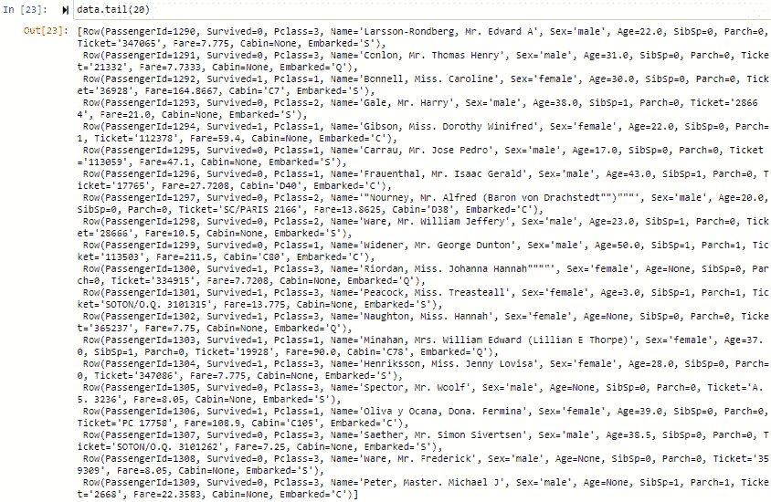

Showing Botton 20 Rows

同样，我们也不能对此做出任何正确的看法，因为我们的数据集太大，无法显示这样的行。

### 5.显示前对数据进行排序

分类是我们把东西按正确的顺序摆放的过程。这可以是从**上升**–由小变大或者从**下降**–由大变小。这在按顺序查看数据点时起着重要的作用。数据框中的列可以是各种类型。但是，两种主要类型是**整数**和**字符串**。

1.  对于整数，排序是根据较大和较小的数字。
2.  对于字符串排序是根据字母顺序。

Pyspark 中的 sort()函数仅用于此目的。它可以将一列或多列作为内部参数。让我们在数据集上尝试一下。我们将对数据集中的 **PassengerID** 列进行排序。为此，我们有两个函数。

1.  **sort()**
2.  **orderBy()**

#### 按升序排序

```py
data = data.sort('PassengerId')
data.show(5)

```

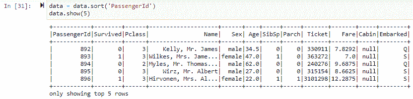

Sorting A Single Column 1

**PassengerID** 列已经排序。该代码将所有元素按升序排列。这里我们只对一列进行排序。**要对多个列进行排序，我们可以在 sort()函数中逐个传递它们，用逗号分隔。**

```py
data = data.sort('Name', 'Fare')
data.show(5)

```

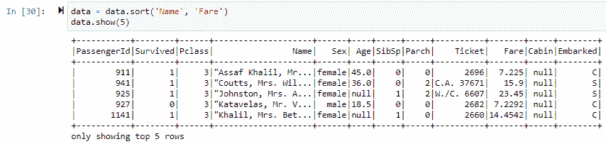

Sorting Multple Columns

#### 按降序排序

这是专门针对 **orderBy()** 函数的。这个函数提供了一个特殊的选项来对我们的数据进行降序排序。

在这种情况下，所有代码都保持不变，只是在插入列并使用**点运算符**将其连接后，我们调用了 **orderBy()** 中的 **desc()** 函数。

**desc()** 按降序*对齐或排序那些特定列的所有元素。*

*首先，让我们看一下数据集中的所有列。*

*代码:*

```py
*data.columns* 
```

*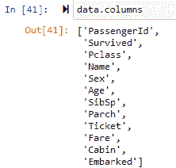

Columns Record* 

*在下面的代码中，我们将对**名称**和**费用**列进行排序。该名称属于字符串数据类型，因此将根据字母顺序进行排序。而 Fare 是一个数字，所以它会是一个大-小的模式。*

***代码:***

```py
*data = data.orderBy(data.Name.desc(), data.Fare.desc())
data.show(5)* 
```

*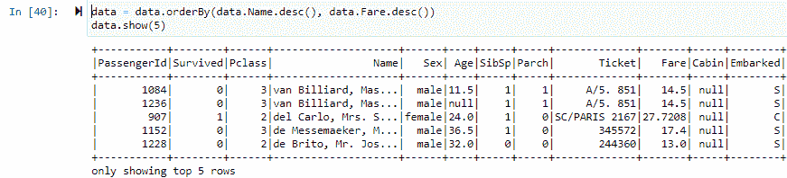

Sorting In Descending Order* 

## *结论*

*这就是我们如何使用 Pyspark 打印数据的全部内容。每一个代码都很短，理解起来很甜蜜。这足以获得 spark 函数的代码知识。这种环境对于**大数据**以及其他行业和技术领域来说非常强大。*