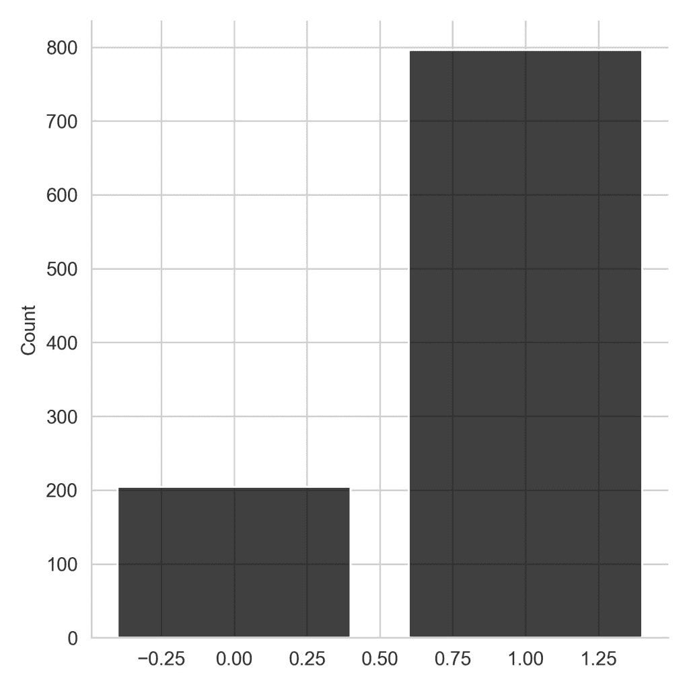

# 用 Python 实现概率分布(实现示例)

> 原文：<https://www.askpython.com/python/examples/probability-distributions>

概率分布是描述随机变量在给定范围内所有可能值和可能性的数学函数。

概率分布有助于模拟随机现象，使我们能够估计某一事件发生的概率。

在本文中，我们将使用 Python 实现并可视化一些常用的概率分布

## 常见概率分布

最常见的概率分布如下:

*   均匀分布
*   二项分布
*   泊松分布
*   指数分布
*   正态分布

让我们用 Python 来实现每一个。

### 1.均匀分布

均匀分布在给定的连续值范围内定义了相等的概率。换句话说，它是一个概率不变的分布。

区间[a，b]上*连续*均匀分布的概率密度函数为:


Uniform Distribution

示例–当掷出六面骰子时，每一面都有 1/6 的机会。

使用 [scipy 模块](https://www.askpython.com/python-modules/python-scipy)在 Python 中实现和可视化均匀概率分布。

```py
#Importing required libraries
from scipy.stats import uniform
import seaborn as sb
import matplotlib.pyplot as plt
import numpy as np

#taking random variables from Uniform distribution
data = uniform.rvs(size = 100000, loc = 5, scale=10)

#Plotting the results
sb.set_style('whitegrid')
ax = sb.distplot(data, bins = 30, color = 'k')
ax.set(xlabel = 'interval')
plt.show()

```


Uniform Distribution Plot

`scipy.stats`模块有一个`uniform`类，其中第一个参数是下限，第二个参数是分布的范围。

*   `loc`–下限。
*   `scale`–分布范围。

例如，如果我们想从 5 到 15 范围内的均匀分布中随机选取值。那么`loc`参数将为 5，因为它是下限。`scale`参数将被设置为 10，如果我们添加`loc`和`scale`，我们将得到 15 作为上限。

### 2.二项分布

**二项分布**是离散概率分布。它有参数 *n* 和 *p* ，其中 p 是成功的概率，n 是试验的次数。

假设我们有一个要么成功要么失败的实验:

*   我们有成功的可能性
*   那么二项式 pmf 可以告诉我们观察到 ***k*** 的概率
*   如果实验进行了 ***n 次*** 次。

二项分布的概率质量函数为:


PMF of Binomial Distribution

```py
#Importing required modules
import seaborn as sb
import matplotlib.pyplot as plt
import numpy as np
from scipy.stats import binom

#Applying the binom class
pb = binom(n = 20, p = 0.6)

x = np.arange(1,21)
pmf = pb.pmf(x)

#Visualizing the distribution
sb.set_style('whitegrid')
plt.vlines(x ,0, pb.pmf(x), colors='k', linestyles='-', lw=5)
plt.ylabel('Probability')
plt.xlabel('Intervals')
plt.show()

```


Binomial Distribution Plot

`scipy.stats`模块有`binom`类，需要以下输入参数:

*   n =间隔数
*   p =成功的概率

binom 类有。pmf 方法要求区间数组作为输入自变量，输出结果是相应的概率值。

#### 二项分布

这是 n = 1 的二项式分布的特殊情况。换句话说，它是一个单次试验的二项分布。

伯努利分布的概率质量函数由下式给出:


Bernoulli Distribution

```py
#Importing the required modules
import seaborn as sb
import matplotlib.pyplot as plt
import numpy as np
from scipy.stats import bernoulli

#Applying the bernoulli class
data = bernoulli.rvs(size = 1000 , p = 0.8)

#Visualizing the results
sb.set_style('whitegrid')
sb.displot(data, discrete=True, shrink=.8 , color = 'k')
plt.show()

```



Bernoulli Distribution Plot

我们需要指定概率`p`作为`bernoulli`类对象的输入参数。为了从分布中选取随机值，伯努利类有一个`.rvs`方法，它采用一个可选的大小参数(要选取的样本数)。

### 3.泊松分布

它给出了给定数量的事件在固定时间间隔内发生的概率，如果这些事件以已知的恒定平均速率发生并且彼此独立。

平均速率也称为λ(*λ*)。

假设我们拥有一家水果店，平均每 10 分钟就有 3 名顾客来到店里。这里的平均速率是 3 或 *λ* = 3。泊松概率分布可以帮助我们回答这样的问题，比如 5 个客户在接下来的 10 分钟内到达的概率是多少？

概率质量函数由下式给出:


PMF of Poisson Distribution

```py
#Importing the required modules
import seaborn as sb
import matplotlib.pyplot as plt
import numpy as np
from scipy.stats import poisson

#Applying the poisson class methods
x = np.arange(0,10)
pmf = poisson.pmf(x,3)

#Visualizing the results
sb.set_style('whitegrid')
plt.vlines(x ,0, pmf, colors='k', linestyles='-', lw=6)
plt.ylabel('Probability')
plt.xlabel('intervals')
plt.show()

```


Poisson Distribution Plot

来自`scipy.stats`模块的`poisson`类只有一个形状参数:`mu`，也就是上面公式中的 rate。`.pmf`将返回相应输入数组值的概率值。

### 4.指数分布

在概率统计中，**指数分布**是泊松点过程中事件之间时间的概率分布。指数分布描述了连续过程改变状态的时间。

泊松分布处理一个事件在给定时期内发生的次数，指数分布处理这些事件之间的时间间隔。

指数分布可以看作是几何分布的连续对应物。


Exponential Distribution Pdf

这里的 *λ* > 0 是分布的参数，通常称为*率参数*。

```py
#Importing required modules
import seaborn as sb
import matplotlib.pyplot as plt
import numpy as np
from scipy.stats import expon

#Applying the expon class methods
x = np.linspace(0.001,10, 100)
pdf = expon.pdf(x)

#Visualizing the results
sb.set_style('whitegrid')
plt.plot(x, pdf , 'r-', lw=2, alpha=0.6, label='expon pdf' , color = 'k')
plt.xlabel('intervals')
plt.ylabel('Probability Density')
plt.show()

```


Exponential Distribution Plot

scipy.stats 模块的`expon`类的输入参数如下:

*   `x` : 分位数
*   `loc` : *【可选】*位置参数*。默认值= 0*
*   `scale` : *【可选】*刻度参数*。默认= 1*

为了计算给定区间的概率密度，我们使用`.pdf`方法。

### 5.正态分布

一个 **[正态分布](https://www.askpython.com/python/normal-distribution)** 也被称为**高斯分布**或者著名的**钟形曲线**。

正态分布的概率密度函数(pdf ):


Normal Distribution

其中，μ =平均值，σ =标准差，x =输入值。

```py
# import required libraries
from scipy.stats import norm
import numpy as np
import matplotlib.pyplot as plt
import seaborn as sb

# Creating the distribution
data = np.arange(1,10,0.01)
pdf = norm.pdf(data , loc = 5.3 , scale = 1 )

#Visualizing the distribution

sb.set_style('whitegrid')
sb.lineplot(data, pdf , color = 'black')
plt.ylabel('Probability Density')

```


Normal Distribution Plot

`scipy.stats`模块有`norm`类用于实现正态分布。

location `loc`关键字指定了平均值。scale `scale`关键字在上面的代码中指定了标准偏差。

为了计算给定区间的概率密度，我们使用提供了`loc`和`scale`自变量的`.pdf`方法。

## 结论

在本文中，我们使用`scipy.stats`模块实现了一些非常常用的概率分布。我们也对不同分布的形状有了直观的了解。

快乐学习！