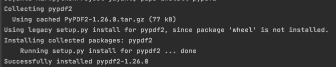
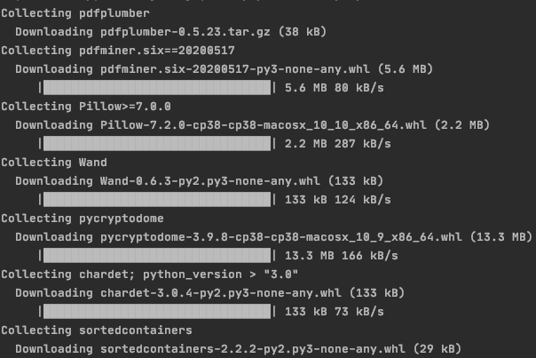

# 如何用 Python 处理 PDF 文件中的文本？

> 原文：<https://www.askpython.com/python/examples/process-text-from-pdf-files>

pdf 是共享文本的常用方式。 *PDF* 代表 ***可移植文档格式*** ，使用 ***。pdf* 文件扩展名**。它是由 Adobe Systems 在 20 世纪 90 年代早期创建的。

使用 python 阅读 PDF 文档可以帮助您自动化各种各样的任务。

在本教程中，我们将学习如何用 Python 从 PDF 文件中提取文本。

让我们开始吧。

## 用 Python 从 PDF 文件中读取和提取文本

出于本教程的目的，我们正在创建一个 2 页的 PDF 样本。你可以使用任何文字处理软件，如微软 Word 或谷歌文档，将文件保存为 PDF 格式。

第 1 页上的文本:

```py
Hello World. 
This is a sample PDF with 2 pages. 
This is the first page. 

```

第 2 页的文本:

```py
This is the text on Page 2\. 

```

## 使用 PyPDF2 提取 PDF 文本

您可以使用 [PyPDF2](https://pypi.org/project/PyPDF2/) 从 PDF 中提取文本。让我们看看它是如何工作的。

### 1.安装软件包

要在您的系统上安装 PyPDF2，请在终端上输入以下命令。你可以阅读更多关于 [pip 包管理器](https://www.askpython.com/python-modules/python-pip)的信息。

```py
pip install pypdf2

```



Pypdf

### 2.导入 PyPDF2

打开一个新的 python 笔记本，开始导入 PyPDF2。

```py
import PyPDF2

```

### 3.以读取二进制模式打开 PDF

使用以下代码行，在[读取二进制模式](https://www.askpython.com/python/built-in-methods/open-files-in-python)下打开 PDF:

```py
pdf = open('sample_pdf.pdf', 'rb')

```

这将为我们的 PDF 创建一个 **PdfFileReader 对象**，并将其存储到变量' *pdf '中。*

### 4.使用 PyPDF2。PdfFileReader()来读取文本

现在您可以使用 PyPDF2 中的 **PdfFileReader** ()方法来读取文件。

```py
pdfReader = PyPDF2.PdfFileReader(pdf)

```

要从 PDF 的第一页获取文本，请使用以下代码行:

```py
page_one = pdfReader.getPage(0)
print(page_one.extractText())

```

我们得到的输出为:

```py
Hello World. 
!This is a sample PDF with 2 pages. !This is the first page. !

Process finished with exit code 0

```

这里我们使用 getPage 方法将页面存储为一个对象。然后我们使用 extractText()方法从页面对象中获取文本。

我们得到的文本属于类型 **String。**

同样，要从 PDF 获取第二页，请使用:

```py
page_one = pdfReader.getPage(1)
print(page_one.extractText())

```

我们得到的输出为:

```py
This is the text on Page 2\. 

```

### 使用 PyPDF2 读取 PDF 文本的完整代码

本节的完整代码如下所示:

```py
import PyPDF2
pdf = open('sample_pdf.pdf', 'rb')
pdfReader = PyPDF2.PdfFileReader(pdf)
page_one = pdfReader.getPage(0)
print(page_one.extractText())

```

如果您注意到，在上面的输出中，第一页的格式有点不对。这是因为 PyPDF2 读取 PDF 的效率不是很高。

幸运的是，Python 有比 PyPDF2 更好的替代方案。我们接下来会谈到这一点。

## 使用 PDFplumber 提取文本

PDFplumber】是另一个可以从 PDF 中提取文本的工具。与 PyPDF2 相比，它更强大。

### 1.安装软件包

让我们开始安装 PDFplumber。

```py
pip install pdfplumber

```



Pdfplumber

### 2.导入 pdf 木材

使用下面一行代码从导入 PDFplumber 开始:

```py
import pdfplumber

```

### 3.使用 PDFplumber 读取 pdf

您可以通过以下代码开始使用 PDFplumber 阅读 pdf:

```py
with pdfplumber.open("sample_pdf.pdf") as pdf:
    first_page = pdf.pages[0]
    print(first_page.extract_text())

```

这将从我们的 PDF 的第一页获取文本。输出如下:

```py
Hello World. 

This is a sample PDF with 2 pages. 

This is the first page. 

Process finished with exit code 0

```

您可以将它与 PyPDF2 的输出进行比较，看看 PDFplumber 在格式化方面如何更好。

PDFplumber 还提供了从 PDF 获取其他信息的选项。

比如可以用**。page_number** 获取页码。

```py
print(first_page.page_number)

```

输出:

```py
1

```

要了解 PDFPlumber 下的更多方法，请参考其官方[文档。](https://github.com/jsvine/pdfplumber)

## 结论

本教程是关于从 pdf 中读取文本的。我们研究了两种不同的工具，并发现其中一种比另一种更好。

现在你知道了如何从 PDF 中读取文本，你应该阅读我们关于[标记化](https://www.askpython.com/python-modules/tokenization-in-python-using-nltk)的教程，开始学习自然语言处理！