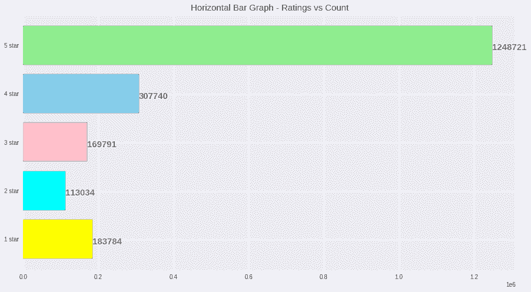
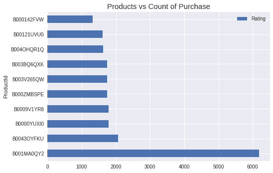
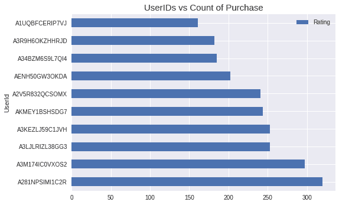

# 基于 Python 的产品推荐系统

> 原文：<https://www.askpython.com/python/examples/product-recommendation-system>

很多时候，你不知道哪种产品在某个特定领域比其他产品更好。好了，不用担心了！Python 对任何事情都有解决方案，这就是推荐系统的用途。

***也读:[Python 中推荐系统的理论介绍](https://www.askpython.com/python/examples/theory-intro-recommendation-systems)***

在本教程中，我们将使用 Python 编程语言构建一个产品推荐系统。让我们从理解我们将在本教程中使用的数据集开始。

在本教程中，我们将使用亚马逊美容产品评级数据集，其中包含超过 200 万个网站上销售的美容相关产品的客户评论和评级。

数据集包含每个产品的以下信息:UserID，它对每个客户都是唯一的，有助于识别用户；ProductID，它有助于唯一地标识产品；评级，范围从 1 到 5；以及时间戳，它提供评级的时间。

* * *

## 代码实现

我们将导入所有必要的库并将数据集加载到程序中。确保您的`.csv`文件与代码文件在同一个目录下，以避免任何错误。看看下面的代码。

```py
import numpy as np
import pandas as pd
import matplotlib.pyplot as plt

df = pd.read_csv("ratings_Beauty.csv")
print("Number of Products in the dataset : ",df.shape[0])

```

在数据集中，我们可以看到总共有`2023070`条美妆产品评论。我们将尝试绘制一个条形图，显示评分值与评分数的对比。

这将帮助我们了解用户的评论在 5 个评分值(即 1、2、3、4 和 5)中的分布情况。请看下面的代码片段。

```py
count_ratings = [0 for i in range(len(np.unique(df['Rating'])))]
print("Number of Unique Ratings available : ",len(count_ratings))

for i in range(df.shape[0]):
  count_ratings[int(df['Rating'][i]-1)]+=1

print("Count of each ratings is : ",count_ratings)

plt.style.use('seaborn')

labels = ["1 star" , "2 star", "3 star", 
          "4 star", "5 star"]

plt.figure(figsize=(15,8),facecolor="w")
ax = plt.barh(labels,count_ratings,
        color=["yellow","cyan","pink",
               "skyblue","lightgreen"],
        edgecolor="black")

for i in ax.patches:
    plt.text(i.get_width()+0.6, i.get_y()+0.3,
             str(round((i.get_width()), 4)),
             fontsize=15, fontweight='bold',
             color='grey')

plt.title("Horizontal Bar Graph - Ratings vs Count",fontsize=15)
plt.show()

```

代码执行后，程序将显示如下图。这个情节将帮助我们了解用户对亚马逊上的美妆产品的看法。



Ratings Vs Count Beauty Products

接下来，我们将从两个方面来看推荐:第一种方式是向用户推荐具有最高 4 星或 5 星评级的产品。

另一种方法是让用户知道哪些用户对产品进行了 4 星或 5 星评级，这将有助于认识到这些用户的评级是有帮助的，因为他们是最多的用户。

让我们使用下面的代码过滤掉评级为 4 星或 5 星的数据。

```py
df_4 = df[df['Rating']==4.0]
df_5 = df[df['Rating']==5.0]
df_45 = pd.concat([df_4, df_5])

```

接下来，我们将查看具有 4 星和 5 星评级的顶级产品，并以条形图的形式显示出来，以了解网站根据评级推荐的最多产品

```py
popular_products = pd.DataFrame(df_45.groupby('ProductId')['Rating'].count())
most_popular = popular_products.sort_values('Rating', ascending=False)[:10]

plt.figure(figsize=(15,8),facecolor="w")
most_popular.head(30).plot(kind = "barh")

plt.title("Products vs Count of Purchase",fontsize=15)
plt.show()

```

该代码在执行时会产生如下图所示的结果。该图显示 product_id 为 B001MA0QY2 的产品是最受推荐的产品，我们可以在下面的图中看到列出的前 10 个最受欢迎的产品。



Product Vs Count Reviews

现在让我们转到另一种方法，根据在网站上评分最高的用户向新用户推荐网站上的产品，因为他们是美容产品的更频繁用户。看看下面的代码和输出。

```py
popular_users = pd.DataFrame(df_45.groupby('UserId')['Rating'].count())
most_popular_users = popular_users.sort_values('Rating', ascending=False)[:10]

plt.figure(figsize=(15,8),facecolor="w")
most_popular_users.head(30).plot(kind = "barh")

plt.title("UserIDs vs Count of Purchase",fontsize=15)
plt.show()

```

看一下上面的代码显示的图表，其中显示了该产品最频繁的用户。



Users Vs Count Reviews

* * *

## 结论

在本教程中，我们学习了使用 Python 编程语言的产品推荐系统。

推荐系统有助于了解产品的当前用户喜欢什么，他们对什么最感兴趣，以便帮助新用户了解他们必须试用什么产品。

感谢您的阅读！

* * *