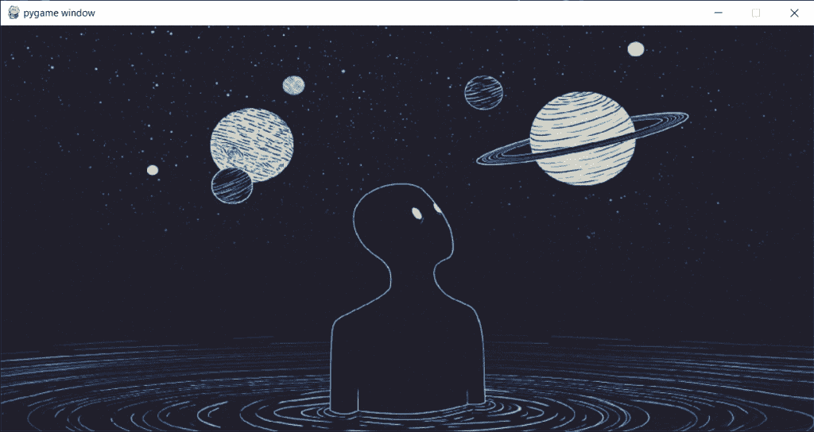

# Python Pygame:给 Python 游戏添加背景音乐

> 原文：<https://www.askpython.com/python-modules/pygame-adding-background-music>

你好。今天在本教程中，我们可以看看如何使用 pygame 在窗口中添加背景音乐。所以让我们开始吧！

## 第一步:下载我们想要播放的音乐

在进入编码部分之前，我们需要做的第一件事是下载一些音乐。你可以选择任何你想要的音乐。我现在用一些简单的朗朗上口的背景音乐。

我已经添加了我要使用的背景音乐。你想听就能听到。

MP3 FORMAT

但问题是在 pygame 中使用`mp3`格式的背景音乐会有很多问题，会导致奇怪的吱吱声和爆裂声，而不是音乐。

因此，为了防止这种情况，我们将 mp3 格式的文件转换为`OOG`格式，这使得它更适合 pygame 窗口。你可以在网上找到文件格式转换器，你只需要上传你的音乐文件，其余的都是免费的！

oog 文件听起来是一样的。我在下面添加了我的`wav`音乐文件供你验证。

WAV FORMAT

## 步骤 2:导入模块

每个程序的第一步是导入必要的模块。相同的代码如下所示。

```py
import pygame
from pygame.locals import *
from pygame import mixer

```

我们将导入`pygame`和`pygame.locals`模块以使窗口平稳运行。我们将导入`mixer`模块来播放音乐。

## 步骤 3:创建基本的屏幕设计和功能

为了创建屏幕，我们首先使用`init`函数初始化 pygame。我们将使用`image.load`函数加载背景图像。

然后，我们将有一个运行循环，将把背景图像和更新屏幕设计。我们还将在事件处理的帮助下添加退出窗口功能。

最后，我们将使用`quit`函数来销毁之前启动的 pygame。相同的代码如下所示。

```py
pygame.init()
width = 1000
height = 500
window = pygame.display.set_mode((width,height))
bg_img = pygame.image.load('Images/bg.png')
bg_img = pygame.transform.scale(bg_img,(width,height))

runing = True
while runing:
    window.blit(bg_img,(0,0))
    for event in pygame.event.get():
        if event.type == QUIT:
            runing = False
    pygame.display.update()
pygame.quit()

```

上面代码的输出屏幕如下所示。



Output Screen1 Bg Music Pygame

## 步骤 4:在程序中初始化混合器

下一步是初始化程序中的`mixer`并使用`music.load`加载音乐，其中音乐文件的路径作为参数传递。

在这之后，我们添加了名为`music.pla` y 的函数。但是这不会启动背景音乐。为此，我们需要在代码中添加更多的元素，这将在后面的章节中介绍。

相同的代码如下所示。

```py
mixer.init()
mixer.music.load('Music File/bensound-summer_wav_music.wav')
mixer.music.play()

```

## 给 Pygame 窗口添加背景音乐——完整代码

最终代码如下所示:

```py
import pygame
from pygame.locals import *
from pygame import mixer

pygame.init()
width = 1000
height = 500
window = pygame.display.set_mode((width,height))
bg_img = pygame.image.load('Images/bg.png')
bg_img = pygame.transform.scale(bg_img,(width,height))

mixer.init()
mixer.music.load('Music File/bensound-summer_wav_music.wav')
mixer.music.play()

runing = True
while runing:
    window.blit(bg_img,(0,0))
    for event in pygame.event.get():
        if event.type == QUIT:
            runing = False
    pygame.display.update()
pygame.quit()

```

## 最终输出

代码的输出显示在下面的视频中。我没有放一个完整的超过 3 分钟的视频。

你可以听到音乐完美的播放！

## 结论

恭喜你！您成功地学会了如何在屏幕上添加背景音乐！你可以尝试不同的音乐声音，并将其添加到你的游戏中，如果你有的话！

感谢您的阅读！