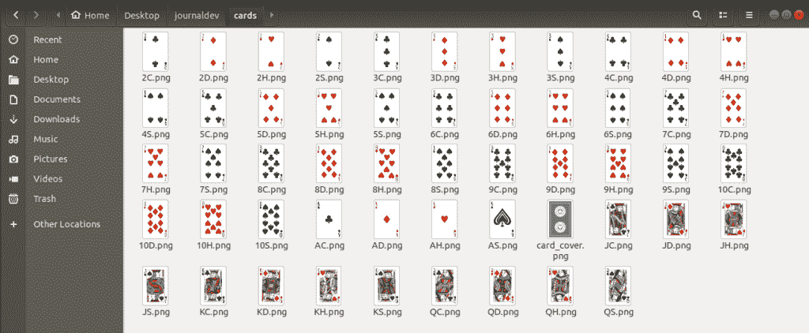

# PyGame 教程:Python 中的图形高低游戏

> 原文：<https://www.askpython.com/python/examples/pygame-graphical-hi-lo-game>

PyGame 是一个用 Python 编写的 2D 游戏开发库。它包含程序员从头开始创建简单或复杂游戏所需的特定函数和类。

在本教程中，我们将使用 PyGame 库创建自己的高低游戏。Hi-Lo 是一种非常简单的赌场游戏，玩家必须猜测一副牌中的下一张牌是高于还是低于当前的牌。

> **建议**:如果这是你第一次创建游戏，试试用 Python 的[命令行实现 hi-lo 游戏。这更容易，并且会让你对游戏机制有更好的理解。但是，如果您已经精通 Python，请继续往下读！](https://www.askpython.com/python/examples/terminal-hi-lo-game-in-python)

牌的排名系统从最低排名的 Ace 开始，到最高排名的 king 结束。

* * *

## Python 中的 GUI 高低游戏

<https://www.askpython.com/wp-content/uploads/2020/07/hi_lo_pygame.mp4>

* * *

## 导入 PyGame

在使用任何 pygame 的模块之前，我们需要导入库。

```py
import pygame

```

所有的 PyGame 函数都可以使用`pygame`后跟`'.'`和函数名来访问。

* * *

## 声明游戏常数

每个游戏设计都需要一些常量，用来指定游戏的关键特性。

```py
# Margins
MARGIN_LEFT = 230
MARGIN_TOP = 150

# WINDOW SIZE
WIDTH = 800
HEIGHT = 600

# COLORS
BLACK = (0, 0, 0)
WHITE = (255, 255, 255)
GRAY = (110, 110, 110)
GREEN = (0, 255, 0)
LIGHT_GREEN = (0, 120, 0)
RED = (255, 0, 0)
LIGHT_RED = (120, 0, 0)

```

对于程序员来说，常量的类型和值是不同的。预先定义这样的常数是一个好习惯，这样在值改变的情况下，我们不必到处去修正它们。

* * *

## 初始化游戏模块

为了使用 PyGame 模块，我们首先需要通过以下方式初始化它们:

```py
# Initializing PyGame
pygame.init()

```

每个游戏都在一个特定的游戏窗口中进行，这个窗口可以根据程序员的需要而改变。这个游戏窗口需要尺寸参数。

```py
# WINDOW SIZE
WIDTH = 800
HEIGHT = 600

# Setting up the screen and background
screen = pygame.display.set_mode((WIDTH, HEIGHT))
screen.fill(GRAY)

```

使用内置的`set_mode()`函数，我们定义窗口大小。在使用 PyGame 时要记住的一件事是，size 参数是作为一个由两个值组成的[元组](https://www.askpython.com/python/tuple/python-tuple)传递的:宽度和高度。

设置好窗口后，我们使用`fill()`命令设置背景颜色。

* * *

## 设置标题和图标

我们的游戏需要一个标题和图标来代表自己。

```py
# Setting up caption
pygame.display.set_caption("Hi-Lo Game")

# Loading image for the icon
icon = pygame.image.load('icon.jpeg')

# Setting the game icon
pygame.display.set_icon(icon)

```

`set_caption()`函数将一个字符串作为参数，并将其作为标题。为了设置图标，我们首先需要使用接受图像文件名称的`load()`函数加载图像。

`set_icon()`功能将图像设置为游戏图标。

> **注意:**如果图像文件不在与 python 游戏文件相同的目录中，那么我们需要添加相对路径以及图像的名称。

* * *

## 定义游戏字体

在屏幕上呈现文本之前，我们需要定义某些字体。

```py
# Types of fonts to be used
small_font = pygame.font.Font(None, 32)
large_font = pygame.font.Font(None, 50)

```

`Font()`函数有两个参数:字体类型(默认字体为`None`)和字体大小。

* * *

## 设置游戏按钮的文本

我们的游戏有两个按钮:高和低。为按钮放置文本需要多个步骤:

1.  为文本呈现字体
2.  获取文本的矩形覆盖
3.  将矩形放在屏幕上

```py
# Hign and Low Game Buttons
high_button = large_font.render("HIGH", True, WHITE)

# Gets_rectangular covering of text
high_button_rect = high_button.get_rect()

# Places the text
high_button_rect.center = (280, 400)

low_button = large_font.render("LOW", True, WHITE)
low_button_rect = low_button.get_rect()
low_button_rect.center = (520, 400)

```

`render()`函数接受以下参数:

*   文本-“高”
*   对文本的平滑边缘应用抗锯齿？–正确
*   文本颜色-白色

`get_rect()`函数返回所提供文本的矩形覆盖。

下一行指定矩形封面的中心位置，从而放置文本。

* * *

## 定义我们的纸牌

为了定义我们的一副牌，我们首先要定义一张单独的牌。我们将借助 [Python 类](https://www.askpython.com/python/oops/python-classes-objects)来完成这项任务。

```py
# Card class definition
class Card:
	def __init__(self, suit_type, value):
		self.suit_type = suit_type
		self.value = value

```

任何牌都有两个特征:花色类型和面值。继续讨论卡的定义，我们使用三种定义数据结构:

```py
# The type of suit
suits = ["Spades", "Hearts", "Clubs", "Diamonds"]

# The type of card
cards = ["A", "2", "3", "4", "5", "6", "7", "8", "9", "10", "J", "Q", "K"]

# The card value
cards_values = {"A": 1, "2":2, "3":3, "4":4, "5":5, "6":6, "7":7, "8":8, "9":9, "10":10, "J":11, "Q":12, "K":13}

```

这些卡的存储是在 Python 对象列表中完成的。

```py
# The deck of cards - List of Objects
deck = []

# Loop for every type of suit
for suit in suits:

	# Loop for every type of card in a suit
	for card in cards:

		# Adding the card to the deck
		deck.append(Card(suit, card))

```

## 设置卡片图像

与图标图像类似，我们首先需要加载卡片图像，然后将它们呈现在游戏界面上。为此，我们需要一副牌中每张牌的图像。令人欣慰的是，它可以很容易地从互联网上获得。

这是卡片的样子:



The images for playing cards

正如我们所看到的，命名约定是必要的，因为当 Python 脚本从卡片组中取出卡片时，卡片将被加载。命名惯例很简单:*牌值后跟花色的第一个字母。*

```py
# Load the card image
prev_card = pygame.image.load(r'./cards/card_cover.png')

# Scale the loaded image 
prev_card = pygame.transform.scale(prev_card , (100,160))

# Choose the starting card from the deck
current_card = random.choice(deck)

# Keep choosing until it is not the highest or lowest
while current_card.value == "A" or current_card.value == "K":
	current_card = random.choice(deck)

# Load the card image	
cur_card =  pygame.image.load(r'./cards/' + current_card.value + current_card.suit_type[0] + '.png')

# Scale the loaded card image
cur_card = pygame.transform.scale(cur_card , (100,160))

# Remove the card from the deck
deck.remove(current_card)

# Loading the card image
next_card =  pygame.image.load(r'./cards/card_cover.png')

# Scaling the loaded image
next_card = pygame.transform.scale(next_card , (100,160))

```

放置原始图像文件可能会覆盖整个屏幕，因此，我们需要根据屏幕的宽度和高度来缩放图像。在 PyGame 中，这是通过`scale()`函数完成的，该函数接受一个输入图像和目标大小进行变换。

根据 Hi-Lo 游戏的规则，起始牌不能是最高或最低的牌，即分别是 a 或 k。我们运行一个循环，直到从一副牌中选出的牌不是他们中的任何一个。

在卡片被选取后，我们需要加载特定的卡片图像以显示在屏幕上。这是由`load()`函数完成的，该函数接受图像名称后面的相对路径。

* * *

## 声明游戏变量

有几个游戏变量是游戏所必需的:

```py
# Number of chances left
chances = 3

# The current score
score = 0

# User's choice initialized
choice = -1

# Used to stop game functioning, if True
over = False

```

上述变量中的主要焦点是用于停止游戏运行的`over`变量，例如，按钮点击。

* * *

## 游戏循环

游戏循环是代码中永远运行的部分，负责维护游戏窗口、组件和游戏逻辑。

```py
# The GAME LOOP
while True:

	# Tracking the mouse movements
	mouse = pygame.mouse.get_pos()

```

游戏循环的第一个议程是跟踪鼠标的移动。这对于识别鼠标点击的位置和其他事情来说很方便。

`get_pos()`函数以(X 轴，Y 轴)的形式返回鼠标在屏幕上的位置的 Python 元组。

* * *

## 处理 PyGame 事件

PyGame 开发中最重要的部分是处理游戏窗口中发生的事件。

PyGame 将发生的每个事件注册到一个事件对象列表中。我们将遍历每个事件对象来处理它。

```py
# Loop events occuring inside the game window 
for event in pygame.event.get():

	# Qutting event
	if event.type == pygame.QUIT:
		pygame.quit()
		quit()

	# Left-mouse clicked event	
	if not over and event.type == pygame.MOUSEBUTTONDOWN:

		# Clicked on the High Button 
		if 220 <= mouse[0] <= 220+125 and 370 <= mouse[1] <= 370+60: 
			choice = 1

		# Clicked on the Low Button	
		if 460 <= mouse[0] <= 460+120 and 370 <= mouse[1] <= 370+60:
			choice = 0

```

我们检查事件的类型并执行所需的任务。必须指出的是，在退出 python 代码之前，我们退出了 PyGame 模块。

* * *

## 游戏逻辑

游戏逻辑包括:

*   将当前卡片放入前一张卡片的位置。
*   从这副牌中选择一张新牌。
*   从这副牌中取出所选的牌。
*   检查新卡是高了还是低了。
*   如果牌越低，那么剩下的机会就越少。
*   如果牌更高，则增加分数。
*   重置玩家选择

```py
# If a valid choice, the game logic	
if choice != -1:	

	# Change current card to previous
	previous_card = current_card
	prev_card = pygame.image.load(r'./cards/' + previous_card.value + previous_card.suit_type[0] + '.png')
	prev_card = pygame.transform.scale(prev_card , (100,160))

	# Set up the current card
	current_card = random.choice(deck)
	deck.remove(current_card)

	cur_card =  pygame.image.load(r'./cards/' + current_card.value + current_card.suit_type[0] + '.png')
	cur_card = pygame.transform.scale(cur_card , (100,160))

	# Check the result, that is, High or Low
	if cards_values[current_card.value] > cards_values[previous_card.value]:
		result = 1
	elif cards_values[current_card.value] < cards_values[previous_card.value]:
		result = 0
	else:
		result = -1	 	

	# Manage the game variables
	if result == -1:
		continue
	elif result == choice:
		score = score + 1
	else:
		chances = chances - 1		

	# End the game if chances are finished
	if chances == 0:
		over = True	

	# Reset the choice
	choice = -1	

```

* * *

## 按钮动画

使用跟踪的鼠标移动，每当鼠标悬停在按钮上时，我们可以创建一个按钮动画。

```py
# Manage the button hovering animation
if 220 <= mouse[0] <= 220+125 and 370 <= mouse[1] <= 370+60: 
	pygame.draw.rect(screen,LIGHT_GREEN,[220,370,125,60])  
else: 
	pygame.draw.rect(screen,GREEN,[220,370,125,60]) 

if 460 <= mouse[0] <= 460+120 and 370 <= mouse[1] <= 370+60: 
	pygame.draw.rect(screen,LIGHT_RED,[460,370,120,60]) 
else: 
	pygame.draw.rect(screen,RED,[460,370,120,60]) 

```

在这段代码中，我们首先检查鼠标位置是否在按钮内部。如果是，那么我们在屏幕上用比原来的按钮颜色更浅的颜色画一个矩形，否则就是原来的按钮颜色。

这里的`pygame.draw.rect()`函数带三个参数，显示面(我们的游戏窗口)，矩形的颜色，盒子的尺寸【起始 x 坐标，起始 y 坐标，宽度，高度】。

* * *

## 显示记分板

我们需要显示一个记分牌，上面有当前的分数和剩余的机会数。

```py
# Displaying scoreboard
pygame.draw.rect(screen, WHITE, [270, 40, 255, 90])
score_text = small_font.render("Score = "+str(score), True, BLACK)
score_text_rect = score_text.get_rect()
score_text_rect.center = (WIDTH//2, 70)

chances_text = small_font.render("Chances = "+str(chances), True, BLACK)
chances_text_rect = chances_text.get_rect()
chances_text_rect.center = (WIDTH//2, 100)	

```

我们使用与按钮文本相似的文本呈现方式。

* * *

## 设置整个显示

在所有的显示组件初始化之后，我们可以使用`blit()`函数将它们放置在我们的游戏窗口上。

```py
# Setting up all the buttons, images and texts on the screen
screen.blit(high_button, high_button_rect)
screen.blit(low_button, low_button_rect)
screen.blit(score_text, score_text_rect)
screen.blit(chances_text, chances_text_rect)
screen.blit(prev_card, (MARGIN_LEFT,MARGIN_TOP))
screen.blit(cur_card, (MARGIN_LEFT+120, MARGIN_TOP))
screen.blit(next_card, (MARGIN_LEFT+240, MARGIN_TOP))	

```

`blit()`函数接收游戏对象，如图像或文本，以及其放置的位置。

* * *

## 管理最终游戏

在游戏逻辑中，当机会结束时，`over`变量被改为`True`。这里显示了它的效果。

```py
# If the game is finished, display the final score
if over == True:
	pygame.draw.rect(screen, WHITE, [270, 40, 255, 90])
	score_text = small_font.render("Final Score = "+str(score), True, BLACK)
	score_text_rect = score_text.get_rect()
	score_text_rect.center = (WIDTH//2, 85)
	screen.blit(score_text, score_text_rect)

```

游戏结束后，我们在记分牌上显示最终得分。

* * *

## 更新游戏显示

最后要做的事情是在游戏循环结束时更新游戏显示。

```py
# Update the display after each game loop
pygame.display.update()

```

* * *

## 完整的代码

```py
import pygame
import random

# Card class definition
class Card:
	def __init__(self, suit_type, value):
		self.suit_type = suit_type
		self.value = value

if __name__ == '__main__':

	# Margins
	MARGIN_LEFT = 230
	MARGIN_TOP = 150

	# WINDOW SIZE
	WIDTH = 800
	HEIGHT = 600

	# COLORS
	BLACK = (0, 0, 0)
	WHITE = (255, 255, 255)
	GRAY = (110, 110, 110)
	GREEN = (0, 255, 0)
	LIGHT_GREEN = (0, 120, 0)
	RED = (255, 0, 0)
	LIGHT_RED = (120, 0, 0)

	# The type of suit
	suits = ["Spades", "Hearts", "Clubs", "Diamonds"]

	# The type of card
	cards = ["A", "2", "3", "4", "5", "6", "7", "8", "9", "10", "J", "Q", "K"]

	# The card value
	cards_values = {"A": 1, "2":2, "3":3, "4":4, "5":5, "6":6, "7":7, "8":8, "9":9, "10":10, "J":11, "Q":12, "K":13}

	# The deck of cards - List of Objects
	deck = []

	# Loop for every type of suit
	for suit in suits:

		# Loop for every type of card in a suit
		for card in cards:

			# Adding the card to the deck
			deck.append(Card(suit, card))

	# Initializing PyGame
	pygame.init()

	# Setting up the screen and background
	screen = pygame.display.set_mode((WIDTH, HEIGHT))
	screen.fill(GRAY)

	# Setting up caption
	pygame.display.set_caption("Hi-Lo Game")

	# Loading image for the icon
	icon = pygame.image.load('icon.jpeg')

	# Setting the game icon
	pygame.display.set_icon(icon)

	# Types of fonts to be used
	small_font = pygame.font.Font(None, 32)
	large_font = pygame.font.Font(None, 50)

	# Hign and Low Game Buttons
	high_button = large_font.render("HIGH", True, WHITE)

	# Gets_rectangular covering of text
	high_button_rect = high_button.get_rect()

	# Places the text
	high_button_rect.center = (280, 400)

	low_button = large_font.render("LOW", True, WHITE)
	low_button_rect = low_button.get_rect()
	low_button_rect.center = (520, 400)

	# Load the card image
	prev_card = pygame.image.load(r'./cards/card_cover.png')

	# Scale the loaded image 
	prev_card = pygame.transform.scale(prev_card , (100,160))

	# Choose the starting card from the deck
	current_card = random.choice(deck)

	# Keep choosing until it is not the highest or lowest
	while current_card.value == "A" or current_card.value == "K":
		current_card = random.choice(deck)

	# Load the card image	
	cur_card =  pygame.image.load(r'./cards/' + current_card.value + current_card.suit_type[0] + '.png')

	# Scale the loaded card image
	cur_card = pygame.transform.scale(cur_card , (100,160))

	# Remove the card from the deck
	deck.remove(current_card)

	# Loading the card image
	next_card =  pygame.image.load(r'./cards/card_cover.png')

	# Scaling the loaded image
	next_card = pygame.transform.scale(next_card , (100,160))

	# Number of chances left
	chances = 3

	# The current score
	score = 0

	# User's choice initialized
	choice = -1

	# Used to stop game functioning, if True
	over = False

	# The GAME LOOP
	while True:

		# Tracking the mouse movements
		mouse = pygame.mouse.get_pos()

		# Loop events occuring inside the game window 
		for event in pygame.event.get():

			# Qutting event
			if event.type == pygame.QUIT:
				pygame.quit()
				quit()

			# Left-mouse clicked event	
			if not over and event.type == pygame.MOUSEBUTTONDOWN:

				# Clicked on the High Button 
				if 220 <= mouse[0] <= 220+125 and 370 <= mouse[1] <= 370+60: 
					choice = 1

				# Clicked on the Low Button	
				if 460 <= mouse[0] <= 460+120 and 370 <= mouse[1] <= 370+60:
					choice = 0

				# Finish the game if the deck is finished
				if len(deck) == 1:
					over = True	

				# If a valid choice, the game logic	
				if choice != -1:	

					# Change current card to previous
					previous_card = current_card
					prev_card = pygame.image.load(r'./cards/' + previous_card.value + previous_card.suit_type[0] + '.png')
					prev_card = pygame.transform.scale(prev_card , (100,160))

					# Set up the current card
					current_card = random.choice(deck)
					deck.remove(current_card)

					cur_card =  pygame.image.load(r'./cards/' + current_card.value + current_card.suit_type[0] + '.png')
					cur_card = pygame.transform.scale(cur_card , (100,160))

					# Check the result, that is, High or Low
					if cards_values[current_card.value] > cards_values[previous_card.value]:
						result = 1
					elif cards_values[current_card.value] < cards_values[previous_card.value]:
						result = 0
					else:
						result = -1	 	

					# Manage the game variables
					if result == -1:
						continue
					elif result == choice:
						score = score + 1
					else:
						chances = chances - 1		

					# End the game if chances are finished
					if chances == 0:
						over = True	

					# Reset the choice
					choice = -1	

		# Manage the button hovering animation
		if 220 <= mouse[0] <= 220+125 and 370 <= mouse[1] <= 370+60: 
			pygame.draw.rect(screen,LIGHT_GREEN,[220,370,125,60])  
		else: 
			pygame.draw.rect(screen,GREEN,[220,370,125,60]) 

		if 460 <= mouse[0] <= 460+120 and 370 <= mouse[1] <= 370+60: 
			pygame.draw.rect(screen,LIGHT_RED,[460,370,120,60]) 
		else: 
			pygame.draw.rect(screen,RED,[460,370,120,60]) 

		# Displaying scoreboard
		pygame.draw.rect(screen, WHITE, [270, 40, 255, 90])
		score_text = small_font.render("Score = "+str(score), True, BLACK)
		score_text_rect = score_text.get_rect()
		score_text_rect.center = (WIDTH//2, 70)

		chances_text = small_font.render("Chances = "+str(chances), True, BLACK)
		chances_text_rect = chances_text.get_rect()
		chances_text_rect.center = (WIDTH//2, 100)	

		# Setting up all the buttons, images and texts on the screen
		screen.blit(high_button, high_button_rect)
		screen.blit(low_button, low_button_rect)
		screen.blit(score_text, score_text_rect)
		screen.blit(chances_text, chances_text_rect)
		screen.blit(prev_card, (MARGIN_LEFT,MARGIN_TOP))
		screen.blit(cur_card, (MARGIN_LEFT+120, MARGIN_TOP))
		screen.blit(next_card, (MARGIN_LEFT+240, MARGIN_TOP))	

		# If the game is finished, display the final score
		if over == True:
			pygame.draw.rect(screen, WHITE, [270, 40, 255, 90])
			score_text = small_font.render("Final Score = "+str(score), True, BLACK)
			score_text_rect = score_text.get_rect()
			score_text_rect.center = (WIDTH//2, 85)
			screen.blit(score_text, score_text_rect)

		# Update the display after each game loop
		pygame.display.update()

```

* * *

## 结论

使用 PyGame 创建我们自己的 Hi-Lo 游戏似乎是一项简单的任务。我们希望这个教程能成为读者未来 PyGame 测试和冒险的基础。

感谢您的阅读。如有疑问或建议，欢迎在下面发表评论。