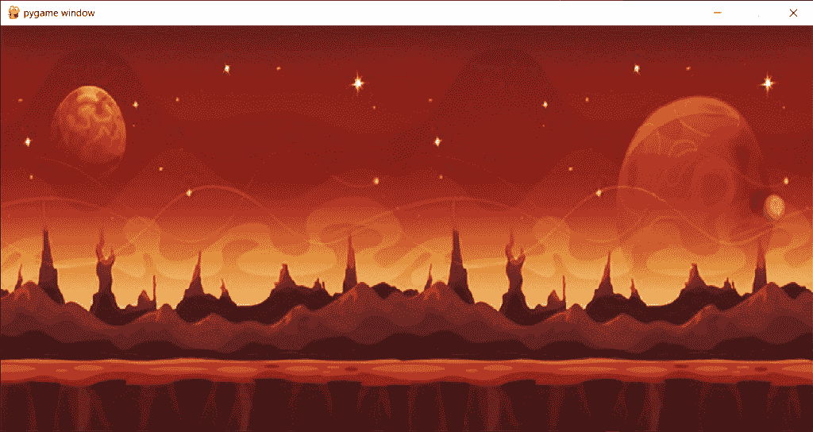

# Python Pygame:循环背景

> 原文：<https://www.askpython.com/python-modules/pygame-looping-background>

你好。今天我将教你如何在 Pygame 中制作一个非常有趣的循环背景！所以让我们开始吧！

## 步骤 1:导入 Pygame

我们将从导入`pygame`模块开始。我们还会将 pygame 初始化到我们的程序中。我们还将为 pygame 窗口的基本功能导入`python.locals`库

相同的代码如下所示。

```py
import pygame
from pygame.locals import *
pygame.init()

```

## 步骤 2:创建基本窗口

接下来需要做的是创建变量来设置游戏窗口的宽度和高度。现在，让我们保持宽度和高度分别为 1000 和 500。

使用名为`display.set_mode`的 pygame 函数创建一个窗口对象，并传递游戏窗口的高度和宽度。

相同的代码如下所示:

```py
width,height = 1000,500
window = pygame.display.set_mode((width,height))

```

## 步骤 3:添加背景图像

要添加背景图像，我们需要做的就是使用名为`image.load`的函数，并添加图像的路径作为参数。

我们还将调整图像的大小，以确保它完全填满整个屏幕。为此，我们将使用`transform.scale`函数，并传递我们的原始图像以及缩放尺寸，即屏幕尺寸。

相同的代码如下所示:

```py
bg_img = pygame.image.load('Images/bg.jpg')
bg_img = pygame.transform.scale(bg_img,(width,height))

```

但是这段代码只会显示窗口几秒钟，然后就消失了。我们不需要那个！

因此，我们将添加逻辑，确保屏幕一直显示，直到用户点击屏幕上的`X`。

让我先给你看看代码。

```py
runing = True
while runing:
    window.blit(bg_img,(0,0))
    for event in pygame.event.get():
        if event.type == QUIT:
            runing = False
    pygame.display.update()
pygame.quit()

```

在代码中，我们创建了一个默认设置为`True`的运行变量。只要运行变量保持为真，应用程序就会运行。

为了放置图像，我们必须在运行循环中放置一个`blit`函数。`blit`函数将获取图像变量和图像的坐标。

为了设置游戏结束逻辑，我们将跟踪所有事件，并检查游戏中发生的事件类型。如果事件类型是按下屏幕上的`X`按钮，我们设置运行值为假。

但是背景图像的显示仍然没有完成。为此，我们将添加一个`display.update`函数，用声明的所有元素更新屏幕。

在加载并关闭整个屏幕后，我们退出了之前初始化的 pygame。

在我们做了所有必要的工作后，我们将会看到如下所示的屏幕。(如果您选择不同的背景图像或屏幕大小，背景图像或窗口形状可能会有所不同)



Screen01 Loop Bg

## 步骤 4:用 Pygame 循环背景

我们的主要目的是沿着屏幕的宽度循环背景图像。为此，我们将使用一个迭代器，`i`,并用 0 值初始化它。

我们将减少这个[迭代器](https://www.askpython.com/python/built-in-methods/python-iterator) (i ),因为我们必须继续。

下面的代码显示了代码的进度以及必要的更改。更改后的行也会突出显示，以便您更容易理解。

```py
import pygame
from pygame.locals import *
pygame.init()
width = 1000
height = 500
window = pygame.display.set_mode((width,height))
bg_img = pygame.image.load('Images/bg.jpg')
bg_img = pygame.transform.scale(bg_img,(width,height))
i = 0
runing = True
while runing:
    window.blit(bg_img,(i,0))
    i-=1
    for event in pygame.event.get():
        if event.type == QUIT:
            runing = False    
    pygame.display.update()
pygame.quit()

```

下面的视频显示了代码的结果。哦，看看右边的循环背景！但是结尾看起来不太对。

这里的问题是我们没有重画图像。因此，程序保持加载像素的最后配置。

现在为了解决这个问题，我们将在图像完全加载后，通过添加背景色来测试这种情况。同样，我们将使用`fill`函数，并传递颜色的 RBG 格式。现在我们将使用 ***黑色*** 。

同样的代码如下所示。这一行将出现在背景图像加载命令之前。

```py
window.fill((0,0,0))

```

同样的输出如下所示。

但是我们希望在背景图像的宽度结束后加载背景图像，而不是黑色。同样，我们将使用`blit`函数并在未来坐标应用背景图像。同样的代码行如下所示。

```py
window.blit(bg_img,(width+i,0))

```

添加代码行后的输出如下所示。背景图像显示两次，但随后再次返回背景。我们不想那样。

发生这种情况的原因是，I 达到了屏幕宽度的负值。我们需要处理同样的情况，当 I 达到宽度的负值时，通过使用`blit`函数来完成。I 值也被重置，即设置为 0。

相同的代码如下所示。这段代码添加在 i decrement 命令和初始加载背景图像之间。

```py
if (i==-width):
        window.blit(bg_img,(width+i,0))
        i=0

```

最终代码如下所示。希望你现在清楚所有的概念。

```py
import pygame
from pygame.locals import *
pygame.init()
width = 1000
height = 500
window = pygame.display.set_mode((width,height))
bg_img = pygame.image.load('Images/bg.jpg')
bg_img = pygame.transform.scale(bg_img,(width,height))

i = 0

runing = True
while runing:
    window.fill((0,0,0))
    window.blit(bg_img,(i,0))
    window.blit(bg_img,(width+i,0))
    if (i==-width):
        window.blit(bg_img,(width+i,0))
        i=0
    i-=1
    for event in pygame.event.get():
        if event.type == QUIT:
            runing = False
    pygame.display.update()
pygame.quit()

```

代码的最终输出如下所示。

## 结论

这种类型的背景循环可用于创建一些基本的 2D 游戏，如简单的跑步或跳跃游戏。

希望你喜欢这个教程！

感谢您的阅读！